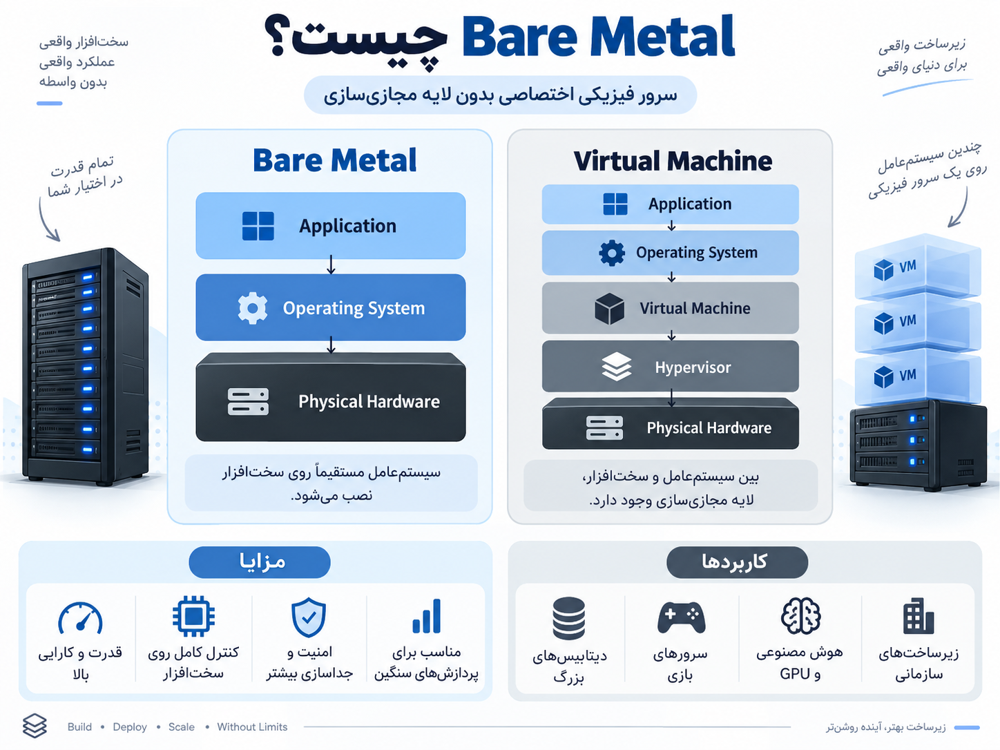

# مقدمه‌ای بر Bare Metal و Virtual Machine

در دنیای زیرساخت (Infrastructure)، وقتی می‌خواهیم یک سرویس یا نرم‌افزار را اجرا کنیم، باید روی یک محیط پردازشی قرار بگیرد. این محیط می‌تواند **سخت‌افزار واقعی (Bare Metal)** باشد یا یک **محیط مجازی‌شده (Virtual Machine)**.

<p align="center">
	
</p>

---

# 1) ا-Bare Metal چیست؟

ا-**Bare Metal** یعنی یک سرور فیزیکی واقعی که تمام منابع سخت‌افزاری آن (CPU، RAM، Storage و Network) مستقیماً در اختیار یک کاربر یا یک سازمان قرار دارد.

در Bare Metal، سیستم‌عامل بدون واسطه روی سخت‌افزار نصب می‌شود.

ساختار:

```
Application
      ↓
Operating System
      ↓
Physical Hardware
```

مثال:

یک شرکت یک سرور Dell یا HP خریداری می‌کند، روی آن Linux نصب می‌کند و دیتابیس یا برنامه خود را مستقیم روی همان سرور اجرا می‌کند.

### چرا از Bare Metal استفاده می‌کنیم؟

چون در بعضی پروژه‌ها نیاز داریم:

- بیشترین قدرت پردازشی را داشته باشیم.
- هیچ منابعی با دیگران مشترک نباشد.
- تأخیر (Latency) بسیار کم باشد.
- کنترل کامل روی سخت‌افزار داشته باشیم.

کاربردها:

- دیتابیس‌های بسیار بزرگ
- پردازش‌های هوش مصنوعی و GPU
- سرورهای بازی آنلاین
- سیستم‌های بانکی و حساس
- پردازش‌های سنگین علمی

---

# 2) ا-Virtual Machine چیست؟

ا-**Virtual Machine (VM)** یعنی یک کامپیوتر مجازی که روی یک سرور فیزیکی ساخته می‌شود.

در این حالت یک نرم‌افزار به نام **Hypervisor** بین سخت‌افزار و ماشین‌های مجازی قرار می‌گیرد و منابع سرور را تقسیم می‌کند.

ساختار:

```
Application
      ↓
Operating System
      ↓
Virtual Machine
      ↓
Hypervisor
      ↓
Physical Hardware
```

مثلاً:

یک سرور با 128GB RAM داریم.

با استفاده از VMware یا KVM می‌توانیم آن را تبدیل کنیم به:

```
VM 1 → 32GB RAM + Linux
VM 2 → 64GB RAM + Windows
VM 3 → 32GB RAM + Linux
```

یعنی چند سیستم مختلف روی یک سخت‌افزار اجرا می‌شوند.

---

# مقایسه Bare Metal و Virtual Machine

|ویژگی|Bare Metal|Virtual Machine|
|---|---|---|
|نوع محیط|سرور فیزیکی واقعی|سرور مجازی|
|دسترسی به سخت‌افزار|مستقیم|از طریق Hypervisor|
|عملکرد|بسیار بالا|کمی کمتر به دلیل لایه مجازی‌سازی|
|مصرف منابع|اختصاصی برای یک کاربر|بین چند VM تقسیم می‌شود|
|هزینه|بیشتر|کمتر|
|انعطاف‌پذیری|کمتر|بسیار بالا|
|سرعت ایجاد سرور|کندتر|سریع (چند دقیقه)|
|مقیاس‌پذیری|محدودتر|آسان‌تر|
|امنیت و جداسازی|بسیار بالا|خوب، ولی وابسته به Hypervisor|
|مدیریت|نیازمند مدیریت سخت‌افزار|مدیریت ساده‌تر|
|مناسب برای|پردازش‌های سنگین|سرویس‌های عمومی و Cloud|

---

# چرا Virtual Machine استفاده می‌شود؟

قبل از مجازی‌سازی، هر برنامه نیاز به یک سرور جدا داشت.

مثلاً:

```
Server 1 → Web Server
Server 2 → Database
Server 3 → Application
```

این باعث می‌شد بسیاری از منابع سرور بلااستفاده بمانند.

با VM:

```
        Physical Server

        Hypervisor

   VM1      VM2       VM3

 Web     Database   App
```

یک سرور می‌تواند چند سرویس مختلف را اجرا کند.

مزایا:

✅ کاهش هزینه سخت‌افزار  
✅ استفاده بهتر از منابع  
✅ ساخت سریع سرور جدید  
✅ امکان Backup و Snapshot  
✅ انتقال راحت سرورها بین ماشین‌ها

---

# یک مثال ساده برای درک بهتر

فرض کن یک ساختمان داریم:

### Bare Metal:

کل ساختمان فقط برای یک نفر است.

- تمام اتاق‌ها برای خودت
- کنترل کامل
- قدرت بیشتر

### Virtual Machine:

یک ساختمان به چند واحد تقسیم شده.

- هر نفر یک واحد دارد
- هزینه کمتر
- مدیریت راحت‌تر

---

# در دنیای DevOps کدام استفاده می‌شود؟

امروزه معمولاً ترکیبی استفاده می‌شوند:

```
Bare Metal Server
        ↓
Virtualization (VM)
        ↓
Docker Containers
        ↓
Applications
```

مثلاً در دیتاسنترهای بزرگ:

- ا-Bare Metal برای قدرت خام
- ا-VM برای مدیریت منابع
- ا-Docker/Kubernetes برای اجرای برنامه‌ها

---

## خلاصه نهایی

ا-**Bare Metal = قدرت و کنترل بیشتر، ولی هزینه و مدیریت بالاتر**

ا-**Virtual Machine = انعطاف و مدیریت آسان‌تر، ولی همراه با یک لایه مجازی‌سازی**

انتخاب بین این دو بستگی دارد به اینکه پروژه بیشتر به **قدرت خام** نیاز دارد یا **انعطاف و مقیاس‌پذیری**.
