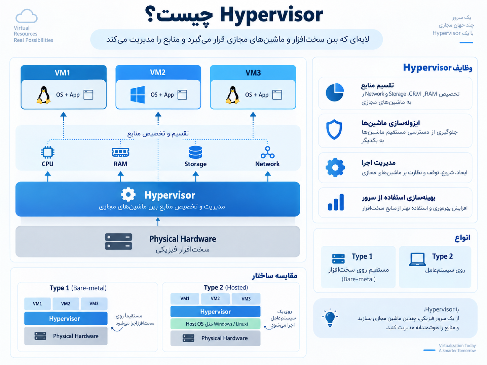

## ا-Hypervisor چیست؟

ا-**Hypervisor یک لایه نرم‌افزاری یا Firmware است که بین سخت‌افزار فیزیکی (Physical Hardware) و ماشین‌های مجازی (Virtual Machines) قرار می‌گیرد و وظیفه دارد منابع سخت‌افزار را مدیریت و بین VMها تقسیم کند.**

<p align="center">
	
</p>

به زبان ساده:

یک سرور فیزیکی مثل یک کامپیوتر قدرتمند است. Hypervisor کاری می‌کند که این یک کامپیوتر تبدیل شود به چند کامپیوتر مجازی مستقل.

مثلاً:

یک سرور داریم:

```
CPU: 64 Core
RAM: 256GB
Storage: 10TB
```

Hypervisor می‌تواند آن را تقسیم کند:

```
VM1 → 16 Core + 64GB RAM → Linux
VM2 → 32 Core + 128GB RAM → Windows
VM3 → 16 Core + 64GB RAM → Linux
```

هر VM فکر می‌کند یک سیستم مستقل دارد.

---

# وظایف اصلی Hypervisor

## 1) تخصیص منابع (Resource Allocation)

مهم‌ترین وظیفه Hypervisor این است که منابع را مدیریت کند:

- CPU
- RAM
- Storage
- Network

مثلاً مشخص می‌کند:

کدام VM چقدر CPU بگیرد یا چقدر RAM مصرف کند.

---

## 2) جداسازی ماشین‌های مجازی (Isolation)

هر ماشین مجازی از دیگری جدا است.

مثلاً:

```
VM1 (Database)
        X
VM2 (Web Server)
```

اگر VM1 مشکل پیدا کند، معمولاً VM2 تحت تأثیر قرار نمی‌گیرد.

این موضوع برای امنیت خیلی مهم است.

---

## 3) مدیریت چرخه عمر VMها

Hypervisor می‌تواند:

- VM بسازد
- روشن کند
- خاموش کند
- حذف کند
- Clone بگیرد
- Snapshot ایجاد کند

مثلاً قبل از یک تغییر بزرگ:

```
Snapshot قبل از Update
        ↓
Update انجام می‌شود
        ↓
اگر مشکل بود → برگشت به Snapshot
```

---

## 4) استفاده بهتر از سخت‌افزار

بدون Hypervisor ممکن است:

```
Server CPU Usage = 10%
RAM Usage = 20%
```

یعنی بیشتر قدرت سرور هدر می‌رود.

با Hypervisor چند سرویس روی همان سخت‌افزار اجرا می‌شوند.

---

# انواع Hypervisor

به طور کلی دو نوع اصلی داریم:

# 1) Type 1 Hypervisor (Bare Metal)

این نوع مستقیماً روی سخت‌افزار نصب می‌شود.

ساختار:

```
Virtual Machines
       |
Hypervisor
       |
Physical Hardware
```

یعنی سیستم‌عامل معمولی وسط نیست.

### ویژگی‌ها:

✅ سرعت بالاتر  
✅ امنیت بیشتر  
✅ مناسب دیتاسنترها  
✅ استفاده سازمانی

### مثال‌ها:

## VMware ESXi

یکی از معروف‌ترین Hypervisorهای دنیا.

کاربرد:

- دیتاسنترها
- شرکت‌های بزرگ
- Cloud Providerها

---

## Microsoft Hyper-V Server

محصول مایکروسافت.

کاربرد:

- سرورهای Windows
- محیط‌های Enterprise

---

## KVM (Kernel-based Virtual Machine)

در لینوکس استفاده می‌شود.

ویژگی:

- Open Source
- محبوب در Cloudها

مثلاً:

- OpenStack
- بسیاری از سرویس‌های Cloud

---

## Xen Hypervisor

یکی از Hypervisorهای قدیمی و قدرتمند.

استفاده در:

- Cloud Infrastructure
- سیستم‌های بزرگ

---

# 2) Type 2 Hypervisor (Hosted)

این نوع روی یک سیستم‌عامل معمولی نصب می‌شود.

ساختار:

```
Virtual Machine
       |
Hypervisor
       |
Host Operating System
       |
Hardware
```

مثلاً:

روی Windows نصب می‌کنی:

```
Windows
   |
VirtualBox
   |
Ubuntu VM
```

---

### ویژگی‌ها:

✅ نصب راحت  
✅ مناسب آموزش و تست  
✅ مناسب کاربران شخصی

ولی:

❌ کمی کندتر از Type 1 است.

---

# مثال‌های Type 2

## VMware Workstation

برای توسعه‌دهنده‌ها و تست سیستم‌عامل‌ها.

مثلاً:

روی لپ‌تاپ Windows:

```
Windows 11
 |
VMware Workstation
 |
Ubuntu Linux
```

---

## Oracle VirtualBox

رایگان و Open Source.

کاربرد:

- آموزش لینوکس
- آزمایش شبکه
- یادگیری DevOps

---

## Parallels Desktop

معروف در Mac.

مثلاً:

MacOS:

```
MacBook
 |
Parallels
 |
Windows VM
```

---

# مقایسه Type 1 و Type 2

|ویژگی|Type 1|Type 2|
|---|---|---|
|محل نصب|مستقیم روی سخت‌افزار|روی سیستم‌عامل|
|سرعت|بالاتر|کمتر|
|امنیت|بیشتر|کمتر|
|کاربرد|دیتاسنتر و سازمان|تست و آموزش|
|مدیریت|حرفه‌ای|ساده|
|مثال|ESXi، Hyper-V، KVM|VMware Workstation، VirtualBox|

---

# یک نکته مهم برای DevOps

در محیط‌های واقعی معمولاً این زنجیره را می‌بینی:

```
Physical Server
        ↓
Hypervisor (ESXi/KVM)
        ↓
Virtual Machines
        ↓
Docker
        ↓
Applications
```

یعنی ممکن است یک شرکت ابتدا با Hypervisor سرورها را مجازی کند و داخل VMها کانتینرهای Docker اجرا کند.

---

## خلاصه خیلی کوتاه:

ا-**Hypervisor = مدیر منابع سرور که یک سخت‌افزار را به چند ماشین مجازی تبدیل می‌کند.**

- برای دیتاسنتر → Type 1 مثل VMware ESXi، KVM، Hyper-V
- برای لپ‌تاپ و یادگیری → Type 2 مثل VirtualBox و VMware Workstation

برای مسیر DevOps که داری می‌خونی، مهم‌ترین‌هایی که باید عمیق یاد بگیری: **VMware ESXi، KVM، Hyper-V و مفاهیم VM Networking و Storage هستند.**
