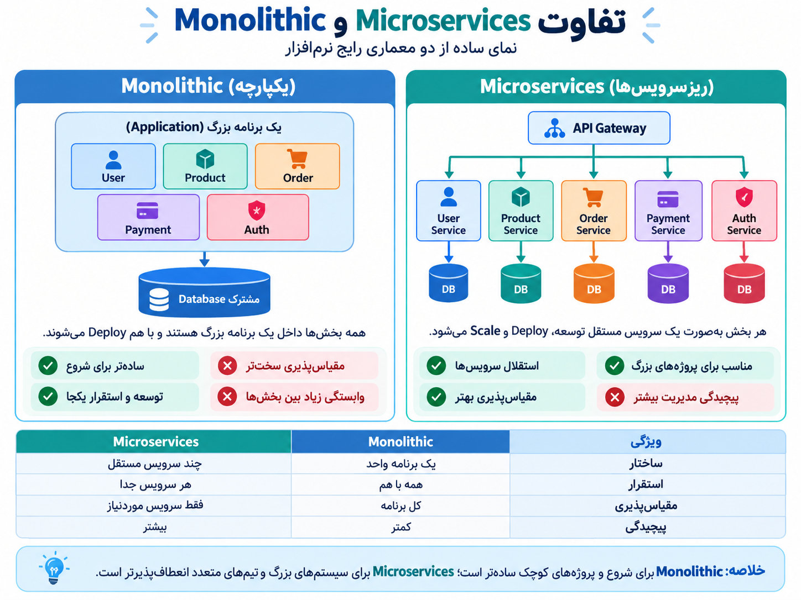

# ا-Monolithic و Microservice چیستند؟

در طراحی نرم‌افزار، دو روش معروف برای ساخت برنامه‌ها وجود دارد:

1. ا-**Monolithic Architecture (معماری یکپارچه)**
2. ا-**Microservices Architecture (معماری سرویس‌گرا)**

<p align="center">
	
</p>

---

# 1) ا-Monolithic چیست؟

در معماری **Monolithic**، کل برنامه به صورت **یک واحد بزرگ و یکپارچه** ساخته می‌شود.

یعنی تمام بخش‌ها داخل یک پروژه هستند:

- User Management
- Authentication
- Payment
- Product
- Order
- Database Connection

همه با هم در یک برنامه اجرا می‌شوند.

ساختار:

```
        Monolithic Application

 ┌───────────────────────────┐
 │ User                      │
 │ Product                   │
 │ Payment                   │
 │ Order                     │
 │ Authentication            │
 └───────────────────────────┘
              |
          Database
```

مثال:  
یک فروشگاه اینترنتی کوچک که همه امکاناتش در یک برنامه نوشته شده است.

---

## مزایای Monolithic

✅ ساده‌تر برای شروع  
✅ توسعه سریع‌تر در پروژه‌های کوچک  
✅ Deploy کردن راحت‌تر  
✅ Debug کردن ساده‌تر

---

## معایب Monolithic

❌ با بزرگ شدن پروژه، کد پیچیده می‌شود  
❌ تغییر یک بخش ممکن است کل برنامه را تحت تأثیر قرار دهد  
❌ مقیاس‌دهی سخت‌تر است  
❌ تیم‌های بزرگ سخت‌تر روی آن کار می‌کنند

مثلاً اگر فقط بخش پرداخت نیاز به منابع بیشتر داشته باشد، باید کل برنامه را بزرگ‌تر کنی.

---

# 2) ا-Microservices چیست؟

در معماری **Microservices**، برنامه بزرگ به چند سرویس کوچک و مستقل تقسیم می‌شود.

هر سرویس:

- مسئول یک کار مشخص است.
- کد جدا دارد.
- می‌تواند جدا Deploy شود.
- معمولاً Database خودش را دارد.

ساختار:

```
             API Gateway

                 |
 --------------------------------
 |        |          |           |
User   Product    Payment     Order
Service Service   Service    Service

 |        |          |           |
DB       DB         DB          DB
```

مثال فروشگاه اینترنتی:

- User Service → مدیریت کاربران
- Product Service → محصولات
- Payment Service → پرداخت
- Order Service → سفارش‌ها

---

# مزایای Microservices

✅ هر سرویس مستقل توسعه پیدا می‌کند  
✅ هر بخش جداگانه Scale می‌شود  
✅ مناسب پروژه‌های بزرگ  
✅ خرابی یک سرویس معمولاً کل سیستم را متوقف نمی‌کند  
✅ تیم‌های مختلف می‌توانند روی سرویس‌های جدا کار کنند

---

# معایب Microservices

❌ پیچیدگی بیشتر  
❌ مدیریت شبکه بین سرویس‌ها سخت‌تر است  
❌ نیاز به ابزارهای DevOps بیشتر دارد:

- Docker
- Kubernetes
- CI/CD
- Monitoring
- API Gateway

---

# مقایسه Monolithic و Microservices

|ویژگی|Monolithic|Microservices|
|---|---|---|
|ساختار|یک برنامه بزرگ|چند سرویس کوچک|
|Deploy|کل برنامه با هم|هر سرویس جدا|
|توسعه|ساده‌تر|پیچیده‌تر|
|مناسب برای|پروژه کوچک و متوسط|پروژه بزرگ|
|Scale کردن|کل برنامه|فقط سرویس مورد نیاز|
|Database|معمولاً مشترک|معمولاً جدا|
|مدیریت|آسان‌تر|سخت‌تر|
|مثال|برنامه‌های ساده|Netflix، Amazon، Uber|

---

# مثال خیلی ساده:

### Monolithic:

مثل یک رستوران که:

- آشپزخانه
- صندوق
- انبار
- مدیریت

همه در یک ساختمان و یک سیستم هستند.

### Microservices:

مثل یک مرکز خرید:

- رستوران جدا
- فروشگاه جدا
- بانک جدا

هر بخش مستقل کار می‌کند ولی با هم ارتباط دارند.

---

# در دنیای DevOps

امروزه معماری رایج‌تر:

```
Developer
    |
   Git
    |
 CI/CD Pipeline
    |
 Docker Container
    |
 Kubernetes
    |
 Microservices
```

یعنی Microservices معمولاً همراه با **Docker و Kubernetes** استفاده می‌شود.

**خلاصه:**

- **Monolithic = یک برنامه بزرگ با همه امکانات داخل یک واحد**
- **Microservices = تقسیم برنامه به سرویس‌های کوچک و مستقل**

mitoni yek aks dorost koni ke khyli khob in 2 mafhomo daronesh namayesh bede
