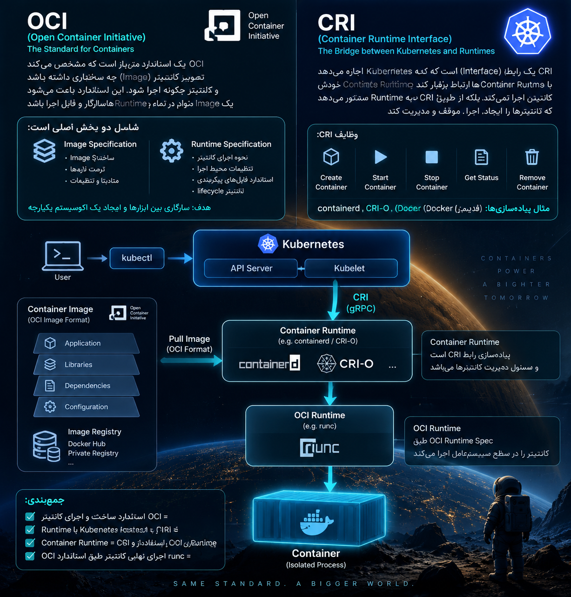

<p align="center">
	
</p>


## ا-OCI چیست؟

ا-**OCI یک قانون و استاندارد برای Containerهاست.**

یعنی مشخص می‌کند:

- یک Container Image چه شکلی باشد.
- یک Container چطور ساخته و اجرا شود.
- ا-Runtimeها چطور باید Container را اجرا کنند.

مثلاً Docker یک Image می‌سازد، ولی چون طبق استاندارد OCI است، می‌تواند در Runtimeهای دیگر هم اجرا شود.

**به زبان ساده:**

> ا۰OCI می‌گوید Container باید چه قوانینی داشته باشد. 📜

مثال:  
مثل استاندارد USB است؛ فرقی نمی‌کند فلش را به چه کامپیوتری وصل کنی، چون همه از یک استاندارد پیروی می‌کنند.

---

## ا-CRI چیست؟

ا-**CRI یک رابط ارتباطی بین Kubernetes و Container Runtime است.**

ا-Kubernetes خودش Container را اجرا نمی‌کند.

پس به Runtimeهایی مثل:

- ا-containerd
- ا-CRI-O

دستور می‌دهد.

مسیر:

```
Kubernetes
      |
      | CRI
      |
containerd / CRI-O
      |
      |
 Container
```

**به زبان ساده:**

> CRI زبان ارتباط Kubernetes با موتور اجرای Container است. 🗣️

---

## یک مثال خیلی ساده:

فرض کن یک رستوران داریم:

🍽️ ا-**OCI**  
= دستورالعمل استاندارد پخت غذا  
(می‌گوید غذا باید چه مشخصاتی داشته باشد)

👨‍🍳 ا-**Container Runtime**  
= آشپز  
(غذا را آماده می‌کند)

👨‍💼 ا-**Kubernetes**  
= مدیر رستوران  
(دستور می‌دهد چه غذایی آماده شود)

📞 ا-**CRI**  
= راه ارتباط مدیر با آشپز

---
### برای حفظ کردن:

✅ ا-**OCI = قانون Container**  
✅ ا-**CRI = ارتباط Kubernetes با Container Runtime**

در یک پروژه واقعی:

```
kubectl
 ↓
Kubernetes
 ↓
CRI
 ↓
containerd
 ↓
OCI (runc)
 ↓
Container
```

این زنجیره را اگر بفهمی، بخش بزرگی از معماری Kubernetes را متوجه شدی.
