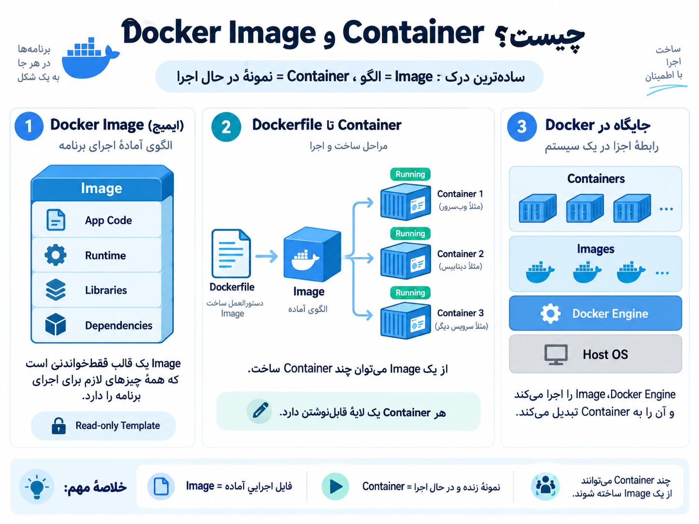

## what is the docker image and docker container?


<p align="center">
	
</p>


ا-**Docker Image** رو مثل یک «قالب آماده» در نظر بگیر. یعنی داخلش همه چیزهایی که برنامه برای اجرا لازم داره مشخص شده: کد برنامه، کتابخانه‌ها، dependencyها، runtime و تنظیمات لازم. خود Image اجرا نمی‌شود؛ فقط یک الگوست.

مثلاً فرض کن یک Image برای Nginx داری:

```
docker pull nginx
```

الان فقط Image را دانلود کردی. هنوز چیزی در حال اجرا نیست.

وقتی از آن Image یک نمونه اجرا می‌کنی:

```
docker run nginx
```

ا-Docker از روی Image یک **Container** می‌سازد.

پس رابطه‌شان خیلی ساده است:

```
Image
  ↓
Container
```

یا دقیق‌تر:

```
nginx Image
    ↓
Container 1

nginx Image
    ↓
Container 2

nginx Image
    ↓
Container 3
```

یعنی از **یک Image می‌توانی چند Container مستقل** بسازی.

یک مثال خیلی ساده:  
ا-**Image مثل فایل نصب یا Template برنامه است.**  
ا-**Container همان برنامه‌ای است که واقعاً در حال اجراست.**

مثلاً:

```
Image = نقشه ساخت خانه
Container = خانه‌ای که از روی آن نقشه ساخته شده
```

می‌توانی از یک نقشه، چند خانه بسازی. همان‌طور که از یک Image می‌توانی چند Container بسازی.

یک تفاوت خیلی مهم هم این است که Image معمولاً **Read-only** است؛ یعنی خود Image هنگام اجرا تغییر نمی‌کند. Container روی Image یک لایه قابل‌نوشتن دارد. بنابراین وقتی داخل Container فایلی می‌سازی یا چیزی تغییر می‌دهی، معمولاً Image اصلی دست‌نخورده می‌ماند.

مثلاً:

```
docker run -d --name web1 nginx
docker run -d --name web2 nginx
```

اینجا:

```
Image:
nginx

Containers:
web1
web2
```

هر دو از یک Image ساخته شده‌اند، ولی دو Container جدا هستند.

برای دیدن Imageها:

```
docker images
```

برای دیدن Containerهای در حال اجرا:

```
docker ps
```

و برای دیدن همه Containerها، حتی متوقف‌شده‌ها:

```
docker ps -a
```

پس فعلاً این جمله رو کاملاً تو ذهنت نگه دار:

ا-**Image = چیزی که Container از روی آن ساخته می‌شود.**  
ا-**Container = نمونه اجرایی Image.**
