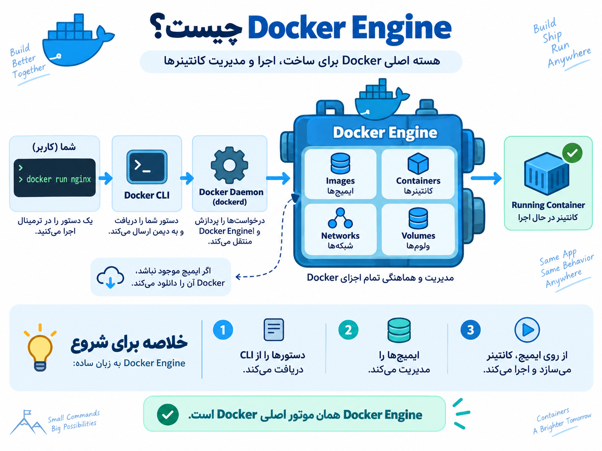

ا-Docker Engine در واقع **هسته اصلی Docker** هست؛ یعنی همون چیزی که واقعاً کانتینرها رو می‌سازه و اجرا می‌کنه.

<p align="center">
	
</p>

خیلی ساده تصور کن:

ا-**Docker Engine = موتور ماشین**  
و **Container = ماشینی که با این موتور حرکت می‌کنه**

ا-Docker Engine چند بخش اصلی داره:

- ا-**Docker Daemon (`dockerd`)**: سرویس اصلی که در پس‌زمینه اجرا میشه و کانتینر، ایمیج، شبکه و Volume رو مدیریت می‌کنه.
- ا-**Docker CLI (`docker`)**: همون دستورهایی که توی ترمینال می‌زنی، مثل `docker run` یا `docker ps`.
- ا-**Docker API**: رابط بین CLI و Docker Daemon.

مثلاً وقتی می‌زنی:

```
docker run nginx
```

اتفاقی که میفته تقریباً اینه:

```
You
 │
 │ docker run nginx
 ▼
Docker CLI
 │
 │ Docker API
 ▼
Docker Daemon (dockerd)
 │
 ├── Image nginx را پیدا می‌کند
 ├── اگر نباشد دانلود می‌کند
 ├── Container می‌سازد
 └── Container را اجرا می‌کند
```

پس این نکته خیلی مهمه:

```
Docker Engine
   │
   ├── Images
   ├── Containers
   ├── Networks
   └── Volumes
```

روی **Linux** معمولاً چیزی که واقعاً برای Docker نیاز داری همین **Docker Engine** هست؛ الزامی نیست Docker Desktop داشته باشی.

مثلاً اگر Ubuntu داری، بعد از نصب Engine می‌تونی بزنی:

```
docker version
```

و:

```
docker info
```

اگر بخوام خیلی کوتاه تعریفش کنم که حفظش کنی:

> ا-**Docker Engine نرم‌افزاریه که Docker Imageها رو مدیریت می‌کنه و از روی اون‌ها Container می‌سازه و اجرا می‌کنه.**

برای مسیر یادگیریت، بعد از Docker Engine بهترین موضوع اینه که دقیق بفهمی **Docker Daemon چیه و وقتی `docker run` می‌زنی پشت صحنه چه اتفاقی میفته**.
