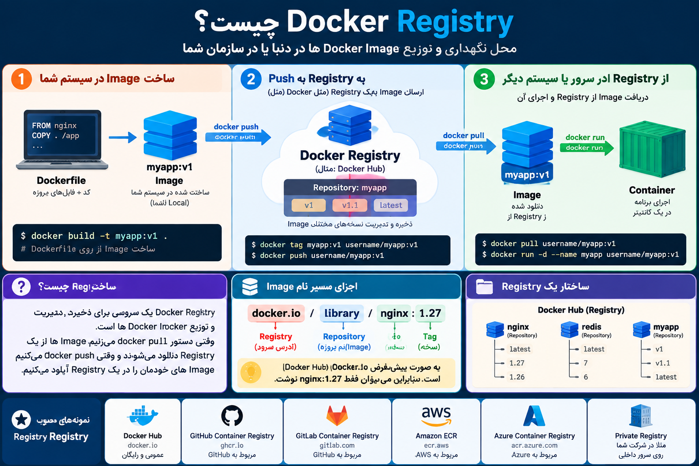
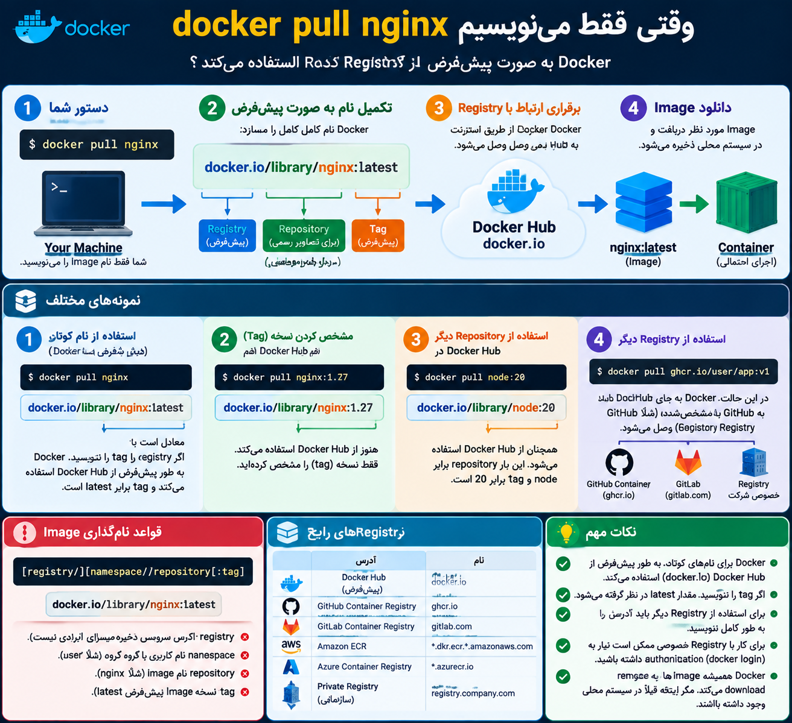

# what is the registry?
# ریجستری چیه؟

---

<p>
	
</p>

خیلی ساده، **Registry در Docker جاییه که Docker Imageها ذخیره و توزیع می‌شن.**

مثل این تصورش کن:

```text
GitHub  → محل نگهداری Code
Docker Registry → محل نگهداری Docker Image
```

مثلاً وقتی می‌زنی:

```bash
docker pull nginx
```

Docker باید Image مربوط به `nginx` رو از یک جایی دانلود کنه. به اون سرویس می‌گیم **Registry**.

معروف‌ترینش **Docker Hub** هست.

```text
        Docker Registry
        (Docker Hub)
             │
             │ docker pull nginx
             ↓
       ┌─────────────┐
       │ Local Docker│
       │ nginx:latest│
       └─────────────┘
```

برعکسش هم داریم. فرض کن خودت Image ساختی:

```bash
docker build -t myapp:v1 .
```

الان Image فقط روی سیستم خودته:

```text
Your Computer
     │
     │ docker push
     ↓
Docker Registry
```

بعد می‌تونی اون رو روی Registry قرار بدی تا سرور یا هم‌تیمی‌ات بتونه Pull کنه.

### Registry با Repository فرق داره

این قسمت خیلی مهمه:

```text
Registry
└── Docker Hub
     │
     ├── nginx Repository
     │    ├── latest
     │    ├── 1.27
     │    └── 1.26
     │
     ├── redis Repository
     │    ├── latest
     │    └── 7
     │
     └── ubuntu Repository
          ├── 24.04
          └── 22.04
```

یعنی:

**Registry** = کل سرویس/انبار

**Repository** = مجموعه Imageهای مربوط به یک پروژه

**Tag** = نسخه یا برچسب یک Image

مثلاً:

```text
docker.io/library/nginx:1.27
   │        │        │
Registry Repository Tag
```

و این دقیقاً به چیزهایی که تا الان یاد گرفتی وصل می‌شه:

```text
Registry
   │
   │ docker pull
   ↓
Image
   │
   │ docker run
   ↓
Container
```

پس وقتی DevOps کار می‌کنی، Registry خیلی مهمه چون معمولاً جریان کارت می‌شه:

```text
Code
 ↓
docker build
 ↓
Image
 ↓
docker tag
 ↓
docker push
 ↓
Registry
 ↓
Server: docker pull
 ↓
Container
```

ا-Registry فقط Docker Hub هم نیست؛ در محیط‌های واقعی ممکنه از **GitHub Container Registry (GHCR)، GitLab Container Registry، AWS ECR، Azure Container Registry (ACR)** یا Registry خصوصی شرکت استفاده کنی.

--- 
## حالا به طور پیش فرض از وقتی docker pull  میزنیم از کجا دانلود میشه از کدوم ریجستری

<p>
	
</p>
