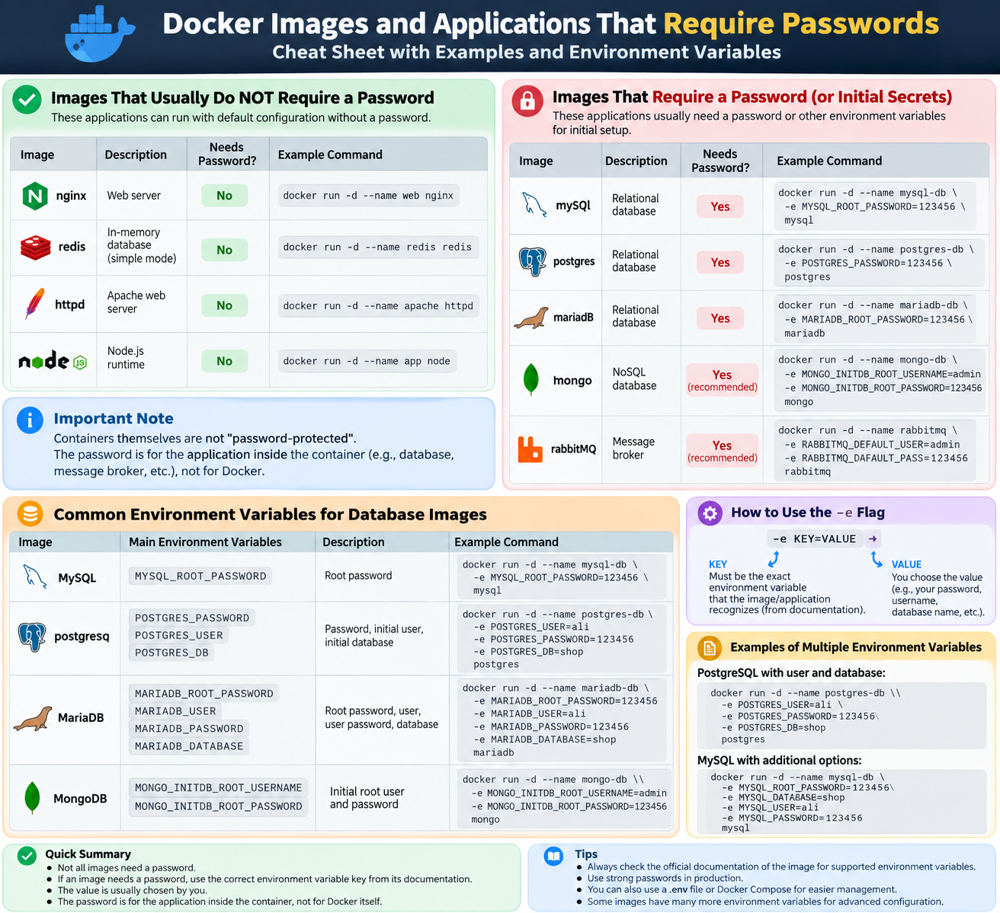

فقط یک اصلاح مفهومی مهم: **Containerها ذاتاً «رمزدار» و «بی‌رمز» نیستند.** این Application داخل Image است که ممکن است برای راه‌اندازی به Password یا Environment Variable نیاز داشته باشد.

می‌تونی این‌طوری دسته‌بندی کنی:

<p align="center">
	
</p>

### 1) ا-Imageهایی که معمولاً Password اولیه نمی‌خواهند

مثلاً Nginx:

```bash
docker run -d --name web nginx
```

اینجا `nginx` بدون Password بالا می‌آید.

یا Redis در حالت ساده:

```bash
docker run -d --name redis redis
```

البته Redis را می‌شود جداگانه با Authentication هم تنظیم کرد.

---

### 2) ا-Imageهایی که برای Initialize شدن معمولاً Password یا Secret می‌خواهند

مثلاً MySQL:

```bash
docker run -d \
  --name mysql-db \
  -e MYSQL_ROOT_PASSWORD=123456 \
  mysql
```

اینجا:

```text
KEY   = MYSQL_ROOT_PASSWORD
VALUE = 123456
```

---

PostgreSQL:

```bash
docker run -d \
  --name postgres-db \
  -e POSTGRES_PASSWORD=123456 \
  postgres
```

اینجا:

```text
KEY   = POSTGRES_PASSWORD
VALUE = 123456
```

---

MariaDB:

```bash
docker run -d \
  --name mariadb-db \
  -e MARIADB_ROOT_PASSWORD=123456 \
  mariadb
```

---

### 3) Imageهایی که چند Environment Variable برای ساخت User/Database می‌گیرند

مثلاً PostgreSQL:

```bash
docker run -d \
  --name postgres-db \
  -e POSTGRES_USER=ali \
  -e POSTGRES_PASSWORD=123456 \
  -e POSTGRES_DB=shop \
  postgres
```

اینجا Image سه KEY مشخص را می‌شناسد:

```text
POSTGRES_USER
POSTGRES_PASSWORD
POSTGRES_DB
```

ولی Valueها را تو انتخاب کردی:

```text
ali
123456
shop
```

---

پس قانون اصلی اینه:

```text
-e KEY=VALUE
```

- `KEY` → معمولاً از مستندات همان Image می‌آید و دلخواه نیست.
- `VALUE` → معمولاً خودت تعیین می‌کنی.

و این هم خیلی مهمه:

```text
Password مربوط به Application است،
نه خود Container.
```

مثلاً:

```text
MYSQL_ROOT_PASSWORD
```

پسورد `root` داخل MySQL است، نه پسورد ورود به Container.

خلاصه‌ی ذهنی:

```text
nginx
→ معمولاً بدون Password

mysql
→ MYSQL_ROOT_PASSWORD

postgres
→ POSTGRES_PASSWORD

mariadb
→ MARIADB_ROOT_PASSWORD
```

