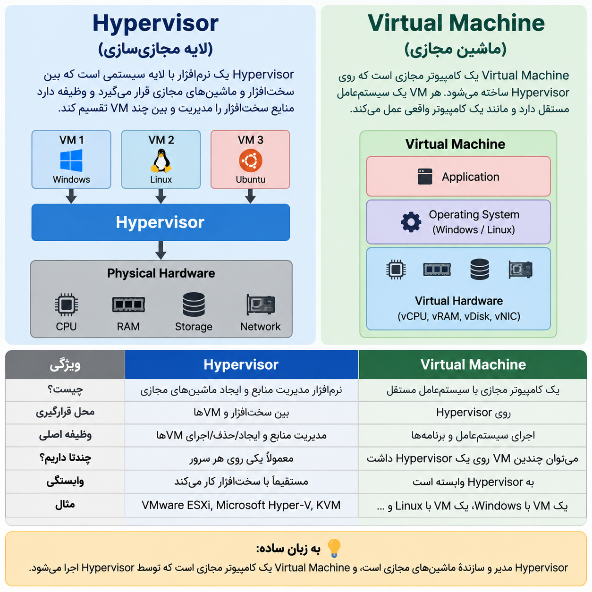

## تفاوت hyper visor and virtual machine
<p align="center">
	
</p>


### **Hypervisor چیست؟**

Hypervisor یک نرم‌افزار یا لایه مدیریتی است که روی سخت‌افزار قرار می‌گیرد و منابع سرور (CPU، RAM، Storage) را بین چند **Virtual Machine** تقسیم می‌کند.

مثال:

```
Physical Server
       ↓
   Hypervisor
       ↓
 VM1   VM2   VM3
```

یعنی **Hypervisor سازنده و مدیر ماشین‌های مجازی است.**

---

### **Virtual Machine چیست؟**

Virtual Machine یک کامپیوتر مجازی است که روی Hypervisor ساخته می‌شود و مثل یک کامپیوتر واقعی سیستم‌عامل و برنامه اجرا می‌کند.

مثال:

```
VM
↓
Windows / Linux
↓
Applications
```

---

### تفاوت خیلی ساده:

||Hypervisor|Virtual Machine|
|---|---|---|
|چی هست؟|مدیر و سازنده VMها|یک کامپیوتر مجازی|
|وظیفه|تقسیم منابع سخت‌افزار|اجرای سیستم‌عامل و برنامه|
|تعداد|معمولاً یک Hypervisor روی سرور|چند VM روی یک Hypervisor|
|مثال|VMware ESXi، KVM، Hyper-V|Ubuntu VM، Windows VM|

**خلاصه یک جمله‌ای:**

> Hypervisor مثل مدیر یک ساختمان است؛ Virtual Machine مثل واحدهای داخل آن ساختمان. 🏢
