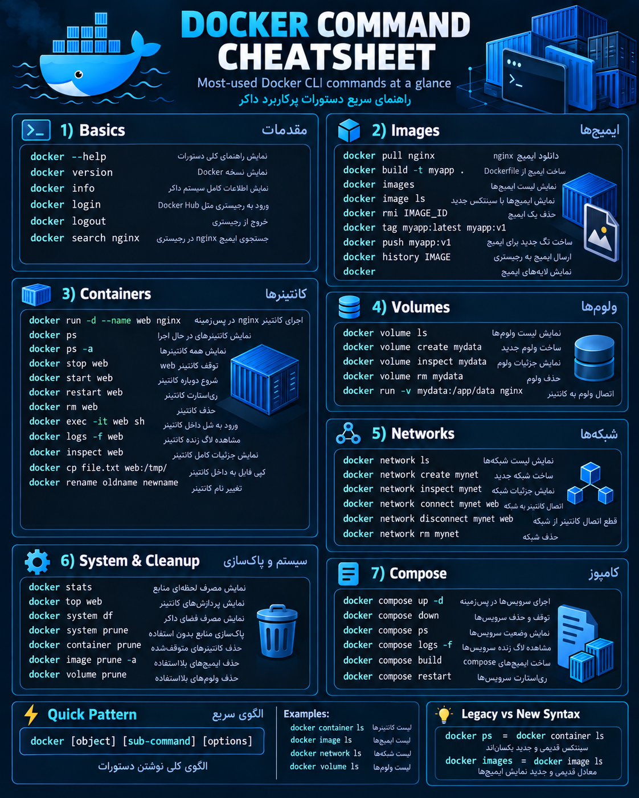

# Docker Command Cheat Sheet

<p align="center">
	
</p>


## ساختار کلی دستورات Docker

تقریباً بیشتر دستورات Docker از این الگو پیروی می‌کنند:

```bash
docker [object] [sub-command] [options]
```

مثال:

```bash
docker container ls
```

یعنی:

- `docker` → ابزار اصلی Docker
    
- `container` → چیزی که می‌خواهیم مدیریت کنیم (Object)
    
- `ls` → عملیاتی که انجام می‌دهیم (Sub-command)
    

---

# 1) Basics (مقدمات Docker)

## نمایش راهنمای Docker

```bash
docker --help
```

کاربرد:  
نمایش لیست دستورات و گزینه‌های Docker.

---

## نمایش نسخه Docker

```bash
docker version
```

کاربرد:  
نمایش نسخه Docker Client و Docker Engine.

---

## نمایش اطلاعات سیستم Docker

```bash
docker info
```

کاربرد:  
نمایش اطلاعات کامل Docker Engine، تعداد کانتینرها، ایمیج‌ها، Storage و تنظیمات.

---

## ورود به Docker Registry

```bash
docker login
```

کاربرد:  
ورود به Docker Hub یا Registry دیگر برای دانلود و ارسال Image.

---

## خروج از Registry

```bash
docker logout
```

کاربرد:  
خروج از حساب کاربری Docker.

---

## جستجوی Image

```bash
docker search nginx
```

کاربرد:  
جستجوی Imageهای موجود در Docker Hub.

مثال:

```bash
docker search nginx
```

برای پیدا کردن Image مربوط به Nginx.

---

# 2) Images (ایمیج‌ها)

Image در Docker یک Template یا Blueprint است که از روی آن Container ساخته می‌شود.

---

## دانلود Image

```bash
docker pull nginx
```

کاربرد:  
دانلود Image از Registry.

مثال:

```bash
docker pull nginx
```

ا-Image رسمی Nginx را دانلود می‌کند.

---

## ساخت Image

```bash
docker build -t myapp .
```

کاربرد:  
ساخت Image از روی Dockerfile.

توضیح:

- `-t` → تعیین نام و Tag
    
- `.` → مسیر Dockerfile فعلی
    

---

## نمایش Imageها

```bash
docker images
```

یا:

```bash
docker image ls
```

کاربرد:  
نمایش لیست Imageهای موجود روی سیستم.

---

## حذف Image

```bash
docker rmi IMAGE_ID
```

کاربرد:  
حذف یک Image.

مثال:

```bash
docker rmi nginx
```

---

## ساخت Tag جدید برای Image

```bash
docker tag myapp:latest myapp:v1
```

کاربرد:  
ایجاد نسخه جدید برای یک Image.

---

## ارسال Image به Registry

```bash
docker push myapp:v1
```

کاربرد:  
آپلود Image به Docker Hub یا Registry.

---

## مشاهده تاریخچه Image

```bash
docker history IMAGE
```

کاربرد:  
نمایش Layerهای تشکیل‌دهنده Image.

---

# 3) Containers (کانتینرها)

ا-Container محیط اجرای Image است.

ا-Image = برنامه آماده

ا-Container = اجرای واقعی آن برنامه

---

## اجرای Container

```bash
docker run -d --name web nginx
```

کاربرد:

اجرای یک Container از Image nginx.

توضیح:

- `-d` → اجرا در پس‌زمینه
    
- `--name` → تعیین نام Container
    

---

## نمایش Containerهای فعال

```bash
docker ps
```

کاربرد:  
نمایش Containerهای در حال اجرا.

---

## نمایش همه Containerها

```bash
docker ps -a
```

کاربرد:  
نمایش Containerهای فعال و متوقف‌شده.

---

## توقف Container

```bash
docker stop web
```

کاربرد:  
متوقف کردن Container.

---

## شروع دوباره Container

```bash
docker start web
```

کاربرد:  
اجرای دوباره Container متوقف‌شده.

---

## Restart کردن Container

```bash
docker restart web
```

کاربرد:  
خاموش و روشن کردن Container.

---

## حذف Container

```bash
docker rm web
```

کاربرد:  
حذف Container.

---

## ورود به داخل Container

```bash
docker exec -it web sh
```

کاربرد:  
باز کردن Shell داخل Container.

مثلاً برای اجرای دستورات Linux داخل Container.

---

## مشاهده Log

```bash
docker logs -f web
```

کاربرد:  
دیدن خروجی و خطاهای برنامه.

`-f` یعنی دنبال کردن لحظه‌ای Log.

---

## مشاهده جزئیات Container

```bash
docker inspect web
```

کاربرد:  
نمایش اطلاعات کامل Container مثل:

- IP
    
- Network
    
- Volume
    
- Configuration
    

---

## کپی فایل به Container

```bash
docker cp file.txt web:/tmp/
```

کاربرد:  
انتقال فایل از Host به Container.

---

## تغییر نام Container

```bash
docker rename oldname newname
```

کاربرد:  
تغییر نام Container.

---

# 4) Volumes (ذخیره‌سازی)

Volume برای نگهداری دائمی اطلاعات Container استفاده می‌شود.

چون با حذف Container اطلاعات داخل آن از بین می‌رود.

---

## نمایش Volumeها

```bash
docker volume ls
```

---

## ساخت Volume

```bash
docker volume create mydata
```

---

## مشاهده اطلاعات Volume

```bash
docker volume inspect mydata
```

---

## حذف Volume

```bash
docker volume rm mydata
```

---

## اتصال Volume به Container

```bash
docker run -v mydata:/app/data nginx
```

کاربرد:

اتصال فضای ذخیره‌سازی به Container.

---

# 5) Networks (شبکه‌ها)

Network باعث ارتباط Containerها با هم می‌شود.

---

## نمایش Networkها

```bash
docker network ls
```

---

## ساخت Network

```bash
docker network create mynet
```

---

## مشاهده جزئیات Network

```bash
docker network inspect mynet
```

---

## اتصال Container به Network

```bash
docker network connect mynet web
```

---

## قطع اتصال

```bash
docker network disconnect mynet web
```

---

## حذف Network

```bash
docker network rm mynet
```

---

# 6) System & Cleanup (مدیریت و پاک‌سازی)

## نمایش مصرف منابع

```bash
docker stats
```

نمایش:

- CPU
    
- RAM
    
- Network
    
- Disk
    

---

## نمایش Processهای Container

```bash
docker top web
```

---

## نمایش مصرف فضای Docker

```bash
docker system df
```

---

## پاک‌سازی منابع اضافی

```bash
docker system prune
```

حذف:

- Containerهای متوقف
    
- Networkهای بلااستفاده
    
- Cache
    

---

## حذف Containerهای متوقف

```bash
docker container prune
```

---

## حذف Imageهای بلااستفاده

```bash
docker image prune -a
```

---

## حذف Volumeهای بلااستفاده

```bash
docker volume prune
```

---

# 7) Docker Compose

ا-Compose برای اجرای چند سرویس با یک فایل YAML استفاده می‌شود.

مثلاً:

- Backend
    
- Database
    
- Redis
    
- Nginx
    

---

## اجرای سرویس‌ها

```bash
docker compose up -d
```

---

## توقف سرویس‌ها

```bash
docker compose down
```

---

## مشاهده وضعیت سرویس‌ها

```bash
docker compose ps
```

---

## مشاهده Log سرویس‌ها

```bash
docker compose logs -f
```

---

## ساخت Imageهای Compose

```bash
docker compose build
```

---

## Restart سرویس‌ها

```bash
docker compose restart
```

---

# تفاوت Syntax قدیمی و جدید Docker

قدیمی:

```bash
docker ps
```

جدید:

```bash
docker container ls
```

هر دو یک کار انجام می‌دهند.

---

قدیمی:

```bash
docker images
```

جدید:

```bash
docker image ls
```

---

# خلاصه ذهنی Docker

```
Docker

│
├── Image
│     ├── pull
│     ├── build
│     ├── ls
│     └── rm
│
├── Container
│     ├── run
│     ├── ps
│     ├── stop
│     ├── exec
│     └── logs
│
├── Volume
│     ├── create
│     ├── ls
│     └── rm
│
├── Network
│     ├── create
│     ├── connect
│     └── rm
│
└── Compose
      ├── up
      ├── down
      └── build
```

این دقیقاً همان چیزی است که یک DevOps Engineer در مرحله ابتدایی Docker باید در ذهن داشته باشد.
