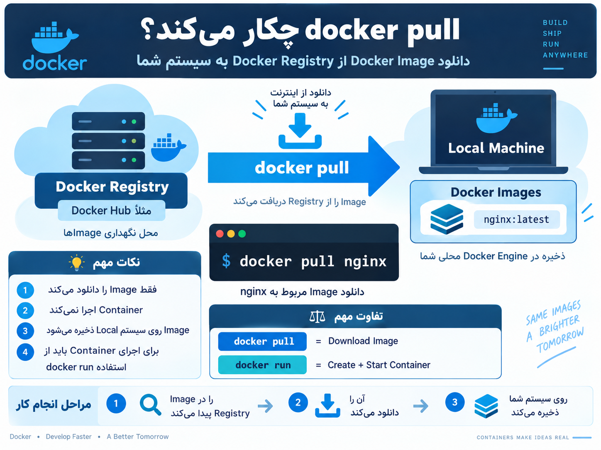

## دستور docker pull چیست؟

---

<p align="center">
	
</p>

حتماً. مرتبط با همین عکس، `docker pull` این کار رو انجام می‌ده:

وقتی دستور زیر رو می‌زنی:

```bash
docker pull nginx
# Download the nginx image from a Docker Registry
```

ا-Docker Engine می‌ره سراغ یک `Docker Registry` مثل `Docker Hub` و Image موردنظر رو پیدا می‌کنه.

مسیر دقیق همون چیزیه که تو عکس می‌بینی:

```text
Docker Registry
      |
      | docker pull
      v
Docker Image
      |
      v
Stored on Local Machine
```

یعنی:

`Docker Registry`  
محلیه که Imageها اونجا نگهداری می‌شن.

`docker pull`  
دستور دانلود Image از Registry هست.

`Docker Image`  
بعد از دانلود روی سیستم تو ذخیره می‌شه.

مثلاً:

```bash
docker pull nginx
```

معمولاً یعنی:

```text
nginx:latest
```

بعد از دانلود می‌تونی چک کنی Image اومده یا نه:

```bash
docker image ls
# List local Docker images
```

نکته خیلی مهمی که خود عکس هم نشون می‌ده:

```text
docker pull
=
Download Image
```

ولی:

```text
docker run
=
Create + Start Container
```

پس `docker pull` خودش Container اجرا نمی‌کنه؛ فقط Image رو میاره روی سیستم تا بعداً بتونی با `docker run` از روش Container بسازی.

مثلاً مسیر کامل:

```text
docker pull nginx
        |
        v
nginx Image downloaded
        |
        v
docker run nginx
        |
        v
nginx Container running
```

به صورت خلاصه

`docker pull downloads a Docker image from a registry and stores it on the local machine.`
