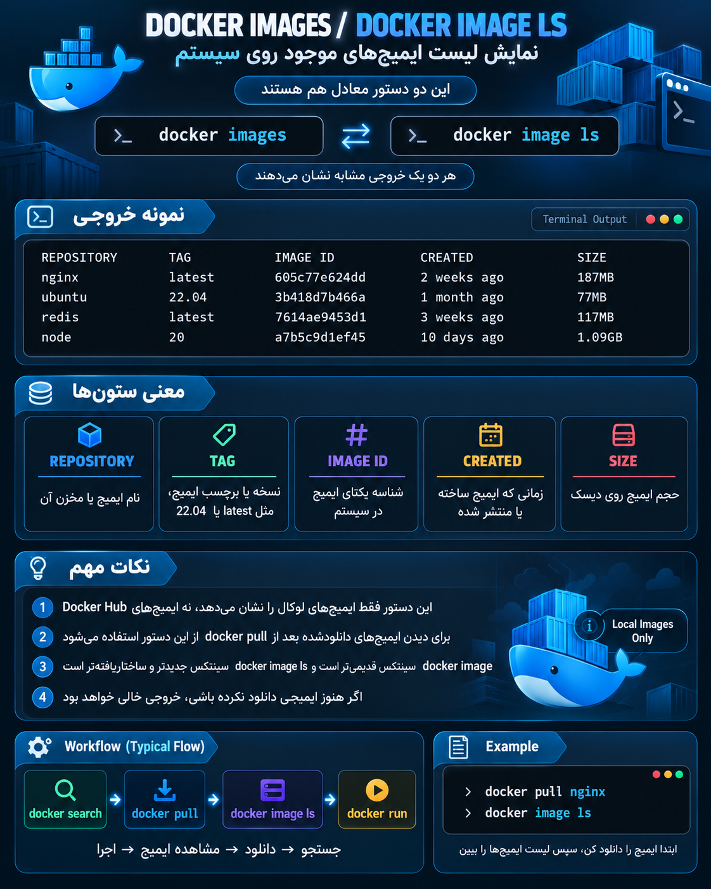

<p align="center">
	
</p>


دستور:

```bash
docker images
```

یا شکل جدیدتر:

```bash
docker image ls
```

هر دو **یک کار انجام می‌دهند**:

> نمایش لیست Imageهایی که روی سیستم (Local Docker Engine) داری.

یعنی بر خلاف:

```bash
docker search
```

که داخل Docker Hub جستجو می‌کرد، این دستور فقط **Imageهای دانلود شده روی کامپیوتر خودت** را نشان می‌دهد.

---

## مثال

فرض کن قبلاً زدی:

```bash
docker pull nginx
```

حالا:

```bash
docker images
```

خروجی:

```text
REPOSITORY    TAG       IMAGE ID       CREATED        SIZE
nginx         latest    605c77e624dd   2 weeks ago    187MB
ubuntu        22.04     3b418d7b466a   1 month ago    77MB
redis         latest    7614ae9453d1   3 weeks ago    117MB
```

---

## معنی ستون‌ها:

### 1) REPOSITORY

نام Image:

مثلاً:

```
nginx
ubuntu
redis
```

---

### 2) TAG

نسخه یا برچسب Image.

مثلاً:

```
latest
22.04
v1
```

اگر هنگام Pull چیزی ننویسی:

```bash
docker pull nginx
```

معمولاً Docker می‌گیرد:

```
nginx:latest
```

ولی می‌توانی نسخه مشخص بگیری:

```bash
docker pull nginx:1.25
```

---

### 3) IMAGE ID

شناسه داخلی Image.

مثلاً:

```
605c77e624dd
```

Docker از این برای شناسایی Image استفاده می‌کند.

مثلاً حذف:

```bash
docker rmi 605c77e624dd
```

---

### 4) CREATED

زمان ساخته شدن Image.

---

### 5) SIZE

حجم Image روی دیسک.

---

## تفاوت ذهنی این سه دستور:

### 1) جستجو در اینترنت Docker Hub:

```bash
docker search nginx
```

یعنی:

«چه Imageهایی وجود دارند؟»

⬇️

---

### 2) دانلود Image:

```bash
docker pull nginx
```

یعنی:

«این Image را بیاور روی سیستم من»

⬇️

---

### 3) دیدن Imageهای موجود:

```bash
docker image ls
```

یعنی:

«چه Imageهایی الان روی سیستم من هستند؟»

---

## یک نکته DevOps مهم:

`docker images` یک دستور قدیمی (Legacy) است.

مدل جدید Docker:

```bash
docker image ls
```

است.

چون Docker الان دستوراتش را بر اساس Object دسته‌بندی کرده:

```
docker
   |
   +── image
          |
          +── ls
          +── pull
          +── rm
          +── inspect
```

یعنی:

```bash
docker image ls
```

= لیست Imageها

```bash
docker image pull nginx
```

= دانلود Image

```bash
docker image rm nginx
```

= حذف Image

این مدل را یاد بگیری، بعداً با `container`, `network`, `volume` هم همان الگو تکرار می‌شود.
