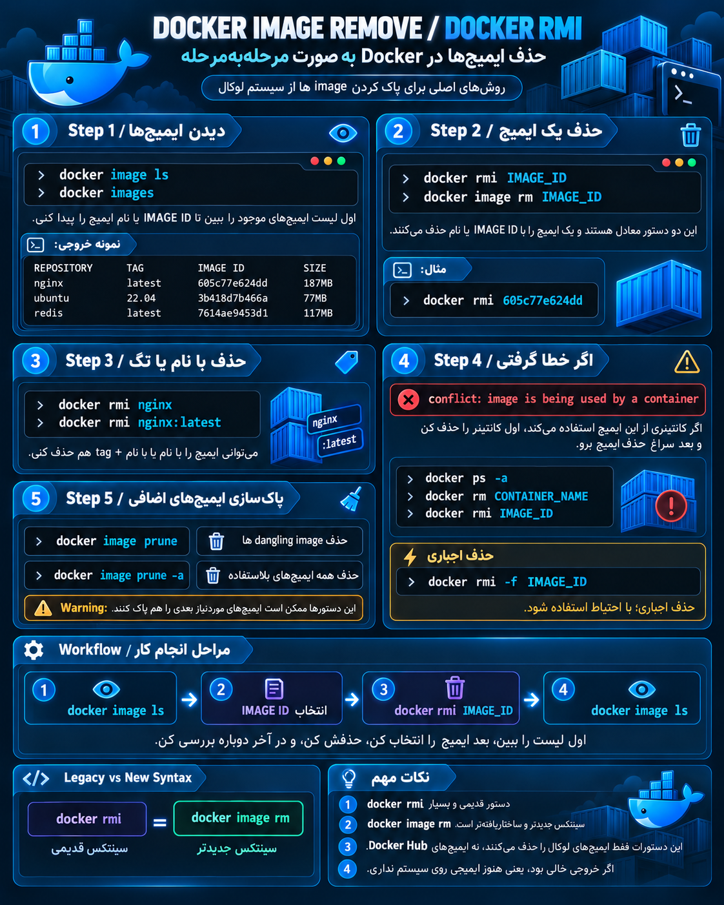

## حذف image  به صورت مرحله ای 


<p align="center">
	
</p>


```bash
# نمایش Image های موجود روی سیستم
docker image ls


# حذف Image با ID یا نام
docker image rm IMAGE_ID


# حذف Image با دستور قدیمی (Legacy)
docker rmi IMAGE_ID


# حذف چند Image همزمان
docker rmi IMAGE_ID1 IMAGE_ID2


# حذف اجباری Image
docker rmi -f IMAGE_ID


# حذف Image با نام و Tag
docker rmi nginx:latest


# پاک کردن Image های بلااستفاده (Dangling)
docker image prune


# پاک کردن تمام Image های بلااستفاده
docker image prune -a
```

---

## توضیح `docker rmi`

ساختار:

```bash
docker rmi [OPTIONS] IMAGE
```

مثال:

```bash
docker rmi nginx
```

یعنی:

> Image با نام nginx را حذف کن.

یا:

```bash
docker rmi 605c77e624dd
```

یعنی:

> Image با این ID را حذف کن.

---

## تفاوت `docker rmi` و `docker image rm`

هیچ تفاوت عملی ندارند:

قدیمی:

```bash
docker rmi nginx
```

جدید:

```bash
docker image rm nginx
```

هر دو به یک دستور داخلی Docker وصل می‌شوند.

---

## Workflow واقعی:

```text
1) دیدن Image ها

docker images
       |
       ↓

2) انتخاب Image

IMAGE ID / NAME

       |
       ↓

3) حذف Image

docker rmi IMAGE_ID

       |
       ↓

4) بررسی دوباره

docker image ls
```

---

## یک نکته مهم:

اگر Image هنوز توسط یک Container استفاده شود:

مثلاً:

```bash
docker rmi nginx
```

ممکن است خطا بدهد:

```text
conflict: unable to delete image because it is being used by a container
```

اول Container را حذف کن:

```bash
docker rm container_name
```

بعد:

```bash
docker rmi nginx
```

---

پس برای یادگیری Docker این را حفظ کن:

```text
docker images
        ↓
دیدن Image ها

docker pull
        ↓
آوردن Image

docker run
        ↓
ساخت Container

docker rmi
        ↓
حذف Image
```

`docker rmi` یکی از همان commandهایی است که در کار روزمره DevOps زیاد می‌بینی.
