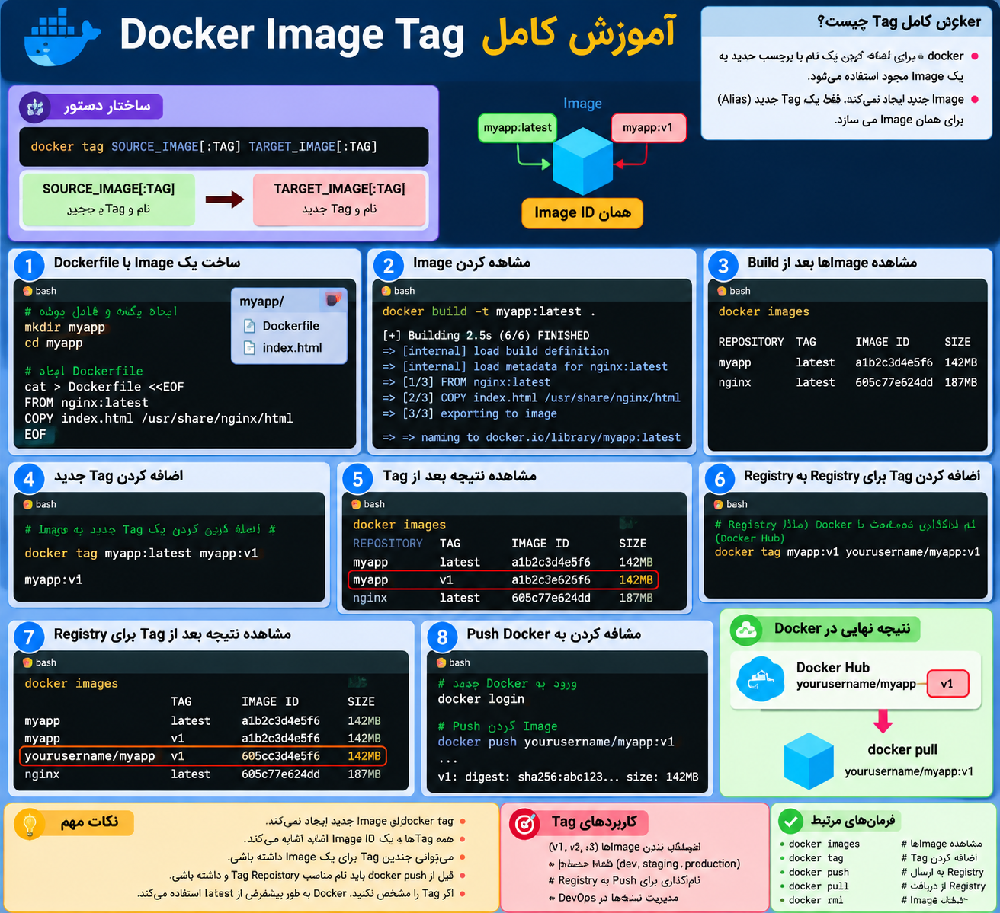

## دستور docker tag چیست


<p align="center">
	
</p>


دستور:

```bash
docker tag
```

برای **اضافه کردن یک Tag (برچسب) جدید به یک Docker Image** استفاده می‌شود.

به زبان ساده:

> ا-`docker tag` یک Image موجود را کپی نمی‌کند؛ فقط یک **نام یا برچسب جدید (Alias)** برای همان Image ایجاد می‌کند.

---

## ساختار دستور

```bash
docker tag SOURCE_IMAGE[:TAG] TARGET_IMAGE[:TAG]
```

یعنی:

```text
Image فعلی  →  نام جدید + Tag جدید
```

---

## مثال ساده

فرض کن این Image را داری:

```bash
docker image ls
```

خروجی:

```text
REPOSITORY   TAG       IMAGE ID
myapp        latest    abc123456
```

حالا می‌خواهی یک Tag جدید بسازی:

```bash
docker tag myapp:latest myapp:v1
```

حالا:

```bash
docker image ls
```

می‌بینی:

```text
REPOSITORY   TAG       IMAGE ID
myapp        latest    abc123456
myapp        v1        abc123456
```

دقت کن:

```
IMAGE ID یکی است
```

یعنی دو Image جدا نیستند.

فقط دو اسم مختلف برای یک Image داری.

---

## کاربرد مهم Docker Tag در DevOps

مهم‌ترین استفاده‌اش قبل از `docker push` است.

فرض کن Image ساختی:

```bash
docker build -t myapp .
```

الان اسمش:

```text
myapp:latest
```

است.

ولی برای Push به Docker Hub باید نام Repository خودت را داشته باشد:

مثلاً:

```bash
docker tag myapp:latest username/myapp:v1
```

حالا:

```bash
docker image ls
```

می‌بینی:

```text
REPOSITORY          TAG
myapp               latest
username/myapp      v1
```

بعد:

```bash
docker push username/myapp:v1
```

---

## ا-Tag معمولاً برای Version بندی استفاده می‌شود

مثلاً:

```bash
nginx:latest
nginx:1.25
nginx:1.26
```

یا:

```bash
myapp:v1
myapp:v2
myapp:production
myapp:staging
```

---

## ارتباط با Registry

Workflow واقعی:

```
Dockerfile
    |
    ↓
docker build
    |
    ↓
myapp:latest
    |
    ↓
docker tag
    |
    ↓
username/myapp:v1
    |
    ↓
docker push
    |
    ↓
Docker Hub
```

---

## چند نکته مهم

### 1) ا-Tag کردن Image جدید نمی‌سازد

اشتباه:

```
myapp:v1 = Image جدید
```

درست:

```
myapp:latest
       |
       |
       +---- myapp:v1
```

هر دو به یک IMAGE ID اشاره می‌کنند.

---

### 2) اگر Tag ندهی، Docker از latest استفاده می‌کند

مثلاً:

```bash
docker pull nginx
```

معادل است با:

```bash
docker pull nginx:latest
```

---

### 3) دیدن Tagها:

```bash
docker image ls
```

---

خلاصه ذهنی:

```
docker build
      ↓
myapp:latest

docker tag
      ↓
username/myapp:v1

docker push
      ↓
Registry
```

در مسیر DevOps، `docker tag` معمولاً پل بین **ساخت Image محلی** و **انتشار Image در Registry** است.
