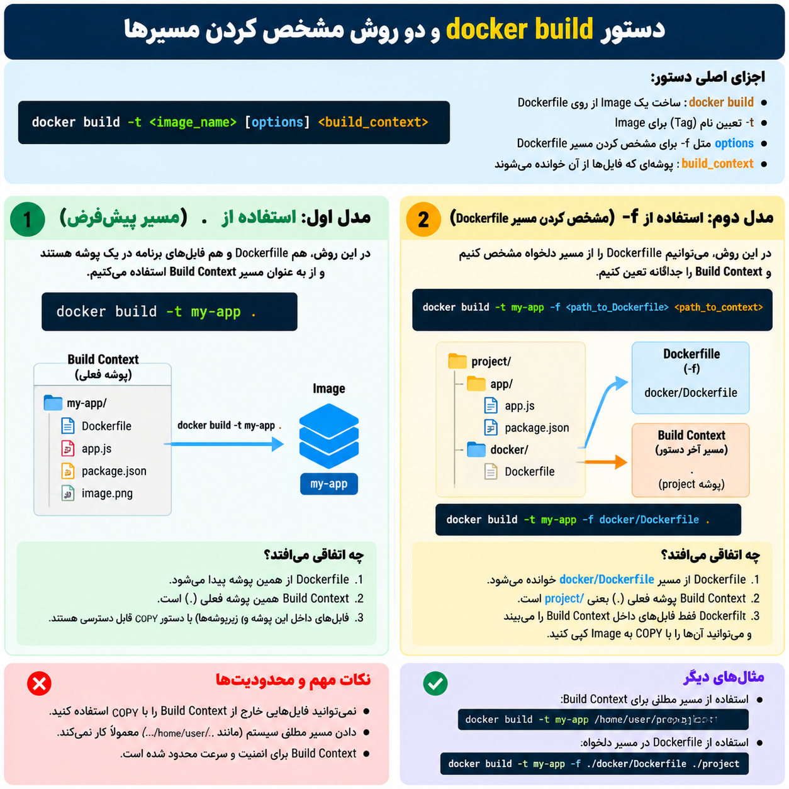

## ا-Build Context چیست؟ و انواع مدل هایی که میشه 

خیلی ساده:

ا-**Build Context یعنی محدوده‌ای از فایل‌های کامپیوتر ما که Docker هنگام ساخت Image اجازه دارد آن‌ها را ببیند و از آن‌ها استفاده کند.** و در قسمت دوم دستور docker build که برایه ساختن   image از رویه داکر فایله ما مشخص میکنیم که مسیر و PATH اون build context مون چی باشه تا داکر هنگام ساخت ایمیج به چه فایل هایی دسترسی داشته باشد

وقتی می‌زنی:

```
docker build -t my-app .
```

آن نقطه (`.`) یعنی:

**"پوشه فعلی من، Build Context است."**

دستور:

```
docker build -t name .
```

معنی:
##### ا-<MARK>این ساختار درون دستور docker build رو بفهمید build context رو فهمیدید</mark> 
- ا-`docker build` → ساختن یک **Image** از روی Dockerfile
- ا-`-t` → گذاشتن **Tag (نام و نسخه)** برای Image
- ا-`name` → اسم Image
- ا-`.` → Build Context (پوشه‌ای که فایل‌های پروژه و Dockerfile را از آن می‌خواند)

مثال:

```
docker build -t my-app .
```

یعنی:

**از Dockerfile موجود در این پوشه یک Image بساز و اسمش را `my-app` بگذار.**

---

مثال:

ساختار:

```
my-app/
│
├── Dockerfile
├── app.js
├── package.json
└── image.png
```

تو داخل همین پوشه هستی:

```
cd my-app
```

و می‌زنی:

```
docker build -t my-app .
```

حالا Build Context این است:

```
my-app/
│
├── Dockerfile
├── app.js
├── package.json
└── image.png
```

Docker می‌تواند این فایل‌ها را با `COPY` بردارد:

```
COPY app.js .
COPY package.json .
```

---

اما اگر ساختار این باشد:
- ۱- <mark> suppppppper mmohem</mark>
```
project/
│
├── backend/
│   ├── app.js
│   └── Dockerfile
│
└── secret.txt
```

و بروی داخل `backend` و بزنی:

```
docker build -t app .
```

Build Context فقط این است:

```
backend/
│
├── app.js
└── Dockerfile
```

Docker دیگر به `secret.txt` دسترسی ندارد.

---

چرا مهم است؟

چون Docker برای امنیت و سرعت، فقط فایل‌های داخل Build Context را می‌بیند.

مثلاً این اشتباه است:

```
COPY /home/user/secret.txt .
```

چون آن فایل خارج از Build Context است.

---

پس خلاصه:

**Build Context = پوشه‌ای که Docker هنگام build به عنوان منبع فایل‌ها می‌بیند.**

و در دستور:

```
docker build -t name PATH
```

آن `PATH` آخر، همان Build Context است.

---
### انواع مدل هایه  دادن مسیر build contect در دستور docker build:

<p align="center">
	
</p>
