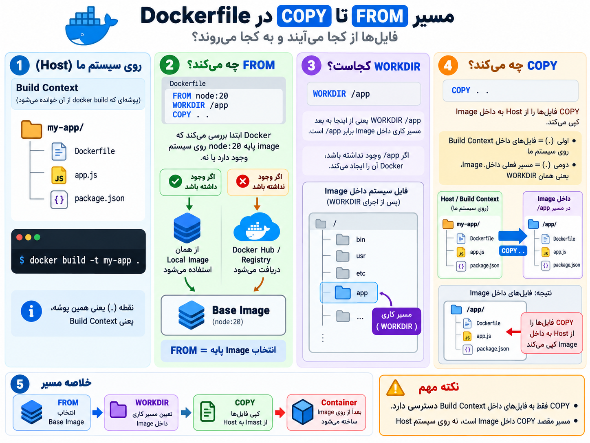

## COPY Instruction

**ساختار:**

```
COPY source destination
```

یا:

```
COPY مبدا مقصد
```

---

## کاربرد:

ا-`COPY` برای **انتقال فایل‌ها و پوشه‌ها از Host (کامپیوتر ما) به داخل Image** استفاده می‌شود.

یعنی به Docker می‌گوییم:

**«این فایل‌های پروژه من را بردار و داخل Image قرار بده.»**

---

مثال:

ساختار پروژه روی سیستم ما:

```
my-app/
│
├── Dockerfile
├── app.js
└── package.json
```

Dockerfile:

```
FROM node:20

WORKDIR /app

COPY app.js .
```

بعد از build:

```
داخل Image:

/app
│
└── app.js
```

---

### COPY . .

یکی از رایج‌ترین حالت‌ها:

```
COPY . .
```

معنی:

```
اولی (.)
↓
تمام فایل‌های Build Context روی سیستم ما

دومی (.)
↓
مسیر فعلی داخل Image (WORKDIR)
```

مثلاً:

```
FROM node:20

WORKDIR /app

COPY . .
```

نتیجه:

```
Container:

/app
│
├── app.js
├── package.json
└── Dockerfile
```

---

## نکته مهم:

ا-`COPY` از **Host مستقیم به Container نمی‌رود.**

مسیرش این است:

```
Host
 |
 | COPY
 ↓
Image
 |
 | docker run
 ↓
Container
```

---

## ارتباط با WORKDIR:

مثلاً:

```
FROM node:20

WORKDIR /app

COPY package.json .
```

یعنی:

1. داخل Image برو به `/app`
2. فایل `package.json` را از Host بردار
3. داخل `/app` قرار بده

نتیجه:

```
/app
└── package.json
```

---

خلاصه ذهنی:

- `FROM` → پایه را انتخاب می‌کند
- `WORKDIR` → محل کار داخل Image را مشخص می‌کند
- `COPY` → فایل‌های پروژه را از Host وارد Image می‌کند

یعنی:

```
Host files
    |
    | COPY
    ↓
Image (/app)
    |
    ↓
Container
```

----
### تا الان سه دستور العمل رو خوندیم بریم یه دوره ای بکنیم که چی شد تا اینجا

<p align="center">
	
</p>
