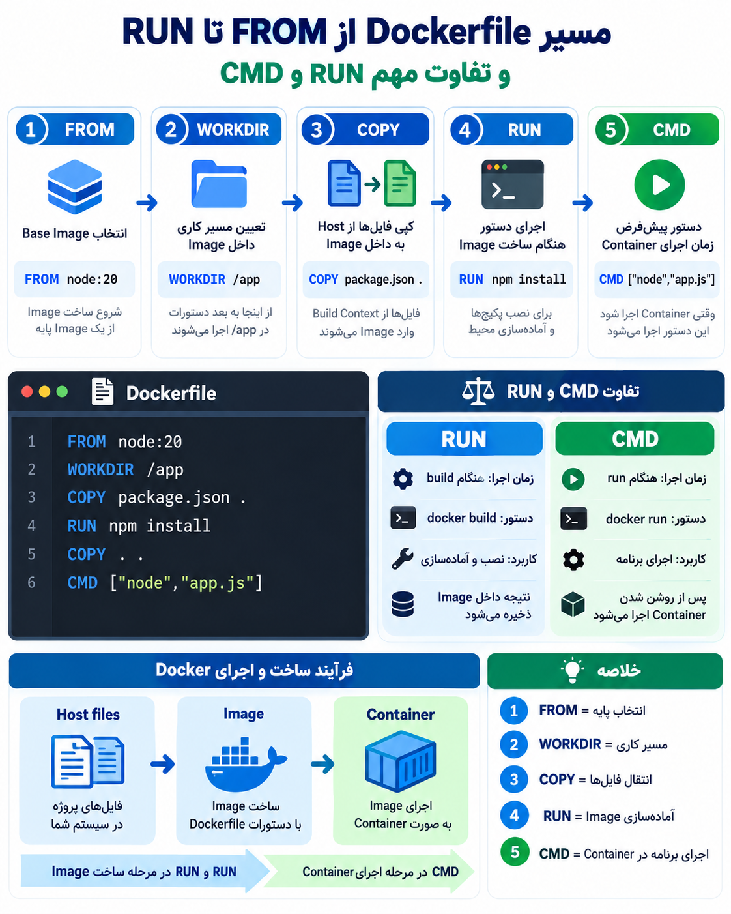

### حالا بریم سراغه فرقه دستورالعمل RUN  و در کدام خط میاید و چیکار میکند چه ساختاری دارد و مهمترین چیز فرقش با دستورالعمل CMD را باید درک کنید که هر کدام در چه زمانی اجرا میشن
---
- اینو یادت باشه RUN  همونطور که از اسمش روشه برایه زمان رانه همان موقعه ای که میخوای image رو بسازی ولی CMD در زمان اجرایه کانتینر اجرا میشه
---
## ۱-جایگاهش کجاست:

ا-`RUN` معمولاً **بعد از `COPY`** می‌آید، ولی قانون اجباری ندارد. جای آن بستگی به کاری دارد که می‌خواهی انجام بدهی.

یک ترتیب خیلی رایج در Dockerfile:

```
FROM node:20

WORKDIR /app

COPY package.json .

RUN npm install

COPY . .

CMD ["node","app.js"]
```

اینجا ترتیب:

1. `FROM` → انتخاب Base Image
2. `WORKDIR` → تعیین مسیر کاری
3. `COPY` → آوردن فایل‌های لازم از Host
4. `RUN` → نصب پکیج‌ها و آماده‌سازی Image
5. `COPY` → آوردن بقیه کد برنامه
6. `CMD` → مشخص کردن اجرای برنامه

---

چرا بعضی وقت‌ها `RUN` بعد از `COPY` می‌آید؟

چون `RUN` معمولاً نیاز دارد فایل‌هایی وجود داشته باشند.

مثلاً:

```
COPY package.json .
RUN npm install
```

یعنی:

- اول فایل لیست پکیج‌ها را بیاور
- بعد پکیج‌ها را نصب کن

---

ولی این هم ممکن است:

```
FROM ubuntu:24.04

RUN apt update && apt install nginx -y

WORKDIR /app

COPY . .
```

چون نصب nginx ربطی به فایل‌های پروژه ندارد.

پس قانون ذهنی:

**FROM → WORKDIR → COPY → RUN → CMD**

یک ترتیب رایج است، ولی `RUN` هر جایی می‌تواند بیاید که نیاز داری چیزی را هنگام ساخت Image اجرا کنی.

---
## ۲- ساختار و توضیحات تکمیلی 
## RUN Instruction

**ساختار:**

```
RUN command
```

یا:

```
RUN دستور
```

---

## کاربرد:

`RUN` برای **اجرا کردن دستورها هنگام ساخت Image** استفاده می‌شود.

یعنی Docker می‌گوید:

**«وقتی داری Image را می‌سازی، این دستور را اجرا کن و نتیجه‌اش را داخل Image ذخیره کن.»**

---

مثال ساده:

```
FROM ubuntu:24.04

RUN apt update
RUN apt install nginx -y
```

روند:

1. Docker از Ubuntu شروع می‌کند:

```
ubuntu:24.04
```

2. دستورهای `RUN` را اجرا می‌کند:

```
apt update
apt install nginx
```

3. یک Image جدید می‌سازد که داخل آن nginx نصب شده است.

---

مثال برای Node:

```
FROM node:20

WORKDIR /app

COPY package.json .

RUN npm install

COPY . .

CMD ["node","app.js"]
```

اینجا:

```
RUN npm install
```

یعنی:

«در زمان ساخت Image، پکیج‌های مورد نیاز برنامه را نصب کن.»

---

## فرق مهم RUN با CMD:

### RUN:

زمان **build** اجرا می‌شود:

```
docker build
```

مثلاً:

```
RUN npm install
```

نتیجه داخل Image ذخیره می‌شود.

---

### CMD:

زمان **اجرای Container** اجرا می‌شود:

```
docker run
```

مثلاً:

```
CMD ["node","app.js"]
```

یعنی وقتی Container روشن شد، برنامه را اجرا کن.

---

تصویر ذهنی:

```
FROM
 ↓
انتخاب Base Image

WORKDIR
 ↓
انتخاب مسیر کار

COPY
 ↓
آوردن فایل‌های برنامه

RUN
 ↓
نصب و آماده‌سازی محیط

CMD
 ↓
اجرای برنامه هنگام روشن شدن Container
```

خلاصه:

**RUN = آماده کردن Image**  
**CMD = اجرای برنامه داخل Container**

---
### این عکسی از خلاصه دستور عمل FROM تا RUN و مقایسه فرق RUN CMD 

<p align="center">
	
</p>
