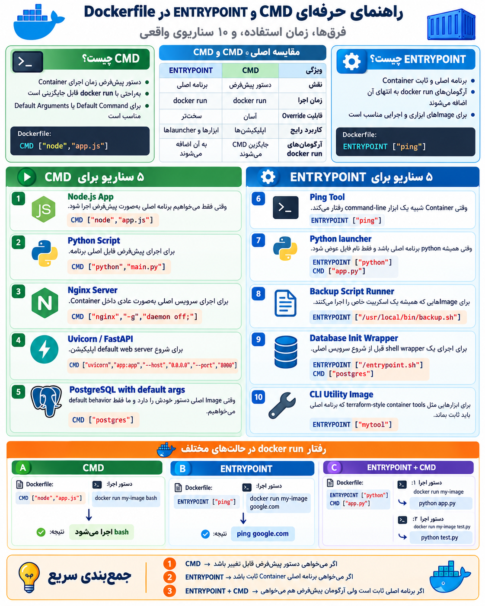

## ENTRYPOINT Instruction

**ساختار:**

```
ENTRYPOINT ["executable","parameter"]
```

---

## کاربرد:

ا-`ENTRYPOINT` مشخص می‌کند **برنامه اصلی (Main Process) داخل Container چیست.**

یعنی وقتی Container اجرا می‌شود، این دستور همیشه به عنوان برنامه اصلی اجرا می‌شود.

مثال:

```
FROM ubuntu

ENTRYPOINT ["ping"]
```

حالا:

```
docker run my-image google.com
```

در واقع اجرا می‌شود:

```
ping google.com
```

چون `google.com` به انتهای `ENTRYPOINT` اضافه می‌شود.

---

# فرق ENTRYPOINT و CMD

هر دو برای زمان اجرای Container هستند، نه زمان ساخت Image.

اما تفاوت اصلی:

## CMD

می‌گوید:

**«دستور پیش‌فرض من این است، ولی کاربر می‌تواند عوضش کند.»**

مثال:

```
CMD ["nginx"]
```

اجرا:

```
docker run my-image
```

نتیجه:

```
nginx
```

اما اگر بزنی:

```
docker run my-image bash
```

CMD جایگزین می‌شود:

```
bash
```

---

## ENTRYPOINT

می‌گوید:

**«این برنامه اصلی Container است و معمولاً تغییر نمی‌کند.»**

مثال:

```
ENTRYPOINT ["ping"]
```

اجرا:

```
docker run my-image google.com
```

نتیجه:

```
ping google.com
```

---

# ترکیب ENTRYPOINT و CMD (خیلی رایج)

مثال:

```
FROM ubuntu

ENTRYPOINT ["ping"]

CMD ["localhost"]
```

حالا:

بدون آرگومان:

```
docker run my-image
```

اجرا می‌شود:

```
ping localhost
```

با آرگومان:

```
docker run my-image google.com
```

اجرا می‌شود:

```
ping google.com
```

یعنی:

- `ENTRYPOINT` → برنامه اصلی
- `CMD` → مقدار پیش‌فرض

---

## تصویر ذهنی:

```
CMD
↓
"اگر چیزی نگفتی، این را اجرا کن"


ENTRYPOINT
↓
"من برنامه اصلی هستم"
```

---

در پروژه‌های واقعی:

مثلاً یک API:

```
ENTRYPOINT ["python"]

CMD ["app.py"]
```

یعنی:

حالت عادی:

```
python app.py
```

ولی می‌توانی:

```
docker run image test.py
```

و تبدیل شود به:

```
python test.py
```

---

خلاصه:
برای شروع Dockerfile، اول `CMD` را خوب یاد بگیر؛ `ENTRYPOINT` بیشتر وقتی مهم می‌شود که شروع به ساخت Imageهای حرفه‌ای‌تر و Production کنی.

<p align="center">
	
</p>
