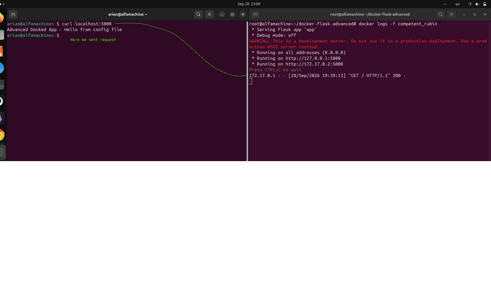

### بریم سراغه یه سناریو کمی سخت تر ۴ رفته رفته لولش رو بیشتر کنیم
---


هدف نهایی این سناریو اینه که یک Flask API داشته باشیم که:

- ا-dependency داشته باشه
- ا-`ENV` بخونه
- کل سورس پروژه رو کپی کنه
- روی پورت 5000 بالا بیاد
- ا-Dockerfile ترتیب منطقی و cache-friendly داشته باشه

ساختار پروژه:

```
docker-flask-advanced/
├── Dockerfile
├── app.py
├── requirements.txt
└── config/
    └── message.txt
```

داخل `requirements.txt`:

```
flask
```

داخل `config/message.txt`:

```
Hello from config file
```

داخل `app.py`:

```
import os

app = Flask(__name__)

@app.route("/")
def home():
    app_name = os.getenv("APP_NAME", "Default App")

    with open("config/message.txt", "r") as f:
        message = f.read()

    return f"{app_name} - {message}"

app.run(host="0.0.0.0", port=5000)

```

حالا وظیفه تو اینه Dockerfile بنویسی که:

۱-از `python:3.12-slim` استفاده کنه  
۲-`WORKDIR` رو `/app` بذاره  
۳-اول `requirements.txt` رو جداگانه کپی کنه  
۴-پکیج‌ها رو نصب کنه  
۵-بعد کل پروژه رو با `COPY . .` وارد image کنه  
۶-`APP_NAME` رو برابر `Advanced Docker App` بذاره  
۷-پورت `5000` رو `EXPOSE` کنه  
۸-با `CMD` برنامه رو اجرا کنه

باید از این‌ها استفاده کنی:

```
FROM
WORKDIR
COPY
RUN
COPY
ENV
EXPOSE
CMD
```

در آخر می‌خوایم با:

```
docker build -t advanced-flask .
```

و:

```
docker run --rm -p 5000:5000 advanced-flask
```

وقتی بریم به:

```
http://localhost:5000
```

این رو ببینیم:

```
Advanced Docker App - Hello from config file
```

ا-Dockerfile رو خودت بنویس و بفرست؛ این یکی واقعاً می‌سنجه که ترتیب دستورات رو فهمیدی یا نه.

---
### خب طبق معمول میریم اول میگیم چیکار باید بکنیم
- ۱-یک ساخت پوشه پروژه و ساخت فایل هایه مربوطه
- ۲-ساخت فایل برنامه app.py
- 3-ساخت  یه پوشه config و قرار دادن فایل message daron اون
- ۴- ساخت ایمیج با docker build -t 
- ۵-ساخت کانتینر با دادن پورت 
- ۶-سرچ رویه اون پورت مربوطه 
- ۷- و در اخر برایه تست درستی دیدن اون متن  return f"{app_name} - {message}"
- ۸- دیدن درخواست http زدن و دیدن  logs -f

---
### ۱-ساخت پوشه پروژه و فایل 
```
mkdir docker-flask-advanced; cd docker-flask-advanced
touch Dockerfile app.py requirements.txt; mkdir config; cd config; touch message.txt

docker-flask-advanced/
├── Dockerfile
├── app.py
├── requirements.txt
└── config/
    └── message.txt
```

---

### ۲-اضافه کردن اون چیزایی که گفته بود باید تو اون فایل مربوطه باشن
---
### ۳- نوشتن داکر فایل
```dockerfile
FROM python:3.12-slim
WORKDIR /app
COPY requirements.txt . #app چون در بالا با  ورکدیر رفتیم تو مسیر .  
RUN pip install -r requirements.txt # ریختن وابستگی ها در زمان ایمیج
COPY . .
ENV APP_NAME="Advance Docker App"
EXPOSE 5000
CMD ["python", "app.py"]
```
- ۱-FROM دانلود base image
- ۲-رفتن به مسیر کاری app/  اگر بود میره توش اگه نبود میسازه میره توش
- ۳-کپی کردن فایل نیازمندی ها از سورس به اون مسیره . که با WORKDIR رفتیم توش
- ۴- RUN میومد هنگام ساخت image اون ارگومان هایی که داشت رو اجرا میکرد
- ۵-ایجاد متغیر محیطی با ENV
- ۶- مشخص کردن اینکه برنامه درون کانتینر رویه چه پورتی گوش کند
- 7- اجرا کردن فایل app.py در زمان ساخت کانتنیر

---
## ۴- حالا بیلد کردن و درست کردن image از داکر فایل
```
docker build -t advanced-flask .
```
----
## ۵-حالا باید کانتینر رو ران کنیم و یه درخواست رویه پورت ۵۰۰۰ بدیم و به ما اون خروجی app.py رو نشون بده
```
docker run --rm -p 5000:5000 advanced-flask

---
curl localhost:5000 
---
output:
Advanced Docked App - Hello from config file
---

```
---
### ۱-<mark>خواندن لاگ زنده که کی داره درخواست میده لحظه ای</mark> 
- با کمک دستور docker logs container_name
<p align="center">
	
</p>

