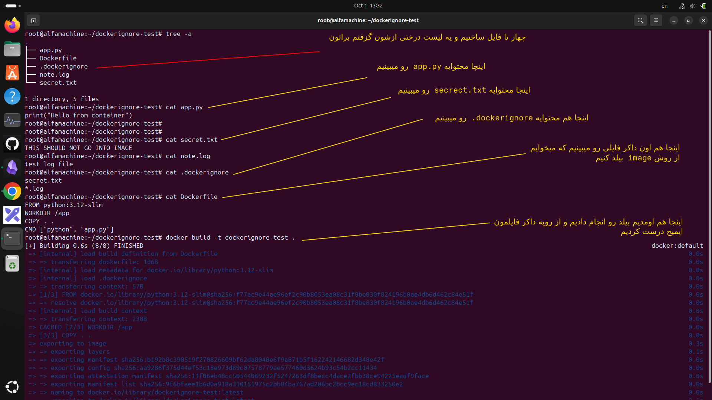
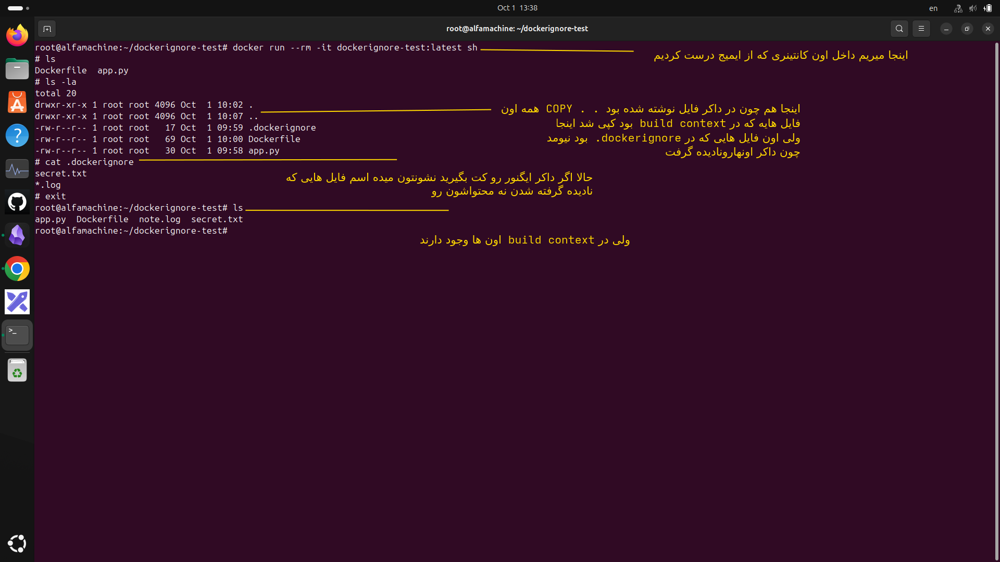

# بریم سراغه dockerignor. یکی از قسمت هایه سوپر مهم 
---
## اول بریم سراغه چند سوال مهم


### اول  docker.ignor چیست ؟
- ا-`.dockerignore` فایلیه که مشخص می‌کنه هنگام `docker build` چه فایل‌ها و پوشه‌هایی وارد **Build Context** نشن
---
### دوم چرا ازش استفاده میکنیم؟
ازش استفاده می‌کنیم چون معمولاً داخل پروژه فایل‌هایی داریم که Docker برای ساخت image بهشون نیازی نداره؛ مثل:

```
.git
.env
node_modules/
venv/
logs/
__pycache__/
```

حذف این فایل‌ها باعث میشه **build سریع‌تر بشه، حجم context کمتر بشه و فایل‌های اضافی یا حساس وارد image نشن.**

---
### طرزه کاره dockerignor. به چه صورت است ؟
معمولاً این فایل رو در همون پوشه‌ای می‌سازی که `Dockerfile` و build context قرار دارن.

مثلاً:

```
project/
├── Dockerfile
├── .dockerignore
├── app.py
├── .env
├── logs/
└── __pycache__/
```

داخل `.dockerignore` می‌نویسی:

```
.env
logs/
__pycache__/
.git
```

یعنی وقتی این دستور رو می‌زنی:

```
docker build -t myapp .
```

ا-Docker این فایل‌ها و پوشه‌ها رو از **build context** کنار می‌ذاره.

فقط یه اصلاح کوچیک در جمله‌ت: بهتره نگیم «Docker اصلاً اون فایل‌ها رو نمی‌بینه»، بلکه دقیق‌تره بگیم:

**این فایل‌ها وارد Build Context نمی‌شن و در نتیجه دستورهایی مثل `COPY . .` هم نمی‌تونن اون‌ها رو کپی کنن.**

---
# بریم سراغه یه مثال عملی که 
- ۱-از ساخت پوشه پروژه 
- ۲-ساخت dockerignor. در پوشه پروژه 
- ۳-ساخت کانتینر 
- ۴-چک کردن اینکه ایا اون فایل ها رفته تو کانتینر یا نه
## بریم سراغه درست کردن سناریو
1- ساخته فایل هایه پوشه

<p align="center">
	
</p>

- ۲ این هم تست درستی اینکه اون فایل ها نادیده یا ignore شدن

<p align="center">
	
</p>
