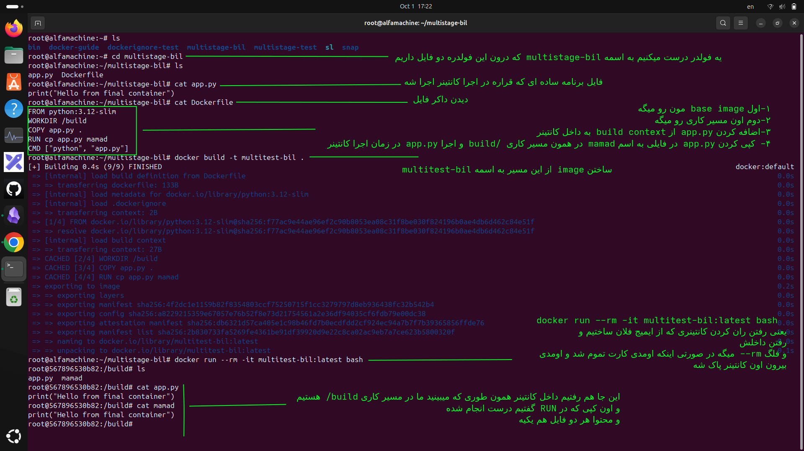
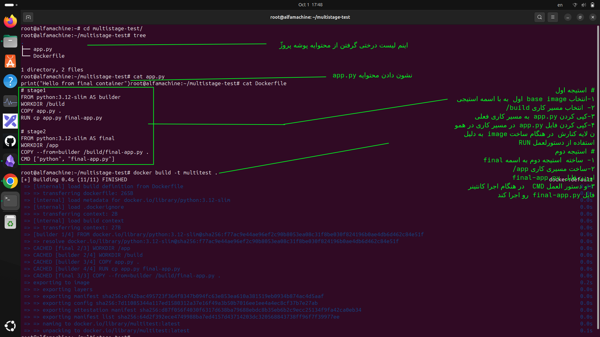
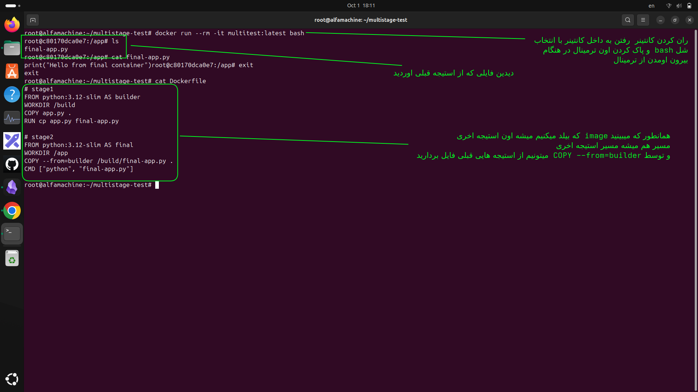

### این نکته خیلی مهمه 

در Multi-stage Build، آخرین Stage مبنای ساخت Image نهایی است. فایل‌ها و ابزارهای Stageهای قبلی به‌صورت خودکار وارد Image نهایی نمی‌شوند؛ فقط چیزهایی که عمداً با دستورهایی مثل `COPY --from=` به Stage آخر منتقل می‌کنیم، در Image نهایی باقی می‌مانند.

---
## یه مثال عملی بگم تا متوجه بشی
، بریم یک سناریوی خیلی ساده و عملی از صفر تا آخر.

فرض کن می‌خوای با Multi-stage یک برنامه خیلی ساده Python بسازی که در Stage اول یک فایل خروجی تولید کنه و در Stage دوم فقط همون خروجی نهایی رو نگه داریم.

### 1) ساخت پوشه پروژه

```
mkdir multistage-test
cd multistage-test
```

فایل‌ها رو بساز:

```
touch app.py
touch Dockerfile
```

ساختار:

```
multistage-test/
├── app.py
└── Dockerfile
```

### 2) محتوای `app.py`

داخلش بنویس:

```
print("Hello from final container")
```

### 3) ساخت Dockerfile

```
# Stage 1
FROM python:3.12-slim AS builder

WORKDIR /build

COPY app.py .

RUN cp app.py final-app.py


# Stage 2
FROM python:3.12-slim AS final

WORKDIR /app

COPY --from=builder /build/final-app.py .

CMD ["python", "final-app.py"]
```

اینجا:

```
Stage 1 = builder
Stage 2 = final
```

در Stage اول:

```
app.py
↓
final-app.py
```

و Stage دوم فقط اینو می‌گیره:

```
final-app.py
```

### 4) ساخت Image

```
docker build -t multistage-test .
```

### 5) اجرای Container

```
docker run --rm multistage-test
```

باید ببینی:

```
Hello from final container
```

### 6) وارد Container شو

```
docker run --rm -it multistage-test sh
```

داخل container بزن:

```
ls -la /app
```

باید تقریباً فقط این فایل رو ببینی:

```
final-app.py
```

حالا بررسی کن:

```
cat final-app.py
```

و اگر بزنی:

```
ls -la /build
```

نباید پوشه Stage اول رو ببینی، چون Stage `builder` وارد image نهایی نشده.

تصویر ذهنی تمرین:

```
Stage 1: builder
/app.py
   ↓
final-app.py
   ↓
COPY --from=builder
   ↓
Stage 2: final
final-app.py
```

---
## اول همین رو با به صورت یک stage  بریم ببنیم داخل کانتینر چیه بعد بریم سراغه مالتی استیج دوتایی تا این مفهموم که image از اخرین استیج درست میشه براتون جا بیوفته:

<p align="center">
	
</p>
- همون طور که میبینید این  به صورت تک استیجی است 

---
## حالا به صورت دابل استیجی 

<p align="center">
	
</p> 
- حالا بریم سراغه دابل استیج و اینکه ببینیم چرا میگیم  stage اخری میشه همون image ما و هرچی توسط stage اخر از build contextمیره درون image 
<p align="center">
	
</p>
- به عکس نگاه کنید کل اون مسیری که طی میکنه و به استیج دوم هم توجه کنید که چقد اهمیت زیادی دارد و ایمیج از رویه stage اخری درست میشه
