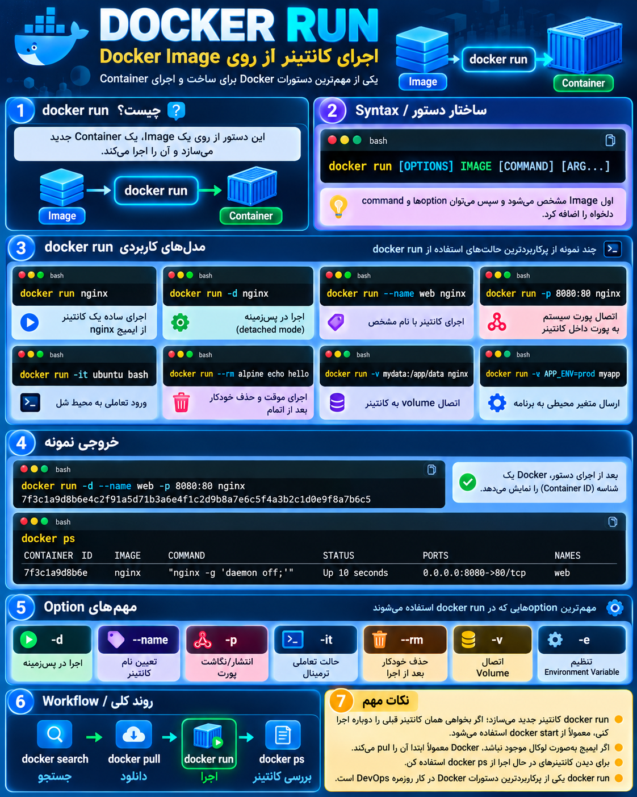

## دستور docker run  چیست؟

---

<p align="center">
	
</p>

## دستور `docker run` چیست؟

```bash
docker run IMAGE
```

مهم‌ترین دستور Docker برای **ساختن و اجرای یک Container از روی یک Image** است.

یعنی:

```text
Docker Image
      |
      | docker run
      ↓
Docker Container (در حال اجرا)
```

مثال:

```bash
docker run nginx
```

یعنی:

- اگر Image به نام `nginx` روی سیستم نباشد → Docker آن را Pull می‌کند.
    
- از روی Image یک Container می‌سازد.
    
- برنامه Nginx را اجرا می‌کند.
    

---

## ساختار کلی:

```bash
docker run [OPTIONS] IMAGE [COMMAND]
```

مثلاً:

```bash
docker run -d --name web -p 8080:80 nginx
```

توضیح:

|بخش|معنی|
|---|---|
|`docker run`|ساخت و اجرای Container|
|`-d`|اجرا در پس‌زمینه (Detached)|
|`--name web`|تعیین اسم Container|
|`-p 8080:80`|اتصال Port سیستم به Container|
|`nginx`|Image مورد استفاده|

---

## چند Option مهم در `docker run`

### 1) اجرای ساده

```bash
docker run nginx
```

یک Container از Nginx اجرا می‌کند.

---

### 2) اجرا در Background

```bash
docker run -d nginx
```

Container در پس‌زمینه اجرا می‌شود.

---

### 3) نام‌گذاری Container

```bash
docker run --name myweb nginx
```

به جای اسم تصادفی Docker، اسم خودت را می‌گذاری.

---

### 4) اتصال Port

```bash
docker run -p 8080:80 nginx
```

یعنی:

```text
Port سیستم من 8080
        |
        ↓
Port داخل Container 80
```

حالا با:

```
localhost:8080
```

به Nginx وصل می‌شوی.

---

### 5) ورود تعاملی به Container

```bash
docker run -it ubuntu bash
```

یعنی:

- `-i` → Interactive
    
- `-t` → Terminal
    

یک Shell داخل Ubuntu باز می‌کند.

---

### 6) حذف خودکار بعد از پایان

```bash
docker run --rm alpine echo hello
```

بعد از اجرا Container را پاک می‌کند.

---

### 7) اتصال Volume

```bash
docker run -v mydata:/app/data nginx
```

برای ذخیره دائمی اطلاعات.

---

### 8) تنظیم Environment Variable

```bash
docker run -e MYSQL_ROOT_PASSWORD=123 mysql
```

ارسال تنظیمات به برنامه.

---

## بعد از اجرای Container چه کنیم؟

دیدن Containerهای فعال:

```bash
docker ps
```

دیدن همه Containerها:

```bash
docker ps -a
```

دیدن Log:

```bash
docker logs container_name
```

ورود به Container:

```bash
docker exec -it container_name bash
```

---

## Workflow واقعی Docker:

```text
docker search
      ↓
پیدا کردن Image

docker pull
      ↓
دانلود Image

docker image ls
      ↓
دیدن Image

docker run
      ↓
ساخت و اجرای Container

docker ps
      ↓
بررسی Container
```

خلاصه:

ا-**`docker run` یعنی: از یک Image یک Container بساز و آن را اجرا کن.**  
این دستور جایی است که Image تبدیل به یک برنامه در حال اجرا می‌شود.
