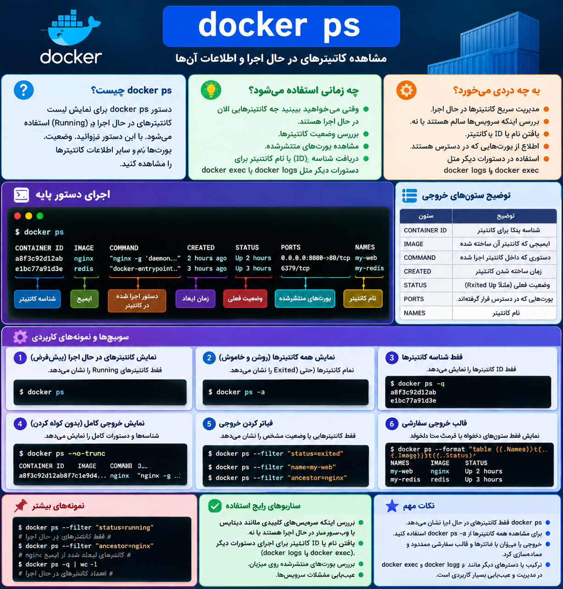

# برسی دستور docker ps  

---


<p>
	
</p>


دستور `docker ps` یکی از اولین دستورهای مهم Docker است و برای **دیدن کانتینرهای در حال اجرا** استفاده می‌شود.

ساختار ساده:

```bash
docker ps
```

وقتی اجرا می‌کنی، Docker لیست کانتینرهایی که الان **Running** هستند را نشان می‌دهد.

مثلاً خروجی:

```text
CONTAINER ID   IMAGE       COMMAND          CREATED        STATUS        PORTS                   NAMES
a8f3c92d12ab   nginx       "nginx -g..."    2 hours ago    Up 2 hours    0.0.0.0:8080->80/tcp    my-web
```

توضیح ستون‌ها:

|ستون|معنی|
|---|---|
|CONTAINER ID|شناسه یکتا برای کانتینر|
|IMAGE|ایمیجی که کانتینر از آن ساخته شده|
|COMMAND|دستوری که داخل کانتینر اجرا شده|
|CREATED|زمان ساخته شدن کانتینر|
|STATUS|وضعیت فعلی (Running, Exited و...)|
|PORTS|پورت‌هایی که Publish شده‌اند|
|NAMES|نام کانتینر|

---

### نکته مهم:

ا-`docker ps` فقط کانتینرهای **فعال** را نشان می‌دهد.

مثلاً اگر این را اجرا کنی:

```bash
docker run nginx
```

یک کانتینر nginx بالا می‌آید.

بعد:

```bash
docker ps
```

می‌بینی:

```text
CONTAINER ID   IMAGE   STATUS
45ab12cd       nginx   Up 5 seconds
```

---

### دیدن همه کانتینرها (حتی خاموش‌ها)

```bash
docker ps -a
```

مثلاً:

```text
CONTAINER ID   IMAGE   STATUS
45ab12cd       nginx   Up 10 minutes
77bc91ef       ubuntu  Exited (0)
```

اینجا Ubuntu قبلاً اجرا شده ولی الان خاموش است.

---

### چند گزینه کاربردی:

### فقط ID کانتینرها:

```bash
docker ps -q
```

خروجی:

```text
45ab12cd
77bc91ef
```

---

### نمایش کامل‌تر:

```bash
docker ps --no-trunc
```

شناسه کامل و command کامل را نشان می‌دهد.

---

### مرتب کردن خروجی:

```bash
docker ps --format "table {{.Names}}\t{{.Image}}\t{{.Status}}"
```

خروجی:

```text
NAMES     IMAGE     STATUS
my-web    nginx     Up 2 hours
```

---

در ذهن DevOps این زنجیره را داشته باش:

```
Docker Registry
       |
       | docker pull
       ↓
Docker Image
       |
       | docker run
       ↓
Container
       |
       | docker ps
       ↓
مشاهده کانتینرهای در حال اجرا
```

پس خیلی خلاصه:

- `docker images` → چه Imageهایی دارم؟
    
- `docker ps` → چه Containerهایی الان روشن هستند؟
    
- `docker ps -a` → چه Containerهایی ساخته شده‌اند (روشن یا خاموش)؟
    

بعد از `docker ps` معمولاً دستور بعدی که باید یاد بگیری `docker logs` و `docker exec` است، چون با آنها وارد دنیای Debug کردن کانتینرها می‌شوی.
