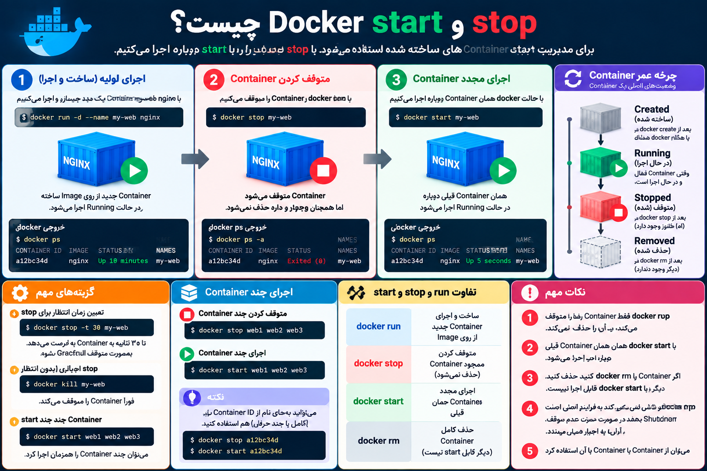

# بریم درمورد دستور docker stop & start صحبت کنیم

---


<p>
	
</p>

ا-`docker start` و `docker stop` برای **مدیریت Containerهایی که از قبل ساخته شده‌اند** استفاده می‌شوند. نکته کلیدی این است که این دستورات Image جدید یا Container جدید نمی‌سازند.

### ا-`docker stop` — متوقف کردن Container

فرض کن nginx را قبلاً اجرا کردی:

```bash
docker run -d --name my-web nginx
```

با:

```bash
docker ps
```

می‌بینی:

```text
CONTAINER ID   IMAGE   STATUS         NAMES
a12bc34d       nginx   Up 10 minutes  my-web
```

حالا:

```bash
docker stop my-web
```

Container متوقف می‌شود:

```text
my-web
```

اگر دوباره:

```bash
docker ps
```

بزنی، دیگر `my-web` را نمی‌بینی، چون `docker ps` فقط Containerهای Running را نشان می‌دهد.

اما اگر:

```bash
docker ps -a
```

بزنی:

```text
CONTAINER ID   IMAGE   STATUS                 NAMES
a12bc34d       nginx   Exited (0)             my-web
```

یعنی Container **حذف نشده**؛ فقط Stop شده.

---

### ا-`docker start` — روشن کردن دوباره همان Container

حالا برای روشن کردن همان Container:

```bash
docker start my-web
```

و:

```bash
docker ps
```

دوباره نشانش می‌دهد:

```text
CONTAINER ID   IMAGE   STATUS        NAMES
a12bc34d       nginx   Up 5 seconds  my-web
```

نکته خیلی مهم اینجاست:

```text
docker stop
     ↓
Container خاموش می‌شود
ولی وجود دارد
     ↓
docker start
     ↓
همان Container دوباره اجرا می‌شود
```

### تفاوت `start` با `run`

این تفاوت را حتماً یاد بگیر:

```text
IMAGE
  │
  │ docker run
  ↓
CONTAINER جدید
  │
  ├── docker stop → خاموش
  │
  └── docker start → روشن مجدد
```

ا-`docker run` معمولاً **Container جدید ایجاد و اجرا می‌کند**.

ولی:

```bash
docker start my-web
```

ا-Container جدید نمی‌سازد؛ **همان Container قبلی را دوباره اجرا می‌کند.**

مثلاً اگر چند بار بزنی:

```bash
docker run -d --name web1 nginx
docker run -d --name web2 nginx
docker run -d --name web3 nginx
```

سه Container داری.

اما:

```bash
docker stop web1
docker start web1
```

هنوز همان `web1` را داری.

### می‌توانی با ID هم کار کنی

لازم نیست حتماً اسم Container را بدهی:

```bash
docker stop a12bc34d
```

و:

```bash
docker start a12bc34d
```

حتی چند Container:

```bash
docker stop web1 web2 web3
```

یا:

```bash
docker start web1 web2 web3
```

### یک نکته مهم درباره `docker stop`

ا-`docker stop` تلاش می‌کند Container را **Graceful** متوقف کند؛ یعنی به فرایند اصلی فرصت می‌دهد خودش درست Shutdown شود. اگر در زمان تعیین‌شده متوقف نشود، Docker در نهایت آن را به اجبار می‌بندد.

مثلاً می‌توانی زمان انتظار را مشخص کنی:

```bash
docker stop -t 30 my-web
```

یعنی تا ۳۰ ثانیه برای Shutdown فرصت بده.

---

برای حفظ کردن این چهار دستور، این مدل خیلی خوبه:

```text
docker run
   ↓
🟢 Container ساخته + اجرا می‌شود

docker stop
   ↓
🔴 Container متوقف می‌شود

docker start
   ↓
🟢 همان Container دوباره اجرا می‌شود

docker rm
   ↓
🗑️ Container حذف می‌شود
```

پس اگر Container را فقط `stop` کردی، با `start` برمی‌گردد؛ ولی اگر `docker rm` کردی، دیگر `docker start` نمی‌تواند آن را برگرداند و باید دوباره از روی Image یک Container بسازی.
