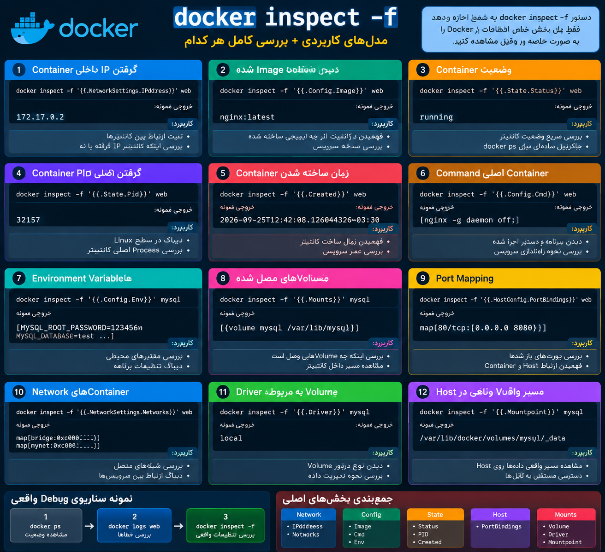

حتماً. اول یک Cheat Sheet از **کاربردی‌ترین مدل‌های `docker inspect -f`** می‌گذارم، بعد هر کدام را کوتاه توضیح می‌دهم.


<p align="center">
	
</p>

## Docker inspect -f Cheat Sheet

```bash
# گرفتن IP داخلی Container
docker inspect -f '{{.NetworkSettings.IPAddress}}' CONTAINER


# دیدن Image استفاده شده توسط Container
docker inspect -f '{{.Config.Image}}' CONTAINER


# دیدن وضعیت Container
docker inspect -f '{{.State.Status}}' CONTAINER


# گرفتن PID اصلی Container
docker inspect -f '{{.State.Pid}}' CONTAINER


# دیدن زمان ساخته شدن Container
docker inspect -f '{{.Created}}' CONTAINER


# دیدن Command اصلی Container
docker inspect -f '{{.Config.Cmd}}' CONTAINER


# دیدن Environment Variables
docker inspect -f '{{.Config.Env}}' CONTAINER


# دیدن Volumeهای متصل شده
docker inspect -f '{{.Mounts}}' CONTAINER


# دیدن Port Mapping
docker inspect -f '{{.HostConfig.PortBindings}}' CONTAINER


# دیدن Networkهای Container
docker inspect -f '{{.NetworkSettings.Networks}}' CONTAINER


# دیدن Driver مربوط به Volume
docker inspect -f '{{.Driver}}' VOLUME_NAME


# دیدن Mountpoint Volume
docker inspect -f '{{.Mountpoint}}' VOLUME_NAME
```

---

# توضیح هرکدام

## 1) گرفتن IP Container

```bash
docker inspect -f '{{.NetworkSettings.IPAddress}}' web
```

مثلاً خروجی:

```text
172.17.0.2
```

کاربرد:

- تست ارتباط Containerها
    
- ا-Debug شبکه
    
- بررسی اینکه Container IP گرفته یا نه
    

---

## 2) فهمیدن Container از چه Imageای ساخته شده

```bash
docker inspect -f '{{.Config.Image}}' web
```

خروجی:

```text
nginx:latest
```

کاربرد:

وقتی چند Image داری و نمی‌دانی این Container از کدام ساخته شده.

---

## 3) وضعیت Container

```bash
docker inspect -f '{{.State.Status}}' web
```

خروجی:

```text
running
```

یا:

```text
exited
```

کاربرد:

بررسی سریع وضعیت بدون استفاده از `docker ps`.

---

## 4) گرفتن PID Container

```bash
docker inspect -f '{{.State.Pid}}' web
```

خروجی:

```text
32157
```

کاربرد:

ا-Debug در سطح Linux:

```bash
ps -fp 32157
```

یا وقتی Docker نمی‌تواند Container را Stop کند.

---

## 5) زمان ساخته شدن Container

```bash
docker inspect -f '{{.Created}}' web
```

کاربرد:

فهمیدن اینکه Container چه زمانی ساخته شده.

---

## 6) ا-Command اجرا شده داخل Container

```bash
docker inspect -f '{{.Config.Cmd}}' web
```

مثلاً:

```text
[nginx -g daemon off;]
```

کاربرد:

فهمیدن برنامه با چه Commandای اجرا شده.

---

## 7) ا-Environment Variableها

```bash
docker inspect -f '{{.Config.Env}}' mysql
```

مثلاً:

```text
MYSQL_ROOT_PASSWORD=123456
```

کاربرد:

ا-Debug تنظیمات برنامه.

مثلاً:

- Database Host
    
- Password
    
- Config
    

---

## 8) Volumeهای متصل

```bash
docker inspect -f '{{.Mounts}}' mysql
```

مثلاً:

```text
mysql-data:/var/lib/mysql
```

کاربرد:

بررسی اینکه Data کجا ذخیره می‌شود.

---

## 9) Port Mapping

```bash
docker inspect -f '{{.HostConfig.PortBindings}}' web
```

مثلاً:

```text
80/tcp -> 8080
```

کاربرد:

وقتی سرویس از بیرون باز نمی‌شود.

بررسی می‌کنی:

```text
Host Port
    |
    ↓
Container Port
```

---

## 10) ا-Networkهای Container

```bash
docker inspect -f '{{.NetworkSettings.Networks}}' web
```

کاربرد:

بررسی اینکه Container داخل چه Networkای است.

مثلاً:

```text
bridge
mynet
```

---

# برای Volume

## Driver Volume

```bash
docker inspect -f '{{.Driver}}' mysql-data
```

خروجی:

```text
local
```

یعنی Docker خودش مدیریت می‌کند.

---

## مسیر واقعی Volume

```bash
docker inspect -f '{{.Mountpoint}}' mysql-data
```

خروجی:

```text
/var/lib/docker/volumes/mysql-data/_data
```

یعنی دیتا روی Host اینجا ذخیره شده.

---

# سناریوی Debug واقعی

فرض کن سایت باز نمی‌شود:

اول:

```bash
docker ps
```

بعد:

```bash
docker logs web
```

اگر مشکل مشخص نشد:

```bash
docker inspect -f '{{.NetworkSettings.IPAddress}}' web
```

شبکه را چک کن.

بعد:

```bash
docker inspect -f '{{.HostConfig.PortBindings}}' web
```

ا-Port را چک کن.

بعد:

```bash
docker inspect -f '{{.Mounts}}' web
```

ا-Volume را بررسی کن.

---

خلاصه ذهنی:

```text
docker inspect -f

Network  → IP / Network
Config   → Image / Env / Command
State    → Status / PID
Host     → Ports
Mounts   → Volume
```

این دستور یکی از ابزارهای اصلی Debug در Docker است چون به جای نگاه کردن به حدس‌ها، **تنظیمات واقعی Container را نشان می‌دهد.**
