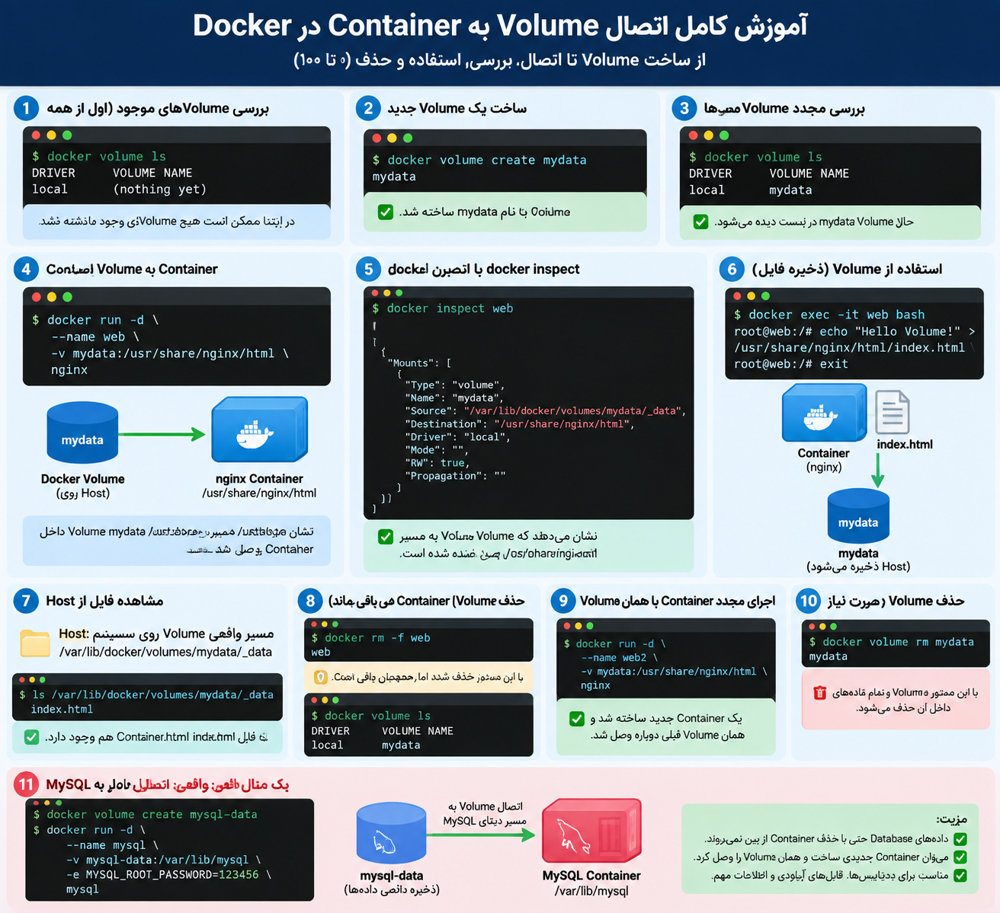

# وصل کردن کانتینر به ولوم


<p align="center">
	
</p>


برای وصل کردن **Container به Volume** معمولاً هنگام ساخت Container این کار را انجام می‌دهیم. یعنی در زمان `docker run` مشخص می‌کنیم کدام Volume به کدام مسیر داخل Container وصل شود.

ساختار:

```bash
docker run -v VOLUME_NAME:CONTAINER_PATH IMAGE
```

---

## مثال مرحله‌به‌مرحله

### 1) ساخت Volume

```bash
docker volume create mydata
```

حالا یک Volume داریم:

```text
mydata
```

---

### 2) ساخت Container و اتصال Volume

```bash
docker run -d \
--name mycontainer \
-v mydata:/app/data \
nginx
```

توضیح:

```text
mydata
   |
   ↓
Volume روی Host

/app/data
   |
   ↓
مسیر داخل Container
```

یعنی هر فایلی که داخل Container در مسیر:

```bash
/app/data
```

ذخیره شود، در Volume به نام `mydata` قرار می‌گیرد.

---

## بررسی اتصال Volume

```bash
docker inspect mycontainer
```

در بخش `Mounts` چیزی شبیه این می‌بینی:

```json
"Mounts": [
    {
        "Type": "volume",
        "Name": "mydata",
        "Destination": "/app/data"
    }
]
```

یعنی:

- Volume:
    

```text
mydata
```

- مسیر داخل Container:
    

```text
/app/data
```

---

## یک سناریوی واقعی با MySQL

```bash
docker volume create mysql-data
```

بعد:

```bash
docker run -d \
--name database \
-v mysql-data:/var/lib/mysql \
-e MYSQL_ROOT_PASSWORD=123456 \
mysql
```

اینجا:

```text
MySQL Container
       |
       ↓
/var/lib/mysql
       |
       ↓
mysql-data Volume
```

پس Database حتی اگر Container حذف شود، باقی می‌ماند.

---

## نکته مهم

اگر Container از قبل ساخته شده باشد، معمولاً نمی‌توانی مستقیم Volume جدید به آن اضافه کنی.

مثلاً این Container:

```bash
docker run -d --name web nginx
```

بعداً نمی‌توانی بگویی:

```bash
docker volume attach mydata web
```

چنین دستوری وجود ندارد.

روش معمول:

1. Container را حذف یا دوباره بساز.
    
2. با `-v` Volume را وصل کن.
    

---

خلاصه:

```text
docker volume create
        ↓
ساخت Storage

docker run -v volume:path
        ↓
وصل کردن Volume به Container

docker inspect
        ↓
بررسی اتصال
```

در Docker، Volume معمولاً **همراه با ساخت Container تعریف می‌شود**.
