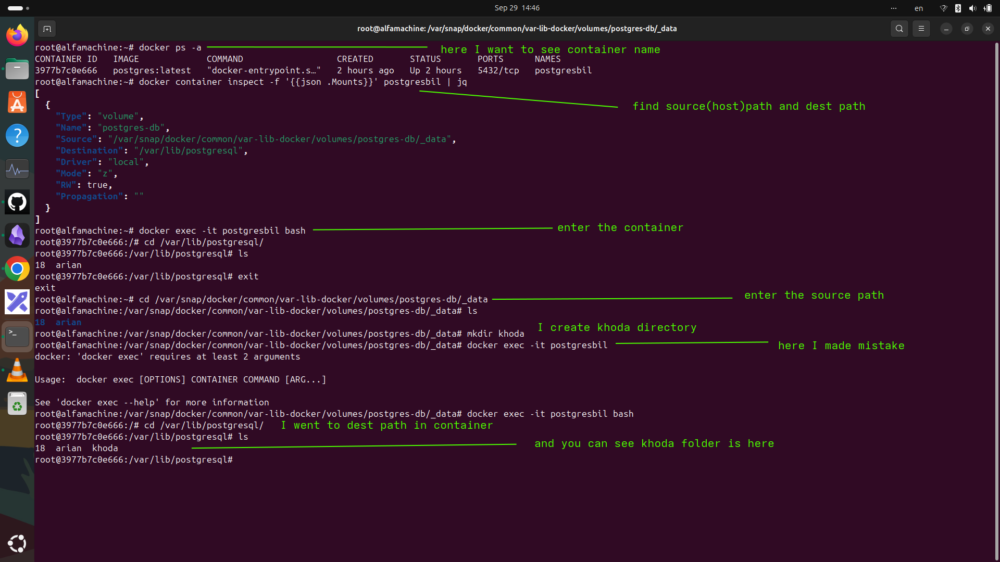

# ۱-چجوری میتونیم اون مسیری که به کانتیر در زمان ران کردنش درست کردیم رو پیدا کنیم که در host ما اون مسیر کجاست و در dest که میشه همون کانتینر کجاست.
# ۲- و قضیه storage location مشترک هرچی تو هاست تغییر بدی در مسیر مقصد هم همون تغییر رو میبینی

---
### 1-چجوری میتونیم ببنیم که اون مسیر کا دیتا مقصد که میشه اون مسیر کانتیر رویه سیسم هاست یا ما کجاست
- از این دستور استفاده میکنید
```
docker inspect -f '{{json .Mounts}}' containername | jq
```
---
output:
```json
[
  {
    "Type": "volume",
    "Name": "postgres-db",
    "Source": "/var/snap/docker/common/var-lib-docker/volumes/postgres-db/_data",
    "Destination": "/var/lib/postgresql",
    "Driver": "local",
    "Mode": "z",
    "RW": true,
    "Propagation": ""
  }
]

```
- ۱- source : مسیرش رویه هاست یا سیستم خودمون 
- ۲-destination: میشه مسیر اون دیتا اون قسمت از کانتیر رو مانت کردیم رویه سیستم خودمون
---
- یا اگه سختتون است بزنید
- docker inspect -f '{{json .Mounts}}' containername | jq
- برید بزنید docker inspect container name 
- و دنبال قسمت Mounts بگردید
---
## 2-اگر ما در مسیر سورس که دیتا رو به اونجا مونت کردیم از سیستممون فایلی یا فولدری رو اضافه کنیم به  اون مسیر سورس ایا درون مقصد هم تغییری میکند منظورمون از مقصد اون مسیری که در کانتیر است 

- یه عکسی درست کردم که به وضوح توضیح میده این مراحل رو 

<p>
	 
</p>

