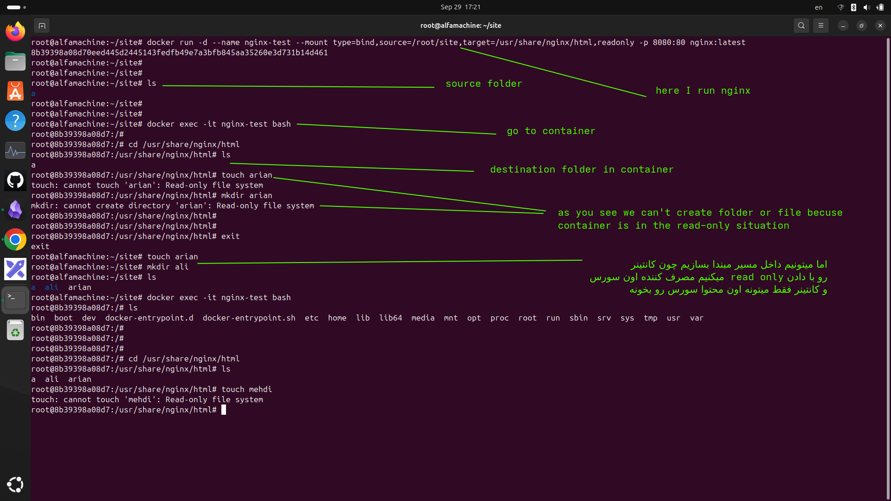

## بریم یه قانون باحال بگیم که کی ما از read only استفاده میکنیم درون مانت  کردن
---
- ببنید یه قانون ساده است برایه شما هایی که میخواید devops  کار کنید
```
اگر سرویس مالک دیتا است → read/write

اگر سرویس فقط مصرف‌کننده دیتا است → read-only
```

مثال:

```
PostgreSQL
     |
     | write/read
     ↓
 /var/lib/postgresql/data
```

ولی:

```
Nginx
     |
     | read only
     ↓
 /usr/share/nginx/html
```
- ببنید همانطور مشاهده میکنید اگر شما بیاید به سروسی PostgresSQL ro یا فقط خواندن بدید در زمان ران کانتینر اصلا سرویس بالا نمیاد چون سرویس صاحب دیتا است و این قانون ساده بالا رو توجه کنید سرویس هایه دیتا بیسی که مالک دیتا هستند و دیتا رو به صورت مداوم مینویسند اصلا کارشون نوشتن است و اگر فقط خواندن بشوند معنایی ندارند پس در سرویس هایی که صاحب دیتا هستند بهشون read only نمیدیم
- ولی برایه nginx اوکیه چرا چون nginx  مصرف کننده است و میره فایل هایه کانفیگ و فایل هایی که براش قرار دادند رو میخونه و نمایش میده و تنظیمات رو اعمال میکنه صاحب اون دیتا نیست
- پس حواستون باشه
- اینم یه قانون ساده
```
Database data
        ↓
Volume

Source code
        ↓
Bind mount

Config file
        ↓
Bind mount + readonly
```

---
### اینجا هم براتون جدولی گذاشتم از اون هایی که بدید فقط خواندن و ندید

| Service                            | مسیر معمول Mount                       | استفاده از read-only؟ | دلیل                                   |
| ---------------------------------- | -------------------------------------- | --------------------- | -------------------------------------- |
| **Nginx (Static Website)**         | `/usr/share/nginx/html`                | ✅ خیلی رایج           | فقط فایل‌های HTML/CSS/JS را سرو می‌کند |
| **Apache Web Server**              | `/var/www/html`                        | ✅ رایج                | اگر فقط سایت استاتیک باشد              |
| **Frontend React/Vue/Angular**     | `/app/dist` یا `/usr/share/nginx/html` | ✅ رایج                | فایل خروجی build تغییر نمی‌کند         |
| **Database PostgreSQL**            | `/var/lib/postgresql/data`             | ❌ استفاده نکن         | دیتابیس باید write کند                 |
| **MySQL / MariaDB**                | `/var/lib/mysql`                       | ❌ استفاده نکن         | نوشتن دیتا و log لازم دارد             |
| **MongoDB**                        | `/data/db`                             | ❌ استفاده نکن         | دیتابیس دائماً تغییر می‌کند            |
| **Redis**                          | `/data`                                | ❌ معمولاً نه          | persistence و dump نیاز به write دارد  |
| **Config فایل Nginx**              | `/etc/nginx/nginx.conf`                | ✅ خیلی خوب            | کانتینر فقط config را بخواند           |
| **SSH keys**                       | `/root/.ssh`                           | ✅ بسیار رایج          | امنیت؛ برنامه فقط بخواند               |
| **SSL Certificate**                | `/etc/ssl/certs`                       | ✅ رایج                | سرویس فقط certificate را مصرف می‌کند   |
| **Environment Config**             | `/app/config`                          | ✅ رایج                | جلوگیری از تغییر تنظیمات               |
| **Log Collector (مثل Fluent Bit)** | `/var/log`                             | معمولاً ❌             | باید بخواند یا گاهی بنویسد             |
| **Prometheus Config**              | `/etc/prometheus`                      | ✅ رایج                | فقط خواندن تنظیمات                     |
| **Grafana Provisioning**           | `/etc/grafana/provisioning`            | ✅ رایج                | فایل‌های تعریف datasource/dashboard    |

---
### مثال واقعی با Nginx

فرض کن روی Host داری:

```
/home/user/site/
 ├── index.html
 ├── style.css
 └── app.js
```

اجرا:

```
docker run -d \
--name nginx \
--mount type=bind,source=/home/user/site,target=/usr/share/nginx/html,readonly \
-p 8080:80 \
nginx
```

اینجا nginx فقط سایت را نمایش می‌دهد و اگر داخل کانتینر کسی بخواهد:

```
echo "hack" > /usr/share/nginx/html/index.html
```

خطا می‌گیرد.

---
### توضیح بهتره اینکه شما read only میزنید چه اتفاقی میوفته 
- براتون داخل ترمینال کد زدم و کدشو نشونتون میدم
- اومد یه سرویس nginx رو بالا اوردم
```
docker run -d --name nginx-test --mount type=bind,source=/root/site,target=/usr/share/nginx/html,readonly -p 8080:80 nginx:latest 
```
- شما وقتی رو حالت read only بزنید باعث میشه که کانتینر مصرف کننده شه و دیگه نمیتونه چیزی رو تغییر بده و بنویسه و فقط میخونه

<p align="center">
	
</p>
