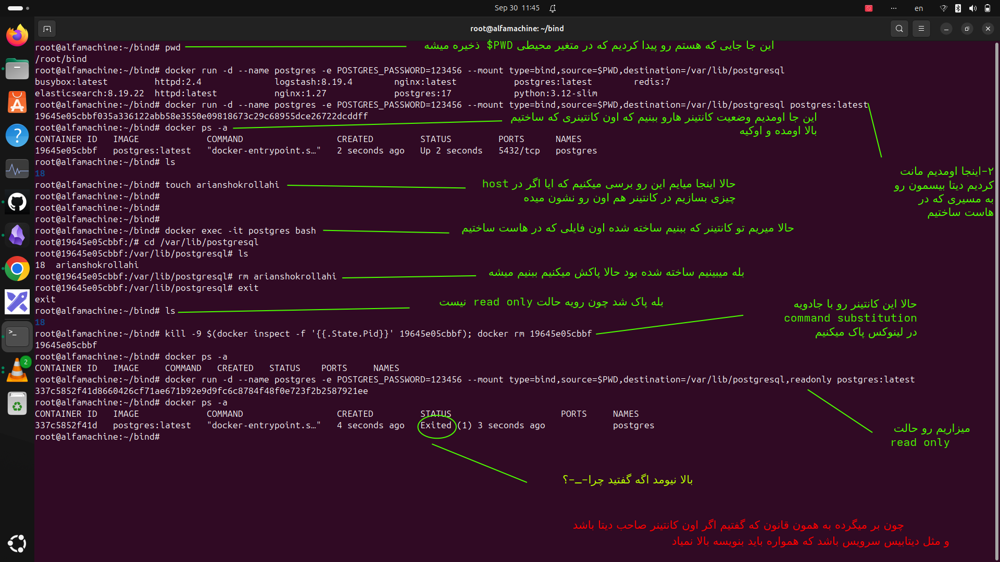

# این بخش هم بریم سراغه مانت کردن به مدل bind
---
##### ا-bind mount  یعنی چی کوتاه؟

ا-Bind Mount یعنی وصل کردن مستقیم یک فایل یا پوشه از **Host** به داخل **Container**.

مثلاً:

```bash
docker run -d \
  --name app \
  --mount type=bind,source=/root/project,target=/app \
  nginx
```

اینجا پوشه `/root/project` روی سیستم خودت، داخل کانتینر در مسیر `/app` دیده می‌شود.

----

##### چرا از Bind Mount استفاده می‌کنیم؟
چون تغییرات بین Host و Container تقریباً مستقیم دیده می‌شوند. مثلاً اگر فایل کد را روی سیستم خودت تغییر بدهی، همان تغییر داخل کانتینر هم وجود دارد. به همین دلیل برای **Development، سورس‌کد، فایل‌های config و فایل‌هایی که می‌خواهیم از Host مدیریت کنیم** خیلی کاربردی است.

خلاصه:

```text
Host
/root/project
     │
     │ Bind Mount
     ▼
Container
/app
```

---
### اینم یه عکس براتون میزارم از اینکه متوجه بشید bind mount  یعنی چی


<p align="center">
	
</p>
- تمام و کمال براتون توضیح دادم برید خط به خطشو ببنید 

