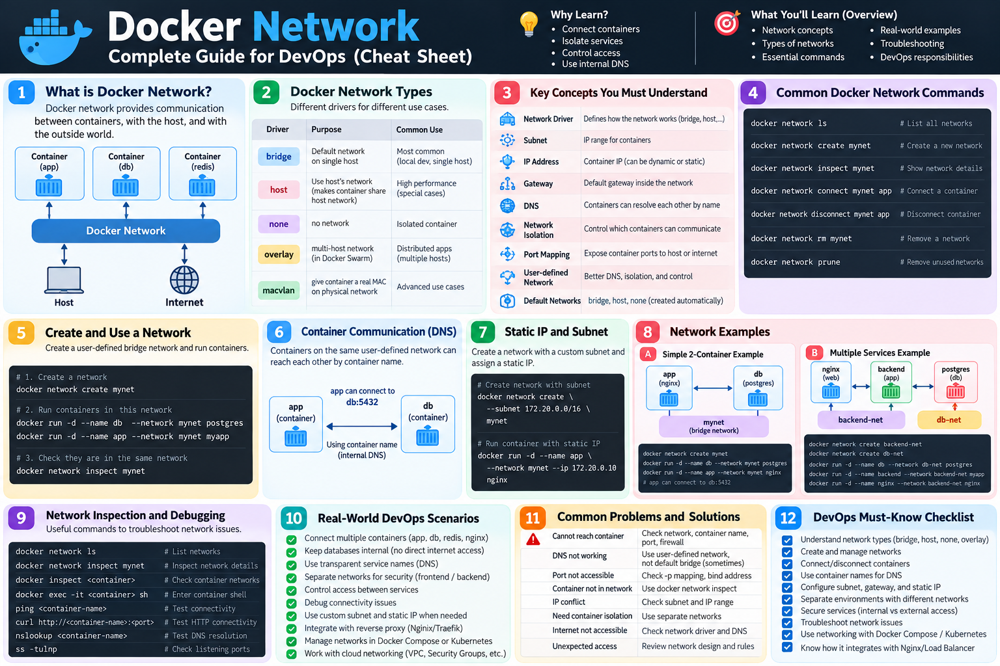

# در این بخش میپردازیم به بخش شبکه (network) درون داکر (docker)
---
#### دستورات پایه ای که باید بدونید درمورد docker در بخش network

```bash
# دیدن Networkهای موجود
docker network ls

# ساخت Network جدید
docker network create mynet

# اجرای Container داخل Network
docker run -d --name app --network mynet nginx

# اتصال Container موجود به Network
docker network connect mynet app

# دیدن جزئیات Network
docker network inspect mynet

# قطع اتصال Container
docker network disconnect mynet app

# حذف Network
docker network rm mynet
```

---
 
####  کد هایی در جلو زیاد میبینید
```bash

# اجرای Container مستقیم داخل یک Network
docker run -d \
  --name app \
  --network mynet \
  nginx
  
  =========

# ساخت Network با Driver مشخص
docker network create \
  --driver bridge \
  mynet
  =========
# ساخت Network با Subnet مشخص
docker network create \
  --subnet 172.20.0.0/16 \
  mynet
  =========
# اجرای Container با IP ثابت داخل Network
docker run -d \
  --name app \
  --network mynet \
  --ip 172.20.0.10 \
  nginx
```

---

## ا-Docker Network چه کار می‌کند؟

- ا-Docker Network برای **ارتباط Containerها با هم، با Host و با بیرون** استفاده می‌شود
- بدون Network مناسب، Containerها نمی‌توانند درست با هم ارتباط داشته باشند.
```bash
Frontend
   |
   | Docker Network
   |
Backend
   |
   | Docker Network
   |
Database
```

---
## چرا Docker Network را یاد می‌گیریم؟

چون در پروژه واقعی معمولاً فقط یک Container نداری

```bash
Nginx
  |
Backend
  |
PostgreSQL
  |
Redis
```

این‌ها باید با هم ارتباط داشته باشند، ولی نه لزوماً همه‌شان به اینترنت یا Host expose شوند.

پس Network برای این‌ها مهم است:

- ارتباط سرویس‌ها
- جداسازی سرویس‌ها
- امنیت
- ا-DNS داخلی
- مدیریت Portها
- طراحی معماری چند Container
---
## ا-Docker Network چه Driverهایی دارد؟

مهم‌ترین‌ها:

```
bridge
host
none
overlay
macvlan
```

برای شروع DevOps این سه‌تا مهم‌ترند:

- `bridge` → معمول‌ترین حالت روی یک Docker Host
- `host` → استفاده مستقیم از Network Host
- `none` → بدون Network

بعداً `overlay` برای Docker Swarm و معماری چند Host مهم می‌شود.

---
---

## یک DevOps باید با Docker Network چه کارهایی بلد باشد؟

باید بتواند:

- ا-Network بسازد
- ا-Container را به Network وصل کند
- چند Container را در یک Network قرار دهد
- بفهمد چرا دو Container به هم وصل نمی‌شوند
- ا-DNS داخلی Docker را بفهمد
- ا-Port Mapping را با Network اشتباه نگیرد
- ا-Network را inspect کند
- ا-Subnet و IP Range را بفهمد
- در صورت نیاز IP ثابت بدهد
- سرویس‌های داخلی و خارجی را از هم جدا کند
- ا-Networkهای بلااستفاده را پاک کند

---
## چیزایی که باید بلد باشی در قسمت شبکه (network) درون داکر

`
<p align="center">
	
</p>
