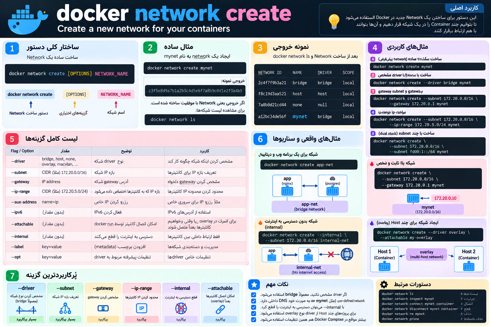

# بریم سراغه دستور docker network
----


<p align="center">
	
</p>


ا-`docker network create` برای **ساختن یک Network جدید در Docker** استفاده می‌شود.

مثلاً:

```
docker network create mynet
```

یعنی یک Network به اسم `mynet` بساز.

اگر Driver مشخص نکنی، معمولاً Docker یک **user-defined bridge network** می‌سازد.

نمونه بررسی:

```
docker network ls
```

ممکن است ببینی:

```
NETWORK ID     NAME      DRIVER    SCOPE
a12bc34de56f   mynet     bridge    local
```

در بخش `docker network create` این چیزها را باید بلد باشی:

- ساخت ساده Network

```
docker network create mynet
```

- ساخت با Driver مشخص

```
docker network create --driver bridge mynet
```

- ساخت با Subnet مشخص

```
docker network create \
  --driver bridge \
  --subnet 172.20.0.0/16 \
  mynet
```

- ساخت با Gateway مشخص

```
docker network create \
  --subnet 172.20.0.0/16 \
  --gateway 172.20.0.1 \
  mynet
```

- ساخت Network با IP Range مشخص

```
docker network create \
  --subnet 172.20.0.0/16 \
  --ip-range 172.20.5.0/24 \
  mynet
```

- اجرای Container داخل Network

```
docker run -d \
  --name app \
  --network mynet \
  nginx
```

- بررسی Network ساخته‌شده

```
docker network inspect mynet
```

چیزهایی که یک DevOps در این بخش باید واقعاً بفهمد:

```
Network Name
Driver
Subnet
Gateway
IP Range
Container Membership
DNS داخلی Docker
```

مثلاً اگر بسازی:

```
docker network create \
  --subnet 172.20.0.0/16 \
  --gateway 172.20.0.1 \
  backend-net
```

معنی‌اش این است:

```
Name     = backend-net
Driver   = bridge
Subnet   = 172.20.0.0/16
Gateway  = 172.20.0.1
Scope    = local
```

بعد Containerها را روی همان Network می‌گذاری:

```
docker run -d --name app --network backend-net nginx
docker run -d --name db --network backend-net postgres
```

و چون هر دو روی یک user-defined network هستند، `app` معمولاً می‌تواند با اسم `db` به Container دیتابیس وصل شود.

برای Fundamentals اگر این‌ها را بلد باشی کافی است:

```
docker network create
--driver
--subnet
--gateway
--ip-range
--network در docker run
docker network inspect
```

و از همه مهم‌تر بفهمی **چرا Network می‌سازی: برای اینکه مشخص کنی کدام Containerها اجازه دارند با هم ارتباط داشته باشند.**
