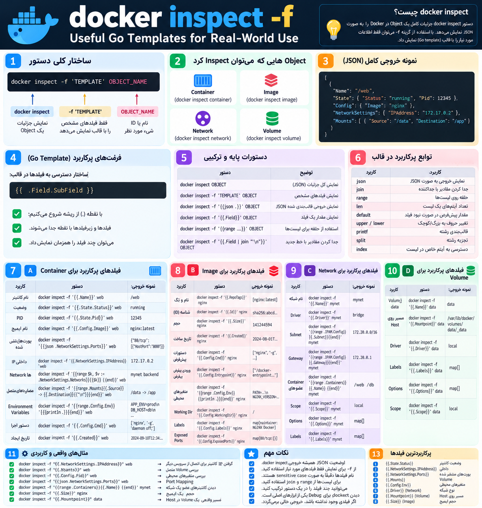

## دستور docker inspect
---


<p align="center">
	
</p>


ا-`docker inspect` برای دیدن **جزئیات کامل یک Object در Docker** استفاده می‌شود.

مثلاً برای:

- Container
- Image
- Volume
- Network

ساختار:

```
docker inspect OBJECT_NAME
```

مثلاً برای Container:

```
docker inspect web
```

خروجی به صورت JSON می‌آید و می‌تواند شامل این چیزها باشد:

```
Name
Image
State
PID
Network
IP Address
Ports
Mounts
Environment Variables
Command
Created Time
```

مثلاً برای یک Container:

```
docker inspect web
```

ممکن است بخشی از خروجی این باشد:

```
{
  "Name": "/web",
  "State": {
    "Status": "running",
    "Pid": 32157
  },
  "Config": {
    "Image": "nginx"
  },
  "NetworkSettings": {
    "IPAddress": "172.17.0.2"
  }
}
```

یعنی:

```
Name
→ اسم Container

State.Status
→ وضعیت Container

State.Pid
→ PID اصلی Container روی Linux

Config.Image
→ Imageای که Container از آن ساخته شده

NetworkSettings.IPAddress
→ IP داخلی Container
```

کاربرد اصلی `docker inspect` در DevOps بیشتر برای **Debug و بررسی تنظیمات واقعی** است.

مثلاً اگر Container به Database وصل نمی‌شود، با Inspect می‌توانی بررسی کنی:

```
Network درست است؟
IP دارد؟
Volume وصل است؟
Environment Variable درست است؟
Port Mapping درست است؟
```

اگر نمی‌خواهی کل JSON را ببینی، از `-f` استفاده می‌کنی:

```
docker inspect -f '{{.State.Status}}' web
```

مثلاً خروجی:

```
running
```

یا:

```
docker inspect -f '{{.NetworkSettings.IPAddress}}' web
```

خروجی:

```
172.17.0.2
```

خلاصه:

```
docker ps
→ اطلاعات سریع

docker logs
→ خطا و خروجی برنامه

docker inspect
→ تنظیمات و جزئیات واقعی Object
```

برای یک DevOps، `docker inspect` یکی از مهم‌ترین ابزارهای Debug در Docker است.
