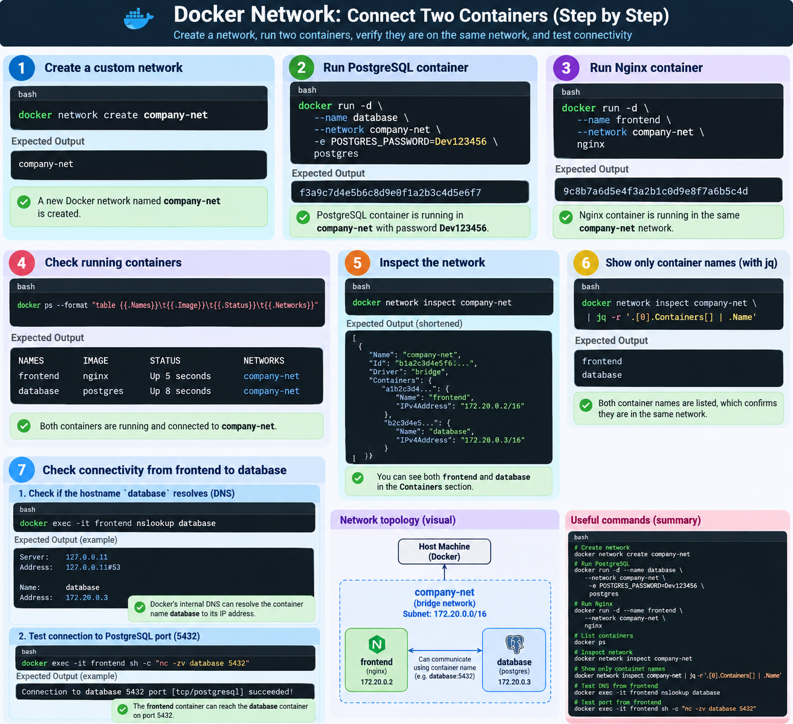

# چی در این تصویر است
- ۱-ساخت شبکه -->docker network
- ۲-ساخته کانتینر از رویه ایمیج-->docker run -d ...
- ۳-وصل کردن اون کانتینر ها بهم در قسمت ساخت کانتینر
- ۴-تست اینکه ایا وصل شده اند یا خیر
---

<p align="center">
	
</p>

آره. توی این عکس من کل سناریوی **وصل کردن دو Container به یک Docker Network و تست ارتباطشون** رو از صفر تا صد نشون دادم.

مراحلش اینه:
- اول یک Network به اسم `company-net` ساخته میشه.
- بعد Container دیتابیس PostgreSQL با اسم `database` روی همین Network اجرا میشه.
- بعد Container Nginx با اسم `frontend` روی همون Network اجرا میشه.
- بعد با `docker ps` و `docker network inspect` بررسی می‌کنیم که هر دو Container واقعاً داخل `company-net` هستن.
- بعد با `jq` فقط اسم Containerهای عضو Network رو جدا می‌کنیم.
- در آخر از داخل `frontend` اسم `database` رو Resolve می‌کنیم و اتصال به پورت PostgreSQL یعنی `5432` رو تست می‌کنیم.

یعنی مفهوم اصلی عکس اینه:

```text
frontend
   ↕
company-net
   ↕
database
```

اگر این سناریو رو کامل بفهمی، یکی از مهم‌ترین مفاهیم پایه Docker Network یعنی **ارتباط Container-to-Container داخل یک User-defined Network** رو یاد گرفتی.
