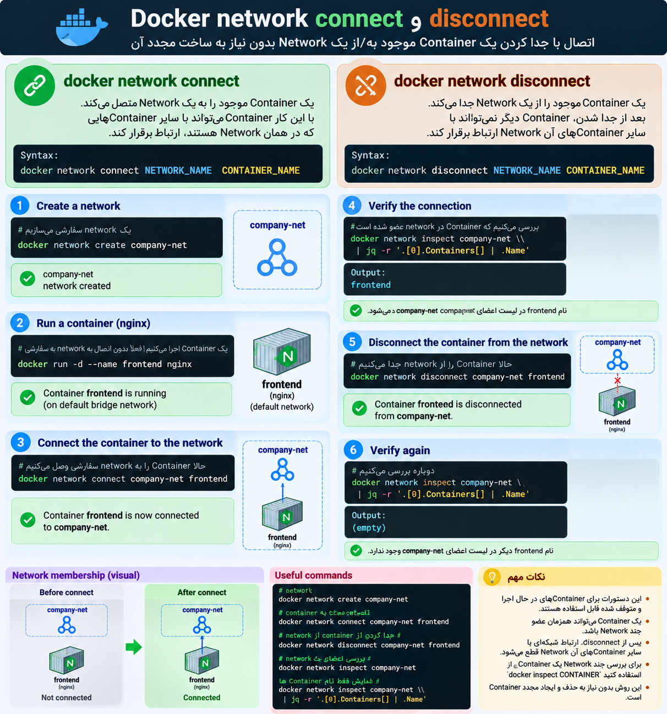

ا-`docker network connect` برای **وصل کردن یک Container موجود به یک Docker Network** استفاده میشه.

ساختار:

```
docker network connect NETWORK_NAME CONTAINER_NAME
```

مثال:

```
docker network connect company-net frontend
```

یعنی Container به اسم `frontend` به Network به اسم `company-net` وصل میشه.

ا-`docker network disconnect` برعکسه؛ یعنی **Container رو از یک Network جدا می‌کنه**.

ساختار:

```
docker network disconnect NETWORK_NAME CONTAINER_NAME
```

مثال:

```
docker network disconnect company-net frontend
```

یعنی `frontend` دیگه عضو `company-net` نیست.

خلاصه:

```
connect    → وصل کردن Container به Network
disconnect → جدا کردن Container از Network
```

<p align="center">
	
</p>
