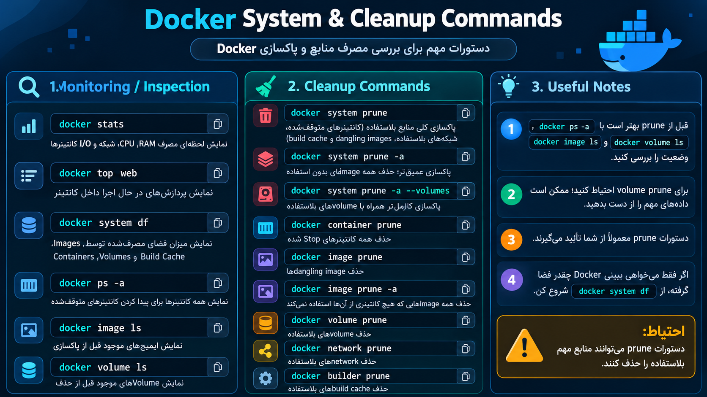

##  خلاصه ای از دستوراتی که در فصل ۶ میخوایم بخونیم
---

<p align="center">
	
</p>

```
# 6 - System and Cleanup

docker stats
# نمایش زنده مصرف CPU، RAM، Network I/O و Disk I/O کانتینرها

docker top web
# نمایش Processهای در حال اجرا داخل کانتینر web

docker system df
# نمایش میزان فضای مصرف‌شده توسط Images, Containers, Volumes و Build Cache

docker system prune
# پاک کردن منابع بلااستفاده Docker مثل Containerهای متوقف‌شده، Networkهای بلااستفاده و Cache

docker container prune
# حذف همه Containerهای Stop شده

docker image prune -a
# حذف همه Imageهایی که هیچ Containerی از آن‌ها استفاده نمی‌کند

docker volume prune
# حذف Volumeهای بلااستفاده
```

### 1. `docker stats`

```
docker stats
```

برای دیدن مصرف لحظه‌ای منابع Containerها استفاده میشه.

مثلاً می‌بینی:

```
CONTAINER   CPU %   MEM USAGE   NET I/O
web         0.20%   15MB        2kB / 1kB
database    1.10%   120MB       5kB / 3kB
```

یعنی می‌تونی مصرف CPU و RAM کانتینرها رو Monitor کنی.

---

### 2. `docker top`

```
docker top web
```

ا-Processهای در حال اجرا داخل Container به اسم `web` رو نشون میده.

مثلاً:

```
UID   PID    CMD
root  2451   nginx: master process
```

برای Debug کردن خیلی کاربردیه.

---

### 3. `docker system df`

```
docker system df
```

نشون میده Docker چقدر Disk مصرف کرده.

مثلاً:

```
TYPE          TOTAL   ACTIVE   SIZE
Images        10      3        2.5GB
Containers    5       2        500MB
Volumes       4       2        1GB
```

برای پیدا کردن اینکه فضای Docker کجا مصرف شده خیلی خوبه.

---

### 4. `docker system prune`

```
docker system prune
```

منابع بدون استفاده Docker رو پاک می‌کنه.

مثل:

```
Stopped Containers
Unused Networks
Dangling Images
Build Cache
```

قبل از حذف ازت Confirmation می‌گیره.

---

### 5. `docker container prune`

```
docker container prune
```

تمام Containerهایی که در حالت `Stopped` هستن رو حذف می‌کنه.

یعنی:

```
Running Container  → باقی می‌ماند
Stopped Container  → حذف می‌شود
```

---

### 6. `docker image prune -a`

```
docker image prune -a
```

ا-Imageهایی که هیچ Containerی ازشون استفاده نمی‌کنه رو حذف می‌کنه.

ا-`-a` یعنی aggressive‌تر از `docker image prune` عمل می‌کنه.

پس قبلش بهتره چک کنی:

```
docker image ls
```

---

### 7. `docker volume prune`

```
docker volume prune
```

ا-Volumeهایی که هیچ Containerی ازشون استفاده نمی‌کنه رو حذف می‌کنه.

این دستور مهمه چون Volume ممکنه دیتابیس و اطلاعات مهم داشته باشه.

پس قبلش بهتره:

```
docker volume ls
```

و:

```
docker volume inspect VOLUME_NAME
```

رو بررسی کنی.

خلاصه این بخش:

```
stats            → Resource monitoring
top              → Process monitoring
system df        → Disk usage
system prune     → General cleanup
container prune  → Remove stopped containers
image prune -a   → Remove unused images
volume prune     → Remove unused volumes
```

