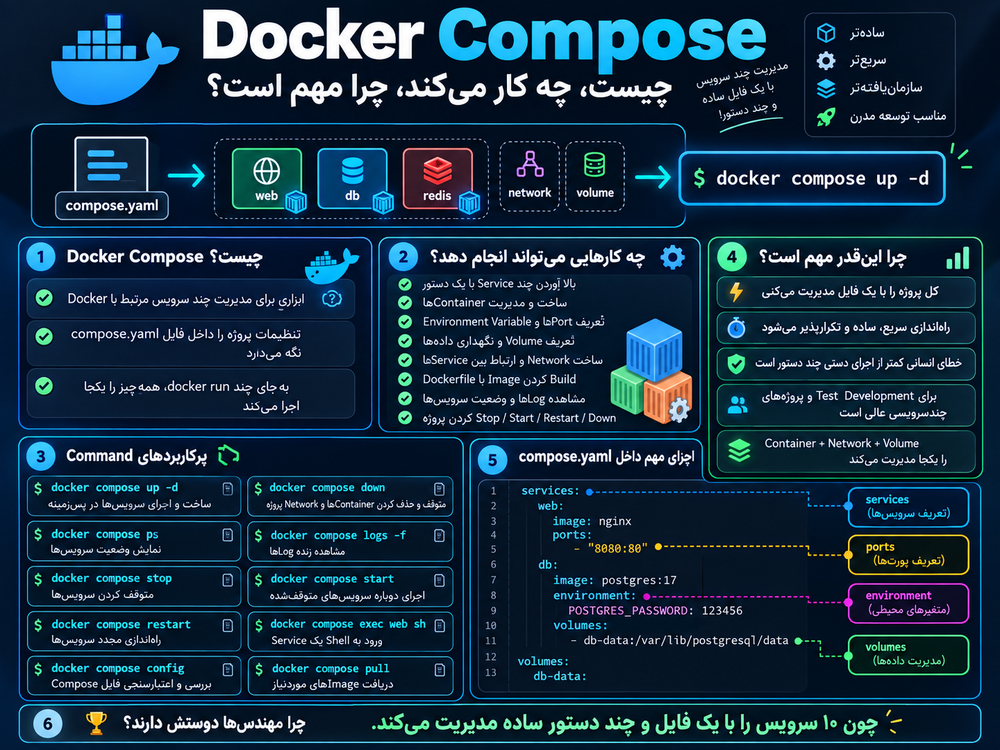

# بریم سراغ یکی از مهم‌ترین بخش‌های Docker: Docker Compose

---
## اول docker compose چیست و چه کار میکند

<p align="center">
	
</p>
## اول یک مقدمه ۳ خطی؛ چرا Docker Compose مهمه؟

1. چند Container و تنظیمات مربوط به اون‌ها رو داخل یک فایل مثل `compose.yaml` مدیریت می‌کنه.
2. با یک دستور مثل `docker compose up -d` می‌تونی کل سرویس‌های پروژه رو بالا بیاری.
3. باعث میشه اجرای پروژه سریع‌تر، تکرارپذیرتر و خیلی ساده‌تر از استفاده از چندین `docker run` جداگانه باشه.

---

## چرا Docker Compose مهمه؟

چون با یاد گرفتن نوشتن فایل `compose.yaml` می‌تونی حتی چندین Service رو با یک دستور بالا بیاری:

```
docker compose up -d
```

یعنی اگر فایل Compose پروژه رو داشته باشی، روی هر سیستمی که Docker نصب باشه، می‌تونی با همین دستور سرویس‌های تعریف‌شده در فایل رو اجرا کنی.

بدون Docker Compose ممکنه مجبور باشی این کارها رو جداگانه انجام بدی:

```
1. Imageها رو pull یا build کنی

2. Containerها رو با docker run بسازی

3. Volume ایجاد کنی

4. Volumeها رو به Containerها mount کنی

5. Network بسازی

6. Containerها رو به Network وصل کنی

7. Port mapping انجام بدی

8. Environment Variableها رو وارد کنی

9. تنظیمات هر Container رو جداگانه مدیریت کنی
```

ولی با Docker Compose بیشتر این تنظیمات رو داخل یک فایل تعریف می‌کنی:

```
compose.yaml
```

و بعد فقط:

```
docker compose up -d
```

در نتیجه:

```
compose.yaml
      ↓
Containers
Volumes
Networks
Ports
Environment Variables
      ↓
docker compose up -d
      ↓
کل پروژه اجرا می‌شود
```

فقط یک اصلاح مهم: بهتره نگیم «همه‌چی خودکار اوکی میشه»، چون Compose فقط چیزهایی رو می‌سازه و مدیریت می‌کنه که **تو داخل فایل به‌درستی تعریف کرده باشی**.

---
```
Docker Compose Prerequisites
============================

1. Docker Basics
   - docker run
   - docker ps
   - docker logs
   - docker exec
   - docker rm
   - docker image

2. Docker Images
   - Difference between Image and Container
   - docker pull
   - Image tags
   - Example: nginx:latest
   - Example: postgres:17

3. Docker Volumes
   - Named Volume
   - Bind Mount
   - Mount path inside container

4. Docker Networks
   - Create network
   - Connect containers
   - Docker DNS
   - Port mapping

5. Environment Variables
   - Using -e
   - Example:
     POSTGRES_PASSWORD
     MYSQL_ROOT_PASSWORD

6. Ports
   - HOST_PORT:CONTAINER_PORT
   - Example:
     8080:80

7. YAML Basics
   - indentation
   - key: value
   - list with -
   - nested structure

8. Docker Compose Syntax
   - services:
   - image:
   - build:
   - container_name:
   - ports:
   - environment:
   - volumes:
   - networks:
   - depends_on:
   - restart:

9. Dockerfile Basics
   - FROM
   - COPY
   - RUN
   - CMD
   - EXPOSE
   - build: .

10. Linux / File Paths
   - Relative path
   - Absolute path
   - Permissions

11. Basic Troubleshooting
   - docker compose ps
   - docker compose logs
   - docker compose config
   - docker inspect
```
