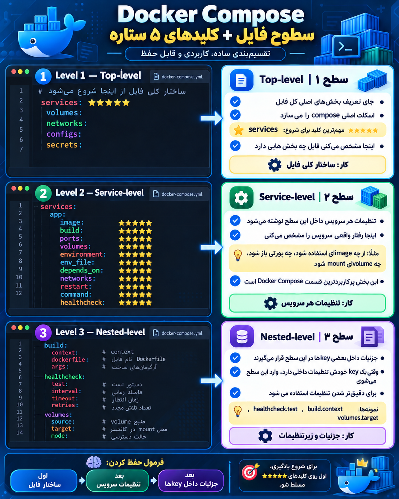

برای یادگیری لازم نیست همه‌ی keyهای Compose را به یک اندازه بخونی. بعضی‌ها تقریباً هر روز استفاده می‌شن، بعضی‌ها بیشتر برای production و پروژه‌های حرفه‌ای‌اند، و بعضی‌ها خیلی کم‌کاربردند.

من از **★★★★★ خیلی مهم** تا **★ کم‌کاربرد** مرتبشون می‌کنم.

|Key|کاربرد|اهمیت|
|---|---|---|
|`services`|تعریف سرویس‌های پروژه|★★★★★|
|`image`|تعیین Image سرویس|★★★★★|
|`build`|ساخت Image از Dockerfile|★★★★★|
|`ports`|اتصال پورت Host به Container|★★★★★|
|`volumes`|Volume و Bind Mount|★★★★★|
|`environment`|تعریف Environment Variable|★★★★★|
|`env_file`|خواندن متغیرها از فایل `.env`|★★★★★|
|`depends_on`|وابستگی بین سرویس‌ها|★★★★★|
|`networks`|اتصال سرویس‌ها به Network|★★★★★|
|`restart`|سیاست Restart کانتینر|★★★★★|
|`command`|جایگزین کردن `CMD` ایمیج|★★★★★|
|`container_name`|تعیین نام کانتینر|★★★★☆|
|`healthcheck`|بررسی سلامت سرویس|★★★★★|
|`entrypoint`|جایگزین کردن `ENTRYPOINT`|★★★★☆|
|`working_dir`|تعیین Working Directory|★★★☆☆|
|`user`|اجرای کانتینر با User خاص|★★★★☆|
|`hostname`|تعیین hostname کانتینر|★★☆☆☆|
|`extra_hosts`|اضافه کردن Host Mapping|★★★☆☆|
|`expose`|مشخص کردن پورت داخلی بدون Publish|★★★☆☆|
|`profiles`|فعال‌کردن سرویس‌ها در Profileهای مختلف|★★★★☆|
|`secrets`|مدیریت Secretها|★★★★☆|
|`configs`|قرار دادن Config داخل Container|★★★☆☆|
|`tmpfs`|ساخت Mount موقت در RAM|★★★☆☆|
|`read_only`|Read-only کردن filesystem کانتینر|★★★★☆|
|`stdin_open`|معادل `docker run -i`|★★☆☆☆|
|`tty`|معادل `docker run -t`|★★☆☆☆|
|`privileged`|دادن دسترسی زیاد به Container|★★☆☆☆|
|`cap_add`|اضافه کردن Linux Capability|★★★☆☆|
|`cap_drop`|حذف Linux Capability|★★★☆☆|
|`security_opt`|تنظیمات امنیتی Container|★★★☆☆|
|`devices`|دادن Device سیستم به Container|★★☆☆☆|
|`device_cgroup_rules`|کنترل Deviceها|★☆☆☆☆|
|`sysctls`|تنظیم Kernel Parameterها|★★☆☆☆|
|`ulimits`|محدودیت Resourceهای Linux|★★★☆☆|
|`mem_limit`|محدودیت RAM|★★★★☆|
|`mem_reservation`|رزرو Memory|★★★☆☆|
|`cpus`|محدودیت CPU|★★★★☆|
|`cpu_shares`|وزن CPU|★★☆☆☆|
|`pids_limit`|محدودیت تعداد Process|★★★☆☆|
|`stop_grace_period`|زمان فرصت برای Shutdown|★★★☆☆|
|`stop_signal`|Signal زمان Stop|★★☆☆☆|
|`init`|اجرای init داخل Container|★★★☆☆|
|`platform`|تعیین معماری مثل `linux/amd64`|★★★☆☆|
|`pull_policy`|سیاست Pull Image|★★★☆☆|
|`logging`|تنظیم Logging Driver|★★★★☆|
|`labels`|Metadata برای Container|★★★☆☆|
|`links`|اتصال قدیمی سرویس‌ها|★☆☆☆☆|
|`external_links`|اتصال به Container خارجی|★☆☆☆☆|
|`network_mode`|تعیین Network Mode|★★★☆☆|
|`dns`|تعیین DNS Server|★★☆☆☆|
|`dns_search`|DNS Search Domain|★☆☆☆☆|
|`domainname`|Domainname کانتینر|★☆☆☆☆|
|`mac_address`|MAC Address|★☆☆☆☆|
|`ipc`|IPC namespace|★☆☆☆☆|
|`pid`|PID namespace|★☆☆☆☆|
|`shm_size`|اندازه `/dev/shm`|★★☆☆☆|
|`storage_opt`|تنظیم Storage Driver|★☆☆☆☆|
|`group_add`|اضافه کردن Group|★★☆☆☆|
|`credential_spec`|Windows Credential|★☆☆☆☆|
|`isolation`|Isolation Mode|★☆☆☆☆|
|`runtime`|تعیین Runtime خاص|★★☆☆☆|
|`scale`|تعداد Instance سرویس|★★☆☆☆|

در خود فایل Compose سه تا بخش سطح بالا خیلی مهم هم داریم:

```
services:
volumes:
networks:
```

و بخش‌های مهم دیگر:

```
configs:
secrets:
```

مثلاً:

```
services:
  backend:
    image: my-backend
    ports:
      - "5000:5000"
    volumes:
      - backend-data:/app/data
    networks:
      - backend-net

volumes:
  backend-data:

networks:
  backend-net:
```

### برای DevOps این ترتیب یادگیری را پیشنهاد می‌کنم

**مرحله 1 — حتماً مسلط باش**

```
services
image
build
ports
volumes
environment
env_file
networks
depends_on
restart
command
```

★★★★★

**مرحله 2 — خیلی مهم برای پروژه واقعی**

```
healthcheck
entrypoint
profiles
secrets
read_only
user
logging
mem_limit
cpus
```

★★★★☆ تا ★★★★★

**مرحله 3 — Production / حرفه‌ای**

```
configs
tmpfs
cap_add
cap_drop
security_opt
ulimits
stop_grace_period
init
pull_policy
```

★★★☆☆ تا ★★★★☆

**مرحله 4 — فعلاً لازم نیست وقت زیادی بذاری**

```
ipc
pid
mac_address
storage_opt
credential_spec
isolation
device_cgroup_rules
links
external_links
```

★ تا ★★

---
# اینم یه عکسه خوب از اینکه سطوح مختلف compose key هارو در داکر متوجه شی  چون درک خوب سطوح باعث این میشه که اشتباه کمتری کنی و به مشکل نخوری در درست کردن کامپوس فایل یا کانفیگ فایل کامپوس

<p align="center">
	
</p>
