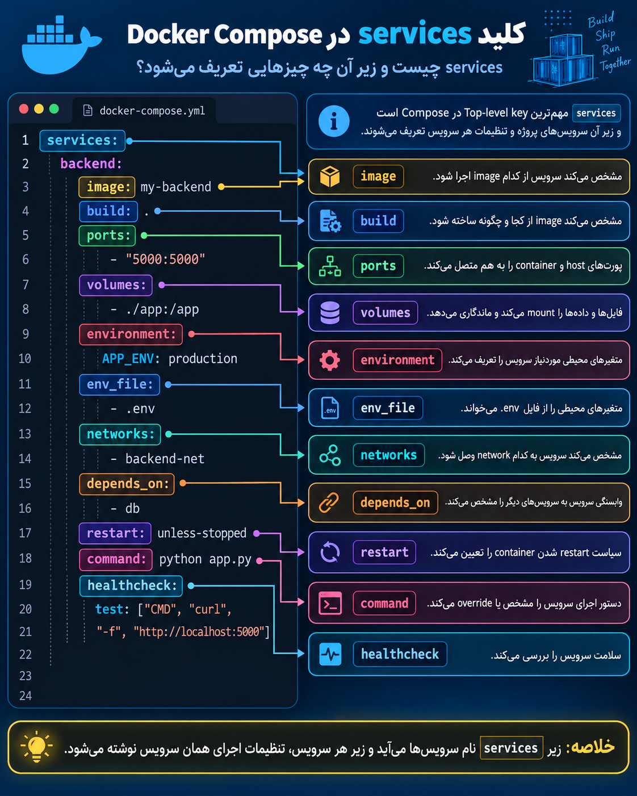

ا-`services` مهم‌ترین **Top-level key** در Docker Compose است.

زیر `services`، تمام **سرویس‌های پروژه** را تعریف می‌کنیم؛ یعنی چیزهایی که قرار است به صورت container اجرا شوند، مثل:

```
services:
  frontend:
  backend:
  database:
  nginx:
```

بعد زیر هر سرویس، تنظیمات همان سرویس می‌آید؛ مثلاً:

```
services:
  backend:
    image: my-backend
    ports:
      - "5000:5000"
    volumes:
      - ./app:/app
    environment:
      APP_ENV: production
    networks:
      - backend-net
    restart: unless-stopped
```

یعنی زیر هر service معمولاً چیزهایی مثل این تعریف می‌شوند:

- ا-`image` → از چه Imageای استفاده شود
- ا-`build` → Image از چه Dockerfileای ساخته شود
- ا-`ports` → پورت‌ها
- ا-`volumes` → فضای ذخیره‌سازی یا mount
- ا-`environment` / `env_file` → متغیرهای محیطی
- ا-`networks` → شبکه‌های سرویس
- ا-`depends_on` → وابستگی به سرویس‌های دیگر
- ا-`restart` → سیاست restart
- ا-`command` → دستور اجرای container
- ا-`healthcheck` → بررسی سالم بودن سرویس

خلاصه برای جزوه:

ا-**`services` جایی است که سرویس‌های پروژه و تمام تنظیمات مربوط به اجرای هر سرویس تعریف می‌شوند.**

---
### اینم یه عکس که از نمایه بهتر ببینید


<p align="center">
	
</p>


<p align="center">
	
</p>

