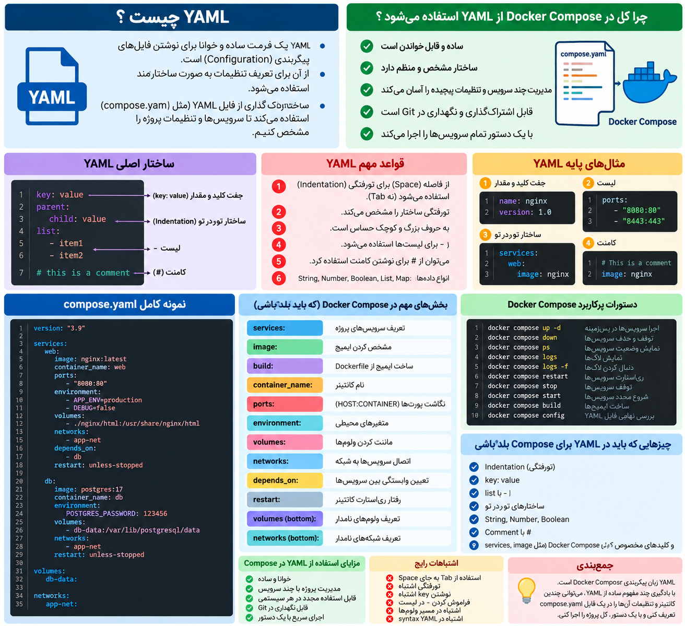

ا-`YAML` یه فرمت ساده و خوانا برای نوشتن **configuration** هست. Docker Compose ازش استفاده می‌کنه تا داخل فایل `compose.yaml` به Docker بگی چه Serviceهایی داری و هرکدوم چه تنظیماتی لازم دارن.


<p align="center">
	
</p>


مثلاً:

```
services:
  web:
    image: nginx
    ports:
      - "8080:80"
```

اینجا YAML فقط داره ساختار تنظیمات رو مشخص می‌کنه.

برای Docker Compose لازم نیست YAML رو خیلی عمیق بلد باشی؛ این چند مورد کافیه:

- ا-**Indentation** خیلی مهمه؛ فاصله‌ها ساختار رو مشخص می‌کنن.
- ساختار `key: value`
- لیست‌ها با `-`
- ساختارهای تو‌در‌تو
- ا-String و Number
- ا-Comment با `#`

مثلاً:

```
services:
  web:
    image: nginx

    ports:
      - "8080:80"

    environment:
      APP_ENV: production
      DEBUG: "false"
```

چیزهایی که در YAML مربوط به Compose زیاد می‌بینی:

```
services:
image:
build:
container_name:
ports:
environment:
volumes:
networks:
depends_on:
restart:
```

یک قانون خیلی مهم YAML:

```
services:
  web:
    image: nginx
```

این درسته، چون `web` زیر `services` و `image` زیر `web` قرار گرفته.

ولی این:

```
services:
web:
image: nginx
```

از نظر ساختار اشتباهه.

پس برای Docker Compose، YAML رو این‌طوری تو ذهنت نگه دار:

```
YAML
↓
زبان نوشتن تنظیمات

compose.yaml
↓
تعریف Serviceها و تنظیمات Docker

docker compose up -d
↓
اجرای تنظیماتی که نوشتی
```

برای شروع Compose، مهم‌ترین بخش YAML همون **indentation + key:value + list** هست.
