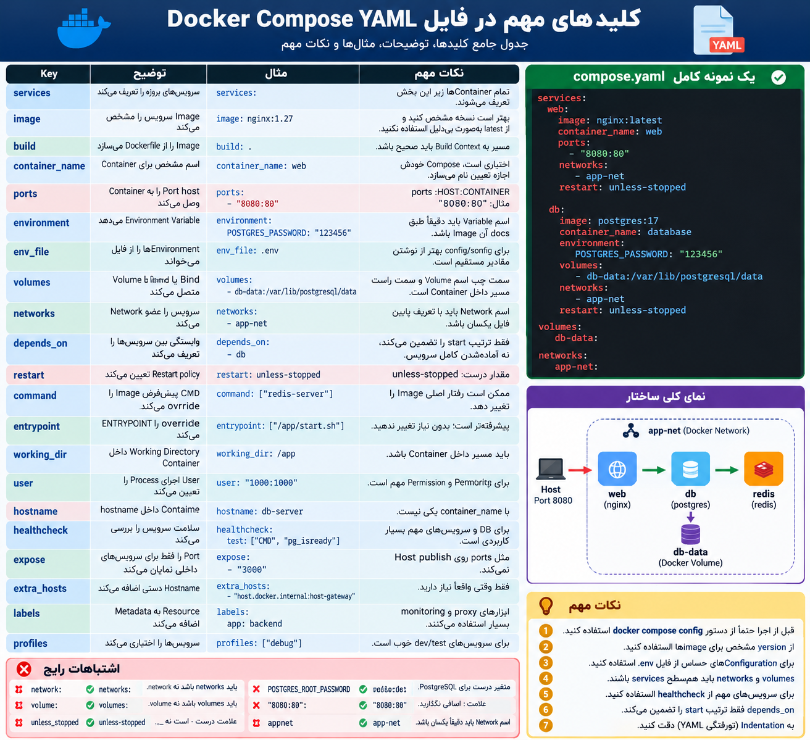

## کلید هایی که در درست کردن کانفیگ فایل yaml باید حواستون باشد

<p align="center">
	
</p>


مهم‌ترین ساختار کلی که باید حفظ باشی:

```
services:
  web:
    image: nginx:1.27
    container_name: web
    ports:
      - "8080:80"
    networks:
      - app-net
    restart: unless-stopped

  db:
    image: postgres:17
    environment:
      POSTGRES_PASSWORD: "123456"
    volumes:
      - db-data:/var/lib/postgresql/data
    networks:
      - app-net

volumes:
  db-data:

networks:
  app-net:
```

چند اشتباه رایج که تو الان باید خیلی حواست بهشون باشه:

```
network:   ❌
networks:  ✅

volume:    ❌
volumes:   ✅

unless_stopped   ❌
unless-stopped   ✅

POSTGRES_ROOT_PASSWORD   ❌
POSTGRES_PASSWORD        ✅

"8080:80":   ❌
"8080:80"    ✅
```

و یکی از بهترین عادت‌ها اینه که قبل از `up` همیشه بزنی:

```
docker compose config
```

این دستور فایل Compose رو parse می‌کنه و خیلی از اشتباهات YAML و Compose رو قبل از اجرا بهت نشون می‌ده.