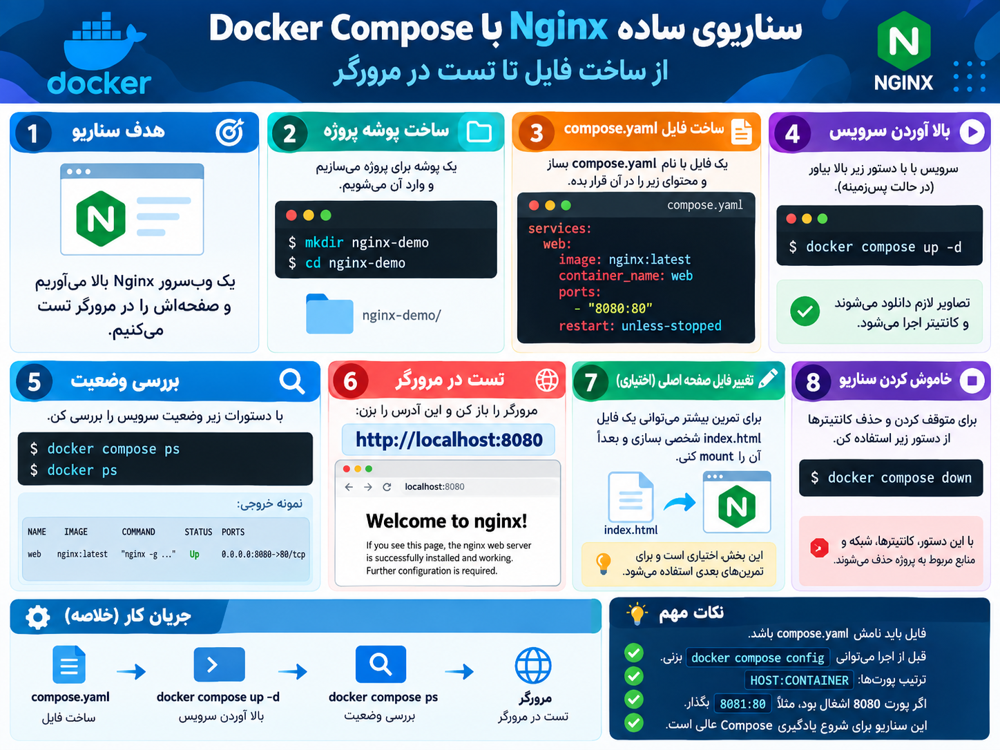

## سناریو اول ساخت فایل کانفیگ yaml. تا تست در گوگل
---

```
# Scenario: Simple Nginx with Docker Compose

# هدف:
# یک Nginx container با Docker Compose بالا بیار
# بعد از داخل مرورگر تستش کن

# Service name:
#   web

# image:
#   nginx:latest

# container_name:
#   nginx-web

# port mapping:
#   8080:80

# restart policy:
#   unless-stopped

# Task:
# 1. یک فایل compose.yaml بنویس
# 2. قبل از اجرا این دستور را بزن:
#    docker compose config
# 3. بعد سرویس را بالا بیار:
#    docker compose up -d
# 4. وضعیتش را بررسی کن:
#    docker compose ps
# 5. بعد داخل مرورگر برو به:
#    http://localhost:8080
# 6. باید صفحه Welcome to nginx را ببینی
```

###  فایل این سناریو

```yaml
services:
  web:
    image: nginx:latest
    container_name: nginx-web
    ports:
      - "8080:80"
    restart: unless-stopped


```
#### چجوری از صحت درست بودن کد ها مطلع شیم
- ۱ نگاه بندازید به کد هاتون دوباره
- ۲- دستور  docker compose config رو بزنید و اگر تب بزنید اسمه سرویس هاتون رو میارد سرویس هاتون رو بنزنید اسمشو جلو  docekr compose config < yourservicename>o  براتون خط کد هایه سرویس هاتون رو میاره اگر ارور نداد یعنی اوکیه
---

<p align="center">
	
</p>
