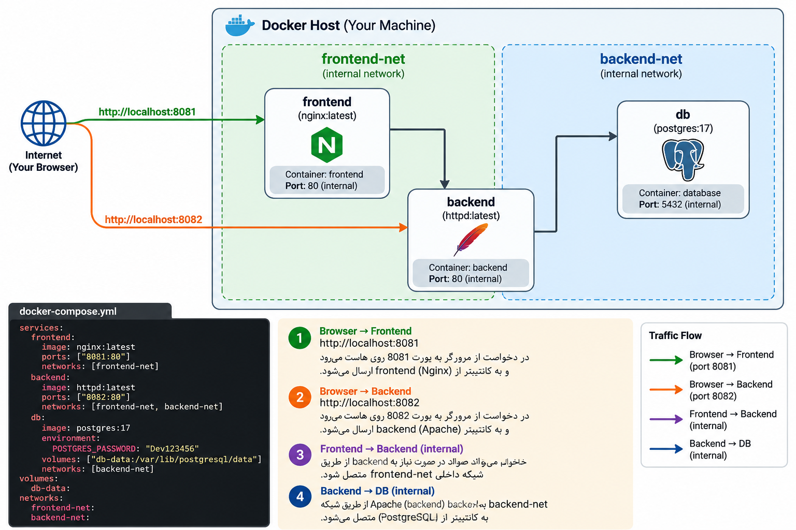

##  این یه سناریو متوسط تر از ساخت فایل کانفیگ yaml برایه docker compse

---
## چیزایی که باید بهش توجه کنید
- ۱- به تورفتگی ها توجه کنید
- ۲- docker network رو باید بسازید از قبل
- ۳-docker volume رو هم همینطور
- ۴-اون مسیری که ماله کانتینر هست رو توجه کنید که مسیره درست رو مانت کنید به volume
- 
```bash
# Scenario: Docker Compose - Medium Level 2

# پروژه شامل 3 سرویس است:

# --------------------------------------------------
# Service 1: frontend
# --------------------------------------------------

# service name:
#   frontend

# image:
#   nginx:latest

# container_name:
#   frontend

# port mapping:
#   8081:80

# network:
#   frontend-net

# restart policy:
#   unless-stopped


# --------------------------------------------------
# Service 2: backend
# --------------------------------------------------

# service name:
#   backend

# image:
#   httpd:latest

# container_name:
#   backend

# port mapping:
#   8082:80

# networks:
#   frontend-net
#   backend-net

# restart policy:
#   always


# --------------------------------------------------
# Service 3: db
# --------------------------------------------------

# service name:
#   db

# image:
#   postgres:17

# container_name:
#   database

# environment:
#   POSTGRES_PASSWORD=Dev123456

# volume:
#   db-data:/var/lib/postgresql/data

# network:
#   backend-net

# restart policy:
#   unless-stopped


# --------------------------------------------------
# Define resources at bottom
# --------------------------------------------------

# volume:
#   db-data

# networks:
#   frontend-net
#   backend-net


# --------------------------------------------------
# Task
# --------------------------------------------------

# compose.yaml را کامل بنویس

# بعد:
# docker compose config

# اگر درست بود:
# docker compose up -d

# و در آخر:
# docker compose ps
```

## بریم سراغه کدهاش

```yaml
services:
  frontend:
    image: nginx:latest
    container_name: frontend
    ports:
      - "8081:80"
    networks:
      - frontend-net
    restart: unless-stopped

  backend:
    image: httpd:latest
    container_name: backend
    ports:
      - "8082:80"
    networks:
      - frontend-net
      - backend-net
    restart: always

  db:
    image: postgres:17
    container_name: database
    environment:
      POSTGRES_PASSWORD: "123456"
    volumes:
      - db-data:/var/lib/postgresql/data
    networks:
      - backend-net
    restart: unless-stopped

volumes:
  db-data:

networks:
  frontend-net:
  backend-net:
```

# بی دقتی هایه احتمالی

```bash
images   ❌ → image     ✅
porst    ❌ → ports     ✅

volumes:
  - name ❌

volumes:
  name:  ✅

networks:
  - name ❌

networks:
  name:  ✅
```

### اینم نمایی از اینکه چه مسیری طی میشه در این راه اندازی سرویس هایی که میخوایم انجام بدیم


<p align="center">
	
</p>
