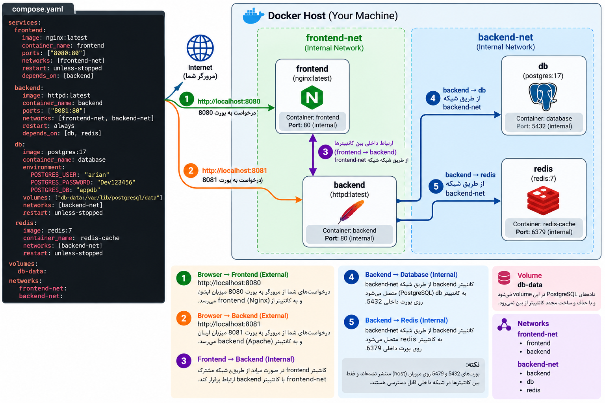

### سناریو سخت تر برایه دستور docker compose 
---
- کارایی که باید بکنی و سناریو

```
# Scenario: Docker Compose - Hard Level

# پروژه شامل 4 سرویس است:
# frontend
# backend
# db
# redis


# --------------------------------------------------
# Service 1: frontend
# --------------------------------------------------

# service name:
#   frontend

# image:
#   nginx:latest

# container_name:
#   frontend

# port mapping:
#   8080:80

# network:
#   frontend-net

# restart policy:
#   unless-stopped

# depends_on:
#   backend


# --------------------------------------------------
# Service 2: backend
# --------------------------------------------------

# service name:
#   backend

# image:
#   httpd:latest

# container_name:
#   backend

# port mapping:
#   8081:80

# networks:
#   frontend-net
#   backend-net

# restart policy:
#   always

# depends_on:
#   db
#   redis


# --------------------------------------------------
# Service 3: db
# --------------------------------------------------

# service name:
#   db

# image:
#   postgres:17

# container_name:
#   database

# environment:
#   POSTGRES_USER=devuser
#   POSTGRES_PASSWORD=Dev123456
#   POSTGRES_DB=appdb

# volume:
#   db-data:/var/lib/postgresql/data

# network:
#   backend-net

# restart policy:
#   unless-stopped


# --------------------------------------------------
# Service 4: redis
# --------------------------------------------------

# service name:
#   redis

# image:
#   redis:7

# container_name:
#   redis-cache

# network:
#   backend-net

# restart policy:
#   unless-stopped


# --------------------------------------------------
# Define resources
# --------------------------------------------------

# volume:
#   db-data

# networks:
#   frontend-net
#   backend-net


# --------------------------------------------------
# Your Task
# --------------------------------------------------

# 1. compose.yaml رو کامل بنویس
# 2. با docker compose config بررسی کن
# 3. اگر درست بود:
#    docker compose up -d
# 4. بعد:
#    docker compose ps
# 5. بعد networkها رو inspect کن:
#    docker network ls
#    docker network inspect ...
# 6. volume رو هم ببین:
#    docker volume ls
```

#### کد هایه این سناریو و کارهایی که باید بکنی
اگر `networks:` و `volumes:` رو داخل خود `compose.yaml` تعریف کرده باشی، معمولاً لازم نیست دستی بسازیشون؛ Compose خودش می‌سازه.

مثلاً این‌ها:

```
docker network create frontend-net
docker network create backend-net

docker volume create db-data
```

فقط وقتی لازم می‌شن که بخوای Network یا Volume رو **خارج از Compose و از قبل** بسازی، یا به شکل external استفاده کنی.

```
services:
  frontend:
    image: nginx:latest
    container_name: frontend
    ports:
      - "8080:80"
    networks:
      - frontend-net
    restart: unless-stopped
    depends_on:
      - backend

  backend:
    image: httpd:latest
    container_name: backend
    ports:
      - "8081:80"
    networks:
      - frontend-net
      - backend-net
    restart: always
    depends_on:
      - db
      - redis

  db:
    image: postgres:17
    container_name: database
    environment:
      POSTGRES_USER: "arian"
      POSTGRES_PASSWORD: "Dev123456"
      POSTGRES_DB: "appdb"
    volumes:
      - db-data:/var/lib/postgresql/data
    networks:
      - backend-net
    restart: unless-stopped

  redis:
    image: redis:7
    container_name: redis-cache
    networks:
      - backend-net
    restart: unless-stopped

volumes:
  db-data:

networks:
  frontend-net:
  backend-net:
```

<p align="center">
	
</p>