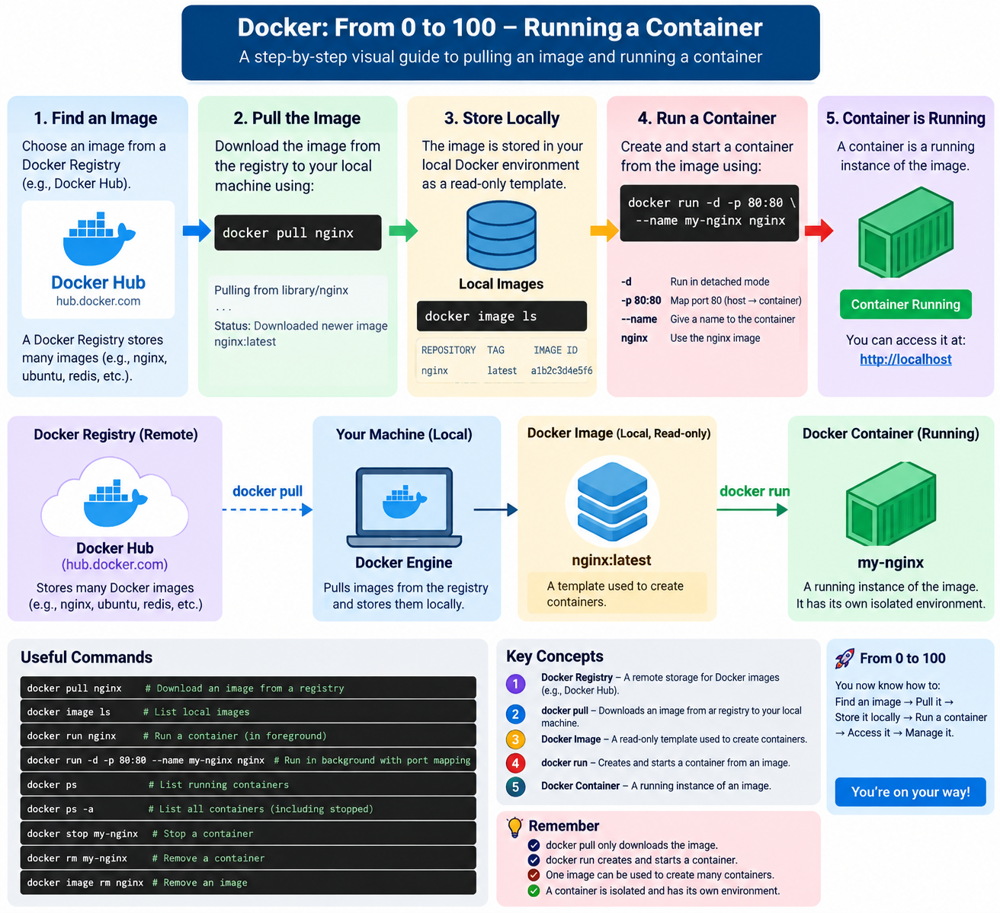

# صفر تا صد اجرایه یک کانتینر

---
این تصویر مسیر کامل اجرای یک Container رو از صفر تا صد نشون می‌ده؛ یعنی از جایی که هنوز Image روی سیستم ما نیست، تا زمانی که Container ساخته و اجرا می‌شه.

<p align="center">
	
</p>

به زبان ساده، مسیر کلی اینه:

```
Docker Registry
      |
      | docker pull
      v
Docker Image
      |
      | docker run
      v
Docker Container
```

اول از همه `Docker Registry` رو داریم.

`Docker Registry` جاییه که Docker Imageها داخلش نگهداری می‌شن.

مثلاً معروف‌ترین Registry:

```
Docker Hub
```

وقتی می‌زنیم:

```
docker pull nginx
```

Docker می‌ره Image مربوط به `nginx` رو از Registry دانلود می‌کنه و روی سیستم ما ذخیره می‌کنه.

بعد می‌تونیم Imageهای دانلودشده رو ببینیم:

```
docker image ls
```

در این مرحله هنوز هیچ Containerی اجرا نشده. فقط Image داریم.

بعد با این دستور:

```
docker run nginx
```

Docker از روی اون Image یک Container می‌سازه و اجرا می‌کنه.

یعنی:

```
nginx Image
     |
     | docker run
     v
nginx Container
```

اگر بخوای Nginx رو به شکل واقعی‌تر اجرا کنی:

```
docker run -d -p 80:80 --name my-nginx nginx
```

معنی بخش‌ها:

```
-d
Run container in background

-p 80:80
Map host port 80 to container port 80

--name my-nginx
Give the container a name

nginx
Use the nginx image
```

بعد برای دیدن Containerهای در حال اجرا:

```
docker ps
```

و برای دیدن همه Containerها:

```
docker ps -a
```

پس مهم‌ترین مفهومی که از این تصویر باید بگیری اینه:

```
Registry
   |
   | docker pull
   v
Image
   |
   | docker run
   v
Container
```

و یک نکته خیلی مهم:

```
docker pull
```

فقط Image رو دانلود می‌کنه.

ولی:

```
docker run
```

از روی Image یک Container می‌سازه و اجرا می‌کنه.

اگر بخوای اینو برای GitHub ذخیره کنی، عنوان خیلی مناسبی براش می‌تونه این باشه:

```
From Docker Registry to Running Container
```

یا:

```
Docker Image to Container Workflow
```
