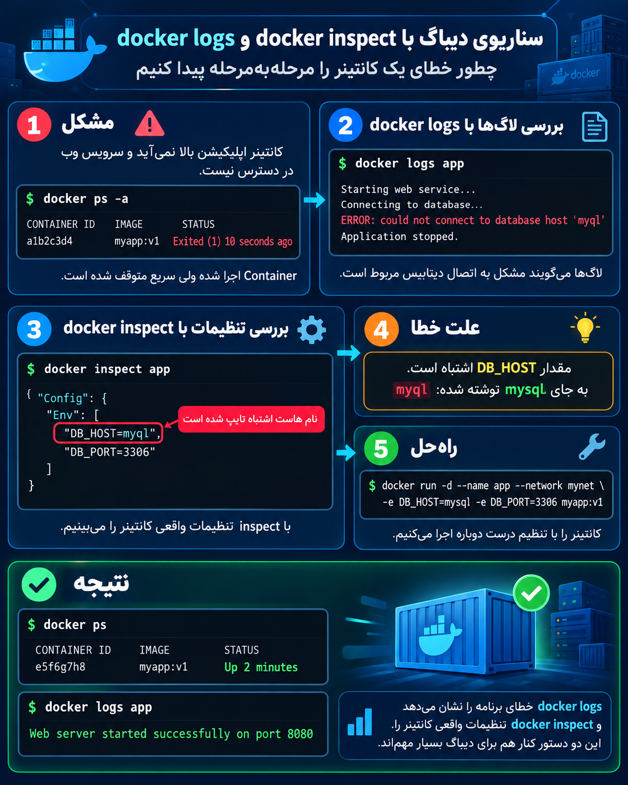

<p align="center">
	
</p>

سناریویی که در عکس است یک **Debug واقعی در محیط DevOps** است که نشان می‌دهد چطور `docker logs` و `docker inspect` کنار هم برای پیدا کردن مشکل استفاده می‌شوند.

سناریو:

## مشکل اولیه

فرض کن یک برنامه وب داری:

```
Application Container
        |
        |
        ↓
    Database (MySQL)
```

برنامه باید به MySQL وصل شود، ولی بالا نمی‌آید.

اول وضعیت Container را می‌بینیم:

```bash
docker ps -a
```

خروجی:

```text
CONTAINER ID   IMAGE       STATUS
a1b2c3d4       myapp:v1    Exited (1)
```

یعنی:

- Container ساخته شده
    
- ولی برنامه داخل آن Crash کرده و خارج شده است.
    

---

# مرحله ۱: استفاده از docker logs

حالا می‌پرسیم:

> برنامه چرا Crash کرده؟

دستور:

```bash
docker logs app
```

خروجی:

```
Starting web service...
Connecting to database...
ERROR: could not connect to database host 'myql'
Application stopped.
```

اینجا متوجه می‌شویم مشکل احتمالاً از اتصال Database است.

ولی هنوز نمی‌دانیم چرا.

---

# مرحله ۲: استفاده از docker inspect

حالا می‌خواهیم تنظیمات واقعی Container را ببینیم:

```bash
docker inspect app
```

در خروجی دنبال Environment Variable می‌گردیم:

```json
"Env": [
    "DB_HOST=myql",
    "DB_PORT=3306"
]
```

اینجا مشکل پیدا شد:

برنامه دنبال این Host می‌گردد:

```
myql
```

ولی اسم درست Database:

```
mysql
```

است.

فقط یک اشتباه تایپی وجود دارد.

---

# مرحله ۳: اصلاح مشکل

Container را با مقدار درست دوباره اجرا می‌کنیم:

```bash
docker run -d \
--name app \
--network mynet \
-e DB_HOST=mysql \
-e DB_PORT=3306 \
myapp:v1
```

تغییر مهم:

قبل:

```
DB_HOST=myql ❌
```

بعد:

```
DB_HOST=mysql ✅
```

---

# مرحله ۴: بررسی نتیجه

دوباره:

```bash
docker ps
```

حالا:

```
CONTAINER ID   IMAGE       STATUS
e5f6g7h8       myapp:v1    Up 2 minutes
```

Container دیگر Crash نمی‌کند.

بعد:

```bash
docker logs app
```

می‌بینیم:

```
Web server started successfully on port 8080
```

---

# نکته مهم Debug در Docker

این دو دستور دو سؤال متفاوت جواب می‌دهند:

### `docker logs`

می‌پرسد:

> داخل برنامه چه اتفاقی افتاده؟

مثلاً:

- Error برنامه
    
- Crash
    
- Connection error
    
- Warning
    

---

### `docker inspect`

می‌پرسد:

> Docker این Container را با چه تنظیماتی ساخته؟

مثلاً:

- Environment Variable
    
- Network
    
- IP
    
- Volume
    
- Port
    
- Image
    

---

پس در کار واقعی معمولاً این مسیر را می‌روی:

```
مشکل Container
        |
        ↓
docker ps -a
        |
        ↓
docker logs
        |
        ↓
فهمیدن نوع خطا
        |
        ↓
docker inspect
        |
        ↓
بررسی تنظیمات واقعی
        |
        ↓
رفع مشکل
```

این یکی از سناریوهای خیلی رایج برای یک DevOps Engineer است؛ چون خیلی وقت‌ها مشکل از خود Docker نیست، بلکه از **Config اشتباه داخل Container** است.
