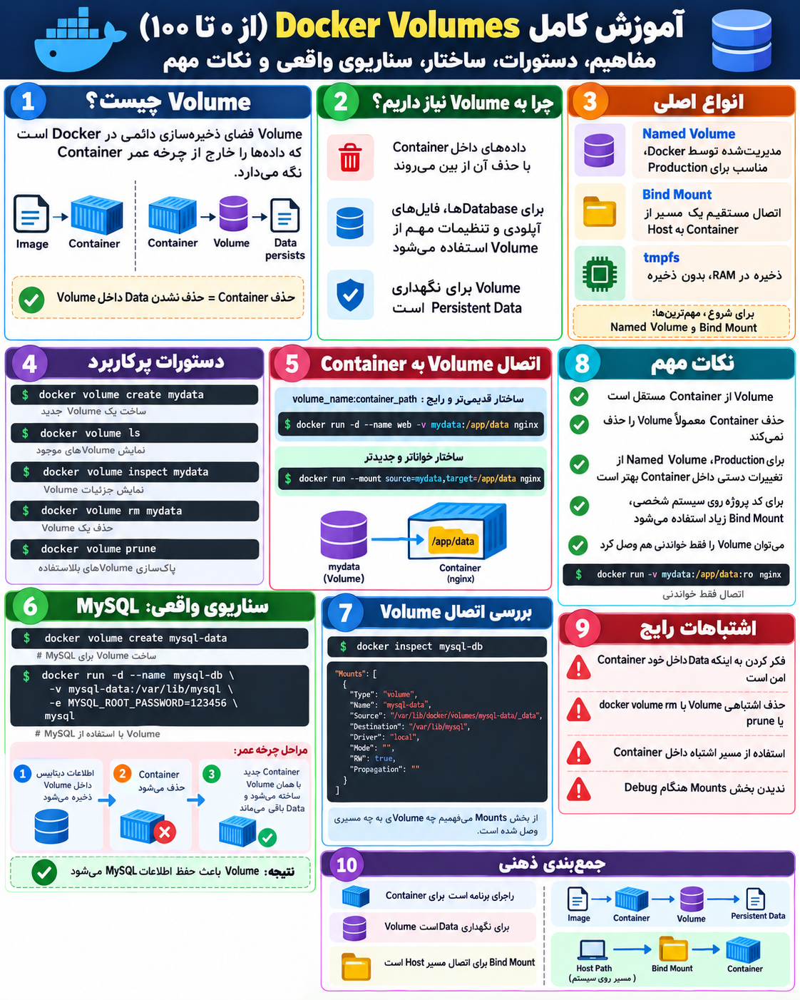
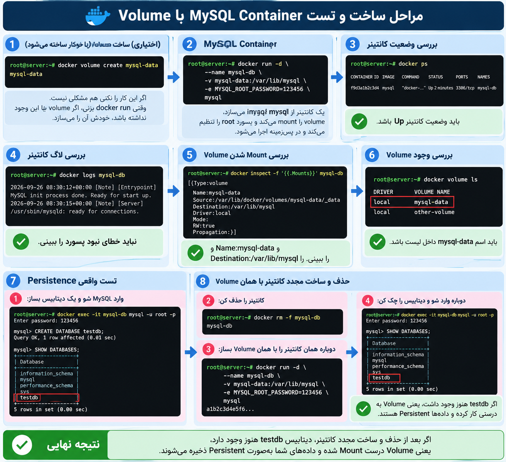

##  0 to 100 mount docker container to docker volume

---
### عکسی رو براتون اوردم که درونش بهتون درمورد این توضیح دادم که چجوری میتونیم docker volume  بسازیم و چجوری میتونیم docker container رو به docker volume مونت کنیم .
- **یه سوال دلیل اینکه کانتینر رو به volume  مونت میکنیم چیست** ؟ 
- دیتای مهم Container را به‌صورت Persistent نگه داریم تا با حذف یا Recreate شدن Container از بین نرود.

---
#### این عکس یه خلاصه کامل از docker volume + یه سناریو عملی از مونت کردن کانتینر به volume که بهتون دموردش توضیح میدم

<p align="center">
	
</p>

#### توضیح درمورد کد هایی که سنارییو عملی زدیم
- اول سوال این سنارییویی که در عکس مطرح شده چیست
- فرض کن یک سرویس MySQL داخل Docker داریم و نمی‌خواهیم با حذف یا Recreate شدن Container، اطلاعات دیتابیس از بین برود. چطور باید یک Volume بسازیم و آن را به مسیر دیتای MySQL وصل کنیم تا Data به‌صورت دائمی باقی بماند؟
- کد هایی که داشت چی بود؟

```bash
docker volume create mysql-data

1-docker run -d \
  2---name mysql-db \
 3- -v mysql-data:/var/lib/mysql \
4-  -e MYSQL_ROOT_PASSWORD=123456 \
 5- mysql
```

#### توضیح خط به خط که این کد ها چیست؟
1. این دستور docker run -d  یعنی یک کانتینر بساز از image mysql که در اخر اومده و اون رو توسط فلگ -d  در پس زمینه اجرا کن
2.  اینجا اومده گفته اسمه اون کانتینر رو بزار name-- توسط این فلگ mysql-db
3.  در اینجا اومده  docker volume  روگفته که ما به دو صورت این قسمت رو میتونیم پیش ببریم اگر docker volume  از قبل ساختیم به اسمه mysql-data اسمه اون رو میدیم و اگر نساختیم هم خودش میسازه فقط این جا چیکار میکنه میاد docker volume ->mysql-data رو وصل میکنید به  مسیر داخل کانتینر  var/lib/mysql/  که mysql دیتایش را در اینجا ذخیره میکنید
4. فقط یک نکته خیلی مهم: خود `-v` «Docker Volume را نمی‌سازد و تمام»؛ در واقع **یک Mount تعریف می‌کند** بین Volume و مسیر داخل Container. اگر Named Volume وجود نداشته باشد، Docker آن را هم در همان لحظه ایجاد می‌کند.
5. و `-e MYSQL_ROOT_PASSWORD=123456` میاد یه متغیر محیطی یا environment variable  تعریف میکند برایه کانتینر و میگه password root در  MYSQL    بشه ۱ تا ۶
- خلاصصههه
```bash
Image:      mysql
Container:  mysql-db
Volume:     mysql-data
Password:   123456
Mode:       Background
```

## حالا از کجا میتونیم بفهمیم درست کار کرده

<p align="center">
	
</p>

