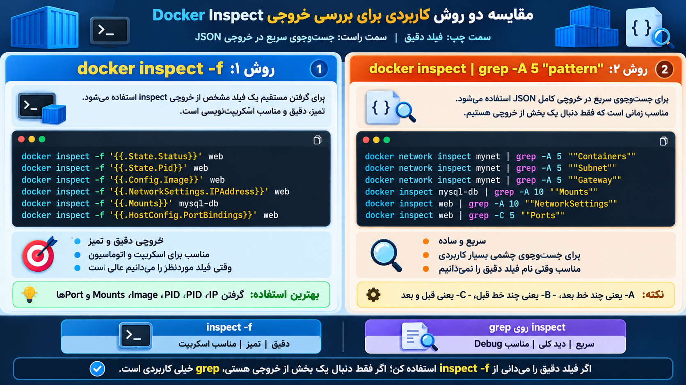

# دو روش برایه پیدا کردن اون بخش از تنظیماتی که میخوایم از بخش inspect
---

	

- پس ما دو روش داریم
- 1-پیدا کردن اون قسمت از inspect  توسط -->" docker obj inspect <> |grep -A line "pattern
- 2-مدل دیگر به کمک خوده دستور docker inspect -f "{{Go Template syntax}}"

## این جدولی از  go template syntax هاست به نظره من همون grep -A بهتر و راحت تره و ماهم چون دنبال راحتیم میریم سراغه grep -A -_-

|Syntax|کاربرد|مثال|
|---|---|---|
|`{{.Field}}`|گرفتن یک فیلد|`{{.Name}}`|
|`{{.Field.SubField}}`|گرفتن فیلد تو‌در‌تو|`{{.State.Status}}`|
|`{{json .Field}}`|نمایش تمیز به شکل JSON|`{{json .Mounts}}`|
|`{{range .Field}}...{{end}}`|Loop روی لیست|`{{range .Mounts}}{{.Name}}{{end}}`|
|`{{if .Field}}...{{end}}`|شرط|`{{if .State.Running}}Running{{end}}`|
|`{{if ...}}{{else}}...{{end}}`|شرط با else|`{{if .State.Running}}UP{{else}}DOWN{{end}}`|
|`{{index .Field "key"}}`|گرفتن مقدار از Map با Key|`{{index .NetworkSettings.Networks "mynet"}}`|
|`{{join .Field ","}}`|Join کردن لیست|`{{join .Config.Env ","}}`|
|`{{len .Field}}`|تعداد آیتم‌ها|`{{len .Mounts}}`|
|`{{printf "%s" .Field}}`|قالب‌بندی خروجی|`{{printf "%s" .Name}}`|
|`{{println .Field}}`|چاپ همراه newline|`{{println .Name}}`|
|`{{lower .Field}}`|تبدیل متن به lowercase|`{{lower .Name}}`|
|`{{upper .Field}}`|تبدیل متن به uppercase|`{{upper .Name}}`|
